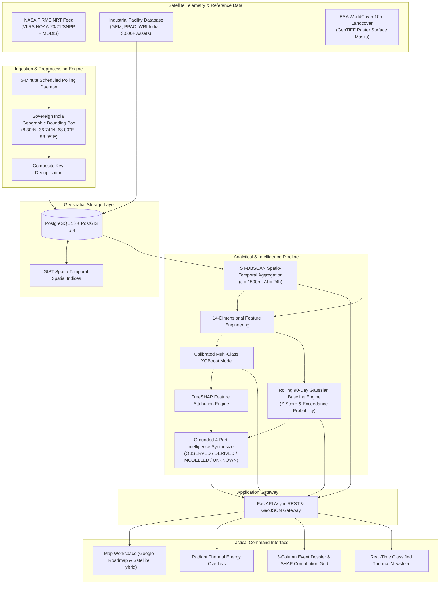
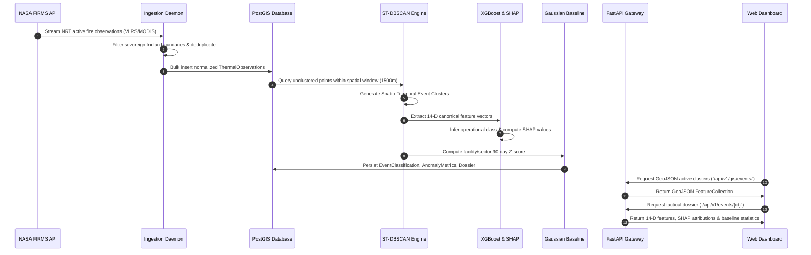

# ThermoTrace AI

### Real-Time Satellite Thermal Monitoring, Industrial Flaring Detection, and Geospatial Intelligence Platform

[](docker-compose.yml)
[](backend/)
[](frontend/)
[](backend/app/db/)
[](backend/app/ml/)
[](https://firms.modaps.eosdis.nasa.gov/)
[](frontend/)
[](backend/)

---

## 1. System Overview

ThermoTrace AI is an automated thermal intelligence platform designed for national-scale satellite monitoring of industrial emissions, flare stacks, refinery furnaces, and high-temperature thermal incidents. 

The system continuously ingests Near-Real-Time (NRT) satellite telemetry from NASA FIRMS sensors (VIIRS NOAA-20, NOAA-21, Suomi-NPP, and MODIS Terra/Aqua), applies spatio-temporal clustering (ST-DBSCAN), extracts a 14-dimensional feature matrix, executes multi-class XGBoost classification with Shapley value attributions (SHAP), and calculates 90-day statistical emission baselines to detect anomalous thermal activity across sovereign Indian territory.

---

## 2. System Architecture



---

## 3. Data Processing & Analytical Pipeline



---

## 4. Mathematical Formulations & Algorithms

### 4.1 Spatio-Temporal Event Clustering (ST-DBSCAN)
Individual satellite detections represent instantaneous pixel observations. Detections are aggregated into discrete physical events using density-based clustering across spatial and temporal dimensions:

$$\mathcal{D}(p_i, p_j) = \sqrt{\left(rac{	ext{haversine}(p_i, p_j)}{\epsilon_s}
ight)^2 + \left(rac{|t_i - t_j|}{\epsilon_t}
ight)^2} \le 1.0$$

* **Spatial Distance Threshold ($\epsilon_s$):** $1500	ext{ m}$
* **Temporal Window ($\epsilon_t$):** $24	ext{ hours}$
* **Minimum Cluster Core Points ($MinPts$):** $1	ext{ detection}$

---

### 4.2 The 14-Dimensional Canonical Feature Matrix

Every aggregated thermal cluster is characterized by a deterministic 14-dimensional feature vector $\mathbf{x} \in \mathbb{R}^{14}$:

| Index | Feature Key | Mathematical Definition | Physical Description |
|:---:|:---|:---|:---|
| 1 | `peak_frp` | $\max_{p \in C} 	ext{FRP}(p)$ | Peak Fire Radiative Power in Megawatts ($MW$) |
| 2 | `mean_frp` | $rac{1}{|C|}\sum_{p \in C} 	ext{FRP}(p)$ | Mean radiative heat emission across observations |
| 3 | `frp_variance` | $	ext{Var}_{p \in C}(	ext{FRP}(p))$ | Variance in radiative output (flaring instability vs steady process) |
| 4 | `max_brightness_temp` | $\max_{p \in C} T_{4}(p)$ | Maximum 4-micron brightness temperature in Kelvin ($K$) |
| 5 | `detection_count` | $|C|$ | Total count of raw satellite observations in cluster |
| 6 | `pass_count` | $|\{t_p \mid p \in C\}|$ | Number of distinct satellite overpasses covering the event |
| 7 | `duration_hours` | $(t_{\max} - t_{\min}) / 3600$ | Observed lifespan of the thermal event |
| 8 | `night_ratio` | $|C_{	ext{night}}| / |C|$ | Proportion of nighttime observations |
| 9 | `footprint_area_km2` | $	ext{Area}(	ext{ConvexHull}(C))$ | Spatial surface area covered by clustered detections |
| 10 | `facility_dist_km` | $\min_{f \in \mathcal{F}} 	ext{dist}(C, f)$ | Orthodromic distance to nearest registered industrial facility |
| 11 | `is_near_facility` | $\mathbb{I}(	ext{dist} < 2.5	ext{ km})$ | Binary indicator for industrial zone co-location |
| 12 | `facility_type_code` | $	ext{OneHot}(	ext{Type}(f))$ | Categorical sector encoding (Refinery, Steel, Power, Chemical, Mine) |
| 13 | `landcover_class` | $	ext{ESA WorldCover}(C_{	ext{centroid}})$ | Landcover category (Built-up: 50, Cropland: 40, Forest: 10, Shrub: 20) |
| 14 | `frp_density` | $	ext{Peak FRP} / (	ext{Area} + \epsilon)$ | Radiative intensity per unit ground surface area ($MW/km^2$) |

---

### 4.3 Supervised Multi-Class Classification & Explainability

The classification engine employs a Gradient Boosted Decision Tree (XGBoost) trained on historical FIRMS observations cross-referenced against ground-truth industrial and agricultural inventories:

$$\hat{y} = rg\max_{c \in \mathcal{C}} P(Y = c \mid \mathbf{x})$$

$$\mathcal{C} = \{	ext{Industrial Flare}, 	ext{Industrial Fire}, 	ext{Routine Process Heat}, 	ext{Wildfire / Agricultural}, 	ext{Urban Non-Industrial}\}$$

**Additive Feature Explanations (TreeSHAP):**
Feature attributions are computed locally for each event to explain classification drivers without heuristic approximations:

$$f(\mathbf{x}) = \phi_0 + \sum_{i=1}^{14} \phi_i(\mathbf{x})$$

Where $\phi_0$ is the expected model base value and $\phi_i(\mathbf{x})$ represents the exact marginal contribution of feature $i$.

---

### 4.4 Rolling 90-Day Gaussian Baseline Anomaly Detection

To differentiate normal operational emissions from severe industrial surges or process upsets, historical baseline statistics ($\mu_{90}, \sigma_{90}$) are maintained per facility and sector:

$$Z = rac{	ext{Peak FRP} - \mu_{90}}{\sigma_{90}}$$

$$	ext{Exceedance } = \Phi(Z) 	imes 100\% = rac{1}{\sqrt{2\pi}} \int_{-\infty}^{Z} e^{-u^2/2} du$$

| Anomaly Tier | Standard Deviation Threshold | Operational Interpretation |
|:---|:---|:---|
| **NOMINAL** | $Z < 1.50\sigma$ | Thermal emission is within expected operational envelope |
| **ELEVATED** | $1.50\sigma \le Z < 2.50\sigma$ | Moderate emission increase above baseline historical mean |
| **ABNORMAL** | $2.50\sigma \le Z < 4.00\sigma$ | Significant flaring or combustion event requiring surveillance |
| **CRITICAL** | $Z \ge 4.00\sigma$ | Severe anomalous heat release indicative of hazardous flaring or fire |

---

## 5. API Specification

| HTTP Method | Route | Description | Response Content-Type |
|:---|:---|:---|:---|
| `GET` | `/api/v1/health` | Service health status, database connection, and model availability | `application/json` |
| `GET` | `/api/v1/gis/events` | GeoJSON FeatureCollection of all sovereign Indian thermal clusters | `application/geo+json` |
| `GET` | `/api/v1/events/{id}` | Comprehensive event dossier including 14-D features, SHAP values, and baseline statistics | `application/json` |
| `GET` | `/api/v1/news` | Real-time classified thermal incident newsfeed | `application/json` |
| `GET` | `/api/v1/firms/status` | Current FIRMS ingestion metrics and timestamp of latest satellite overpass | `application/json` |

---

## 6. Deployment & Environment Setup

### 6.1 Containerized Deployment (Docker Compose)

```bash
# Clone the repository
git clone https://github.com/sharancode3/ThermoTrace-AI.git
cd ThermoTrace-AI

# Copy environment configuration
cp .env.example .env

# Build and start all services
docker-compose up -d --build
```

**Service Endpoints:**
* **Frontend Web Dashboard:** `http://localhost:3000`
* **FastAPI Backend Gateway:** `http://localhost:8000`
* **Interactive API Documentation:** `http://localhost:8000/docs`
* **PostgreSQL / PostGIS Instance:** `localhost:5432`

---

### 6.2 Local Development Setup

#### Backend (Python 3.11+)
```bash
cd backend
python -m venv venv

# Activate virtual environment
# Windows:
.env\Scripts\Activate.ps1
# Linux/macOS:
source venv/bin/activate

# Install dependencies
pip install -r requirements.txt

# Run database synchronization and live ingestion
python scripts/sync_schema.py
python scripts/live_firms_ingestion.py

# Start development server
uvicorn app.main:app --host 0.0.0.0 --port 8000 --reload
```

#### Frontend (Node.js 20+)
```bash
cd frontend
npm install
npm run dev
```

---

## 7. Directory Structure

```
ThermoTrace-AI/
├── backend/
│   ├── app/
│   │   ├── api/             # FastAPI endpoint definitions (GIS, events, news, health)
│   │   ├── core/            # Configuration settings and database connectivity
│   │   ├── db/              # SQLAlchemy models and database session management
│   │   ├── domain/          # Anomaly engine, feature extraction, ST-DBSCAN, geocoding
│   │   ├── ml/              # Serialized XGBoost model loader and SHAP attribution
│   │   └── schemas/         # Pydantic data validation models
│   ├── data/
│   │   └── models/          # Model artifacts (thermo_xgb_v1.0.0.joblib, classes.npy)
│   ├── scripts/             # Data ingestion daemons, baseline updater, ML training scripts
│   ├── tests/               # Backend test suites
│   ├── Dockerfile           # Backend container specification
│   └── requirements.txt     # Python package requirements
├── frontend/
│   ├── src/
│   │   ├── app/             # Next.js App Router (monitor, facilities, reports)
│   │   ├── components/      # UI components (MapComponent, EventDetailPanel, Sidebar)
│   │   └── lib/             # API client, geospatial helpers, and telemetry hooks
│   ├── public/              # Static vector assets
│   ├── Dockerfile           # Frontend container specification
│   └── package.json         # Node.js dependencies and scripts
├── data/                    # Industrial facility databases and WorldCover metadata
├── docs/                    # Architectural requirements (PRD, TRD) and ML specifications
├── docker-compose.yml       # Production container orchestration
├── .env.example             # Environment variable template
└── README.md                # Project documentation
```

---

## 8. Compliance & Operational Standards

Developed in alignment with operational requirements for the Smart India Hackathon (SIH 2026), supporting technical evaluation standards established by the National Technical Research Organisation (NTRO) and Central Pollution Control Board (CPCB).
