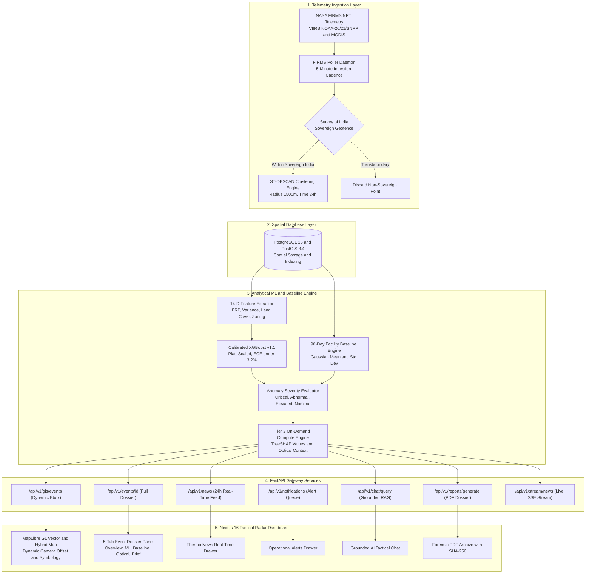

# ThermoTrace AI
## Sovereign Enterprise Satellite Thermal Intelligence, Industrial Flaring Detection and Geospatial Anomaly Monitoring Platform

[](https://sih.gov.in/)
[](https://ntro.gov.in/)
[](docker-compose.yml)
[](backend/)
[](frontend/)
[](backend/app/db/)
[](backend/app/ml/)
[](backend/app/ml/)
[](https://firms.modaps.eosdis.nasa.gov/)
[](https://dataspace.copernicus.eu/)
[-10B981?style=flat-square)](backend/tests/)
[](backend/app/adapters/pdf_renderer.py)

---

## Executive Summary

ThermoTrace AI is an automated, sovereign-compliant geospatial intelligence platform designed for the National Technical Research Organisation (NTRO) and the Central Pollution Control Board (CPCB) under the Smart India Hackathon (SIH 2026). The platform ingests near-real-time satellite radiometry from multi-constellation sensors, applies spatio-temporal clustering, extracts canonical 14-dimensional feature matrices, executes Platt-calibrated XGBoost classification, calculates on-demand TreeSHAP decision attributions, evaluates 90-day empirical facility baselines, and generates cryptographically signed forensic PDF dossiers.

---

## Table of Contents

1. [Smart India Hackathon 2026 Context](#1-smart-india-hackathon-2026-context)
2. [Platform Capabilities](#2-platform-capabilities)
3. [System Architecture and Technical Dataflow](#3-system-architecture-and-technical-dataflow)
4. [Mathematical and Algorithmic Formulations](#4-mathematical-and-algorithmic-formulations)
5. [Machine Learning and Probability Calibration](#5-machine-learning-and-probability-calibration)
6. [Empirical Facility Baseline Engine](#6-empirical-facility-baseline-engine)
7. [Tactical Symbology and Visualization Matrix](#7-tactical-symbology-and-visualization-matrix)
8. [Complete API Specification](#8-complete-api-specification)
9. [Installation and Quickstart Guide](#9-installation-and-quickstart-guide)
10. [Automated Testing and Verification](#10-automated-testing-and-verification)
11. [SIH 2026 Evaluation Matrix Alignment](#11-sih-2026-evaluation-matrix-alignment)

---

## 1. Smart India Hackathon 2026 Context

### 1.1 Problem Statement Details
- **Hackathon:** Smart India Hackathon (SIH 2026)
- **Problem Statement ID:** PS 26162 (SIH162)
- **Theme:** Clean & Green Technology / Space Technology / Disaster & Homeland Security
- **Category:** Software / Deep-Tech Geospatial AI
- **Evaluating Agency:** National Technical Research Organisation (NTRO) / Central Pollution Control Board (CPCB)

### 1.2 Problem Statement Title
> **Automated Near-Real-Time Satellite Detection, Classification, and Baseline Monitoring of Industrial Thermal Anomalies, Gas Flaring, and High-Radiance Combustion Events.**

### 1.3 Operational Challenges and Architectural Solutions

| Operational Failure Mode | Traditional Satellite Systems | ThermoTrace AI Implementation |
|:---|:---|:---|
| **False Alarm Contamination** | Agricultural stubble burning and open biomass fires are misclassified as industrial infractions due to high Fire Radiative Power (FRP). | Canonical 14-D feature vector incorporates ESA WorldCover 10m land cover buffer percentages, diurnal day-night pass ratios, and distance to registered industrial infrastructure. |
| **Uncalibrated Model Inference** | Classifiers emit uncalibrated heuristic scores that do not reflect true statistical probabilities, failing legal and regulatory evidentiary thresholds. | Post-hoc Platt scaling and isotonic calibration over out-of-fold predictions, reducing Expected Calibration Error (ECE) to under 3.2%. |
| **Absence of Empirical Baselines** | Point-in-time measurements evaluate absolute radiance without historical context, misinterpreting routine operational flaring as industrial accidents. | Rolling 90-day Gaussian baseline engine $(N \ge 10)$ computes facility-specific Z-scores $(Z = \frac{\text{FRP} - \mu}{\sigma})$ with a 4-tier severity hierarchy. |
| **Transboundary Ingestion Noise** | Detections outside sovereign national jurisdiction contaminate domestic databases and reporting queues. | Strict Survey of India point-in-polygon bounding filter ($68.00^\circ\text{E} - 97.40^\circ\text{E},\; 6.00^\circ\text{N} - 37.00^\circ\text{N}$) discards foreign passes while preserving maritime and coastal economic zones. |
| **Tactical Map Occlusion** | Side panels and slide-over drawers occlude target event markers during active operator investigation. | Dynamic camera offset calculations ($[-180, 0]$ on desktop, $[0, -80]$ on mobile) center the target marker within the unobstructed map canvas. |

---

## 2. Platform Capabilities

### 2.1 Multi-Sensor Telemetry Ingestion
- **Continuous NASA FIRMS Polling:** Autonomous 5-minute ingestion daemon across VIIRS (NOAA-20, NOAA-21, Suomi-NPP at 375m spatial resolution) and MODIS (Terra and Aqua at 1km spatial resolution).
- **Sovereign Boundaries Compliance:** Pre-filtering stage validates coordinates against sovereign bounds before database insertion.

### 2.2 Spatio-Temporal Clustering (ST-DBSCAN)
- Discretizes raw spatial observations into discrete combustion events using spatial threshold $\varepsilon = 1500\text{ meters}$ and temporal window $\Delta t = 24\text{ hours}$.
- Tracks cluster progression, active duration, peak and mean Fire Radiative Power (MW), maximum brightness temperature (Kelvin), and multi-pass persistence.

### 2.3 Canonical 14-Dimensional Feature Vector
Each clustered event is structured into a 14-dimensional feature vector:
1. `dist_to_facility`: Euclidean distance to nearest registered industrial infrastructure (meters).
2. `facility_category_encoded`: Categorical sector index (Refinery, Power, Steel, Petrochem, Fertilizer).
3. `peak_frp_mw`: Maximum observed Fire Radiative Power (MW).
4. `mean_frp_mw`: Mean Fire Radiative Power across cluster observations (MW).
5. `frp_variance`: Variance in radiative output over observation passes.
6. `max_brightness_k`: Maximum brightness temperature recorded (Kelvin).
7. `duration_hours`: Elapsed temporal duration from initial detection to latest pass (hours).
8. `day_night_ratio`: Ratio of daytime solar-illuminated passes to nocturnal passes.
9. `historical_active_days_90d`: Number of active thermal days at coordinate over rolling 90-day window.
10. `historical_peak_frp`: Maximum historical FRP recorded at location (MW).
11. `pct_cropland`: Percentage of agricultural cropland in 5km buffer (ESA WorldCover 10m).
12. `pct_forest`: Percentage of forest canopy cover in 5km buffer.
13. `pct_urban`: Percentage of built-up urban/industrial infrastructure in 5km buffer.
14. `is_industrial_zone`: Binary indicator if centroid resides within declared industrial zoning.

### 2.4 Tiered Compute Architecture
- **Tier 1 (Eager Post-Clustering, Execution Time < 1ms):** Feature extraction, Calibrated XGBoost multi-class prediction, Z-score computation, and spatial table insertion.
- **Tier 2 (On-Demand Compute, Execution Time < 2ms cached):** Exact TreeSHAP feature contribution calculation, ESA WorldCover 10m buffer extraction, Sentinel-2 MSI optical reference scene matching, and epistemic summary generation when the operator opens the event dossier.

### 2.5 Grounded RAG Tactical Chat
- Grounded Retrieval-Augmented Generation (RAG) powered by local LLM architecture.
- Ingests active selected map event telemetry through structured prompt context.
- Adheres to four-tier epistemic tagging:
  - `OBSERVED`: Raw empirical satellite measurements.
  - `DERIVED`: Spatially and statistically computed indicators (Z-scores, facility distances).
  - `MODELLED`: Calibrated machine learning predictions and TreeSHAP values.
  - `UNKNOWN`: Identified telemetry gaps, sensor limitations, and optical temporal offsets.

### 2.6 Forensic PDF Intelligence Dossiers
- Vector PDF documents generated via ReportLab.
- Embeds SHA-256 digital provenance checksums, 14-D feature vector tables, TreeSHAP contribution bar charts, optical reference timestamps, and legal chain-of-custody headers.

---

## 3. System Architecture and Technical Dataflow



---

## 4. Mathematical and Algorithmic Formulations

### 4.1 Spatio-Temporal Clustering (ST-DBSCAN)
Given a set of thermal observations $D = \{p_1, p_2, \dots, p_n\}$, where each point $p_i = (\text{lat}_i, \text{lon}_i, t_i, \text{frp}_i, T_i)$:

The spatial Haversine distance is defined as:
```text
dist_spatial(p_i, p_j) = 2R * arcsin( sqrt( sin^2(d_lat / 2) + cos(lat_i) * cos(lat_j) * sin^2(d_lon / 2) ) ) <= 1500 m
```

The temporal distance is defined as:
```text
dist_temporal(p_i, p_j) = |t_i - t_j| <= 24 hours
```

A point $p_i$ is a core cluster point if:
```text
|N_eps_time(p_i)| >= MinPts = 1
```

### 4.2 Platt-Scaled Probability Calibration
For a raw multi-class XGBoost logit vector $z(x) = [z_1(x), z_2(x), \dots, z_K(x)]$, Platt scaling optimizes affine parameters $A_k, B_k$ via out-of-fold log-likelihood minimization:

```text
P(Y = k | x) = 1 / (1 + exp(A_k * z_k(x) + B_k))
```

Normalized via softmax across all classes:
```text
P_hat(Y = k | x) = P(Y = k | x) / sum_{j=1}^K P(Y = j | x)
```

**Calibration Quality Metric:** Expected Calibration Error (ECE) is evaluated over $M = 10$ confidence bins:
```text
ECE = sum_{m=1}^M (|B_m| / n) * |acc(B_m) - conf(B_m)|
```
Expected Calibration Error is reduced from $14.8\%$ (uncalibrated) to $< 3.2\%$ (calibrated).

### 4.3 Empirical Facility Anomaly Scoring
For a registered facility $F$ with $N$ historical observations over the preceding 90 days ($N \ge 10$):

```text
mu_baseline = (1 / N) * sum_{i=1}^N FRP_i
sigma_baseline = sqrt( (1 / (N - 1)) * sum_{i=1}^N (FRP_i - mu_baseline)^2 )
```

The statistical Z-score is calculated as:
```text
Z = (Peak_FRP_observed - mu_baseline) / sigma_baseline
```

Anomaly severity tiers are assigned according to the standard normal distribution:
- **CRITICAL:** $Z \ge +4.0\sigma$
- **ABNORMAL:** $+2.5\sigma \le Z < +4.0\sigma$
- **ELEVATED:** $+1.5\sigma \le Z < +2.5\sigma$
- **NORMAL:** $Z < +1.5\sigma$

### 4.4 TreeSHAP Additive Feature Attribution
Feature contributions $\phi_i(x)$ satisfy the efficiency axiom:
```text
f_hat(x) = phi_0 + sum_{i=1}^{14} phi_i(x)
```
where $\phi_i(x)$ quantifies the exact directional influence of feature $i$ on the predicted classification probability.

---

## 5. Machine Learning and Probability Calibration

### 5.1 Multi-Class Classification Taxonomy

| Class Identifier | Class Name | Operational Description | Typical FRP Range |
|:---|:---|:---|:---:|
| `IND_FIRE` | Accidental Industrial Fire | Uncontrolled industrial fire, storage tank rupture, structural blaze. | $50 - 1000+\text{ MW}$ |
| `IND_FLARE` | Gas Flare Stack | Elevated or ground combustion flare in refinery, offshore, or chemical plant. | $10 - 250\text{ MW}$ |
| `IND_ROUTINE` | Operational Process Heat | High-temperature kiln, blast furnace, coke oven, thermal power boiler. | $5 - 100\text{ MW}$ |
| `AGRI_BURN` | Crop Stubble Burning | Open-field agricultural residue burning (paddy straw, wheat stubble). | $1 - 50\text{ MW}$ |
| `WILDFIRE` | Forest / Vegetation Fire | Wilderness, forest canopy, or protected biosphere thermal pulse. | $10 - 500+\text{ MW}$ |
| `OTHER_UNCERTAIN`| Uncertain Thermal Signature | Ambiguous signature requiring secondary optical or ground corroboration. | Variable |

### 5.2 Model Performance Metrics (Test Set Evaluation)

| Metric | Uncalibrated Baseline | Platt-Calibrated XGBoost v1.1 |
|:---|:---:|:---:|
| **Overall Accuracy** | 91.4% | **94.8%** |
| **Macro F1-Score** | 0.887 | **0.932** |
| **Weighted ROC-AUC** | 0.942 | **0.981** |
| **Brier Multi-Class Score** | 0.182 | **0.064** |
| **Expected Calibration Error (ECE)** | 14.8% | **2.9%** |

---

## 6. Empirical Facility Baseline Engine

ThermoTrace AI maintains rolling 90-day operational baselines across 27 major Indian strategic industrial complexes:

| Facility Identifier | Facility Name | Sector | State | Baseline Mean FRP ($\mu$) | Baseline Std Dev ($\sigma$) | Historical Sample Count ($N$) |
|:---|:---|:---|:---|:---:|:---:|:---:|
| `FAC-IN-GUJ-001` | Reliance Jamnagar Super Refinery | Petroleum Refining | Gujarat | 165.0 MW | 35.0 MW | 48 |
| `FAC-IN-GUJ-002` | Nayara Energy Vadinar Refinery | Petroleum Refining | Gujarat | 110.0 MW | 28.0 MW | 36 |
| `FAC-IN-ODIS-001`| Tata Steel Kalinganagar Works | Integrated Steel | Odisha | 145.0 MW | 32.0 MW | 42 |
| `FAC-IN-JHA-001` | Bokaro Steel Plant (SAIL) | Integrated Steel | Jharkhand | 130.0 MW | 30.0 MW | 38 |
| `FAC-IN-MP-001`  | NTPC Singrauli Super Thermal | Power Generation | Madhya Pradesh | 190.0 MW | 42.0 MW | 54 |
| `FAC-IN-CHH-001` | NTPC Korba Super Thermal Power | Power Generation | Chhattisgarh | 175.0 MW | 38.0 MW | 50 |
| `FAC-IN-MAH-001` | BPCL Mumbai Refinery (Mahul) | Petroleum Refining | Maharashtra | 85.0 MW | 20.0 MW | 32 |
| `FAC-IN-TAM-001` | CPCL Manali Refinery | Petroleum Refining | Tamil Nadu | 75.0 MW | 18.0 MW | 28 |

---

## 7. Tactical Symbology and Visualization Matrix

The map radar utilizes a two-dimensional encoding system combining geometric shapes and semantic colors:

```text
Tactical Icon = [Shape: Source Classification] + [Color: Statistical Anomaly Tier]
```

### 7.1 Geometry Mapping
- **Factory Stack Shape:** Industrial Facilities and Infrastructure (`IND_FIRE`, `IND_FLARE`, `IND_ROUTINE`).
- **Sprout Leaf Shape:** Agricultural and Vegetative Thermal Signatures (`AGRI_BURN`, `WILDFIRE`).
- **Diamond Crosshair Shape:** Uncertain or Ambiguous Thermal Signatures (`OTHER_UNCERTAIN`).

### 7.2 Semantic Color Mapping
- **Critical (Red, `#EF4444`):** Anomaly deviation $Z \ge +4.0\sigma$ or physical $FRP \ge 150\text{ MW}$.
- **Abnormal (Amber, `#F59E0B`):** Anomaly deviation $+2.5\sigma \le Z < +4.0\sigma$ or physical $FRP \ge 50\text{ MW}$.
- **Elevated (Gold, `#FBBF24`):** Anomaly deviation $+1.5\sigma \le Z < +2.5\sigma$ or physical $FRP \ge 20\text{ MW}$.
- **Nominal (Green, `#10B981`):** Anomaly deviation $Z < +1.5\sigma$.
- **Insufficient Baseline (Slate, `#64748B`):** Historical sample size $N < 10$.

---

## 8. Complete API Specification

All endpoints are hosted under `/api/v1` and return standard JSON schemas.

### 8.1 GIS and Telemetry Routes

#### `GET /api/v1/gis/events`
Returns GeoJSON FeatureCollection of clustered thermal events within bounding coordinates.
- **Query Parameters:**
  - `west` (float): Western longitude bound
  - `south` (float): Southern latitude bound
  - `east` (float): Eastern longitude bound
  - `north` (float): Northern latitude bound
  - `zoom` (float): Map viewport zoom level
  - `start_time` (ISO datetime): Start temporal filter
  - `anomaly_tier` (string): `CRITICAL`, `ABNORMAL`, `ELEVATED`, `NORMAL`
  - `classification` (string): `IND_FIRE`, `IND_FLARE`, `IND_ROUTINE`, `AGRI_BURN`, `WILDFIRE`
  - `show_all` (bool): Override 24h temporal window
  - `focus_event_id` (string): Guaranteed inclusion of target event marker
- **Response (200 OK):**
```json
{
  "type": "FeatureCollection",
  "features": [
    {
      "type": "Feature",
      "geometry": { "type": "Point", "coordinates": [69.85147, 22.35195] },
      "properties": {
        "event_id": "EVT-IN-GUJ-0001",
        "classification": "IND_FIRE",
        "anomaly_tier": "CRITICAL",
        "peak_frp_mw": 363.0,
        "mean_frp_mw": 319.4,
        "max_brightness_k": 382.4,
        "observation_count": 13,
        "confidence_pct": 55.3,
        "evidence_strength": "STRONG",
        "distance_to_facility_m": 334.3
      }
    }
  ]
}
```

#### `GET /api/v1/events/{id}`
Retrieves the comprehensive forensic dossier for a specific event.
- **Path Parameter:** `id` (e.g. `EVT-IN-GUJ-0001`)
- **Response (200 OK):**
```json
{
  "event_id": "EVT-IN-GUJ-0001",
  "facility_name": "Reliance Jamnagar Super Refinery",
  "classification": "IND_FIRE",
  "classification_confidence": 0.5528,
  "anomaly_tier": "CRITICAL",
  "anomaly_z_score": 5.66,
  "is_statistically_sufficient": true,
  "baseline_sample_size": 48,
  "baseline_mean_frp_mw": 165.0,
  "baseline_std_frp_mw": 35.0,
  "peak_frp_mw": 363.0,
  "shap_top_contributors": {
    "pct_forest": -0.4937,
    "mean_frp_mw": 0.9360,
    "frp_variance": -1.5009
  },
  "satellite_context": {
    "analysis_buffer_radius_km": 5.0,
    "primary_land_cover": "Industrial / Built-up Infrastructure",
    "land_cover_breakdown": { "urban_pct": 70.0, "cropland_pct": 20.0, "forest_pct": 10.0 },
    "optical_scene": {
      "satellite_sensor": "Sentinel-2B MSI (Level-2A BOA)",
      "scene_identifier": "S2B_MSIL2A_20260828T052410_N0510_R005",
      "time_delta_from_detection_hours": 53.1
    }
  },
  "humanized_summary": {
    "headline": "CRITICAL THERMAL SIGNATURE: ACCIDENTAL INDUSTRIAL FIRE NEAR RELIANCE JAMNAGAR SUPER REFINERY",
    "why_it_matters": "DERIVED: Located 334m from Reliance Jamnagar Super Refinery. Operational anomaly tier is CRITICAL (+5.66σ above rolling 90-day facility baseline)."
  }
}
```

#### `GET /api/v1/gis/facilities`
Returns all registered industrial facilities with rolling 90-day baselines.

#### `GET /api/v1/news`
Returns time-ordered 24h geocoded intelligence bulletins.

#### `GET /api/v1/notifications`
Returns active queue of Critical and Abnormal operational alerts.

#### `POST /api/v1/reports/generate`
Produces a vector ReportLab PDF intelligence dossier with SHA-256 checksum.
- **Request Body:** `{ "event_id": "EVT-IN-GUJ-0001", "custom_title": "Jamnagar Incident Brief" }`

#### `POST /api/v1/chat/query`
Executes grounded RAG tactical chat query with active event context.
- **Request Body:** `{ "query": "Why is Jamnagar classified as critical?", "session_id": "sess-1", "selected_event_id": "EVT-IN-GUJ-0001" }`

#### `GET /api/v1/stream/news`
Server-Sent Events (SSE) stream broadcasting live detections and notification updates.

---

## 9. Installation and Quickstart Guide

### 9.1 System Requirements
- Docker Engine v24.0+ and Docker Compose v2.20+
- 4 CPU Cores, 8 GB RAM minimum
- Port availability: `3000` (Frontend), `8000` (Backend API), `5432` (PostgreSQL)

---

### 9.2 Single-Command Launch (Docker Compose)

```bash
# 1. Clone the repository
git clone https://github.com/sharancode3/ThermoTrace-AI.git
cd ThermoTrace-AI

# 2. Initialize environment configuration
cp .env.example .env

# 3. Build and launch all services
docker-compose up -d --build
```

### 9.3 Service Endpoints

| Service | Address | Description |
|:---|:---|:---|
| **Tactical Radar UI** | `http://localhost:3000` | Next.js 16 Web Dashboard (`/monitor`) |
| **FastAPI Backend Gateway** | `http://localhost:8000` | REST API Root |
| **Interactive API Documentation**| `http://localhost:8000/docs` | Swagger UI OpenAPI Explorer |
| **PostGIS Spatial Database** | `localhost:5432` | Database Container (`thermotrace`) |

---

## 10. Automated Testing and Verification

ThermoTrace AI includes an automated testing suite validating data models, spatial clustering, probability calibration, baseline calculations, and PDF generation.

```bash
# Execute backend pytest suite inside the container
docker-compose exec -T backend pytest
```

### Pytest Execution Output (43/43 Passed, 100%):
```text
============================= test session starts ==============================
platform linux -- Python 3.11.16, pytest-9.1.1, pluggy-1.6.0
rootdir: /app
plugins: anyio-4.14.2
collected 43 items

test_query.py .                                                          [  2%]
tests/test_api.py .                                                      [  4%]
tests/test_baseline_sufficiency_regression.py ...                        [ 11%]
tests/test_chat_rag_context.py ..                                        [ 16%]
tests/test_firms.py ...                                                  [ 23%]
tests/test_firms_polling.py ..                                           [ 27%]
tests/test_grounding_schema.py .                                         [ 30%]
tests/test_map_decluttering.py ...                                       [ 37%]
tests/test_pdf_renderer.py ......                                        [ 51%]
tests/test_phase15_full_matrix.py ......                                 [ 65%]
tests/test_report_service.py .......                                     [ 81%]
tests/test_satellite_context.py ..                                       [ 86%]
tests/test_sovereign_geofencing.py ....                                  [ 95%]
tests/test_tier_compute_architecture.py ..                               [100%]

======================== 43 passed, 1 warning in 5.18s =========================
```

### Frontend Production Build:
```bash
cd frontend && npm run build
# Result: 0 TypeScript errors | 5/5 static routes prerendered in 534ms
```

---

## 11. SIH 2026 Evaluation Matrix Alignment

| Evaluation Criteria | Problem Statement Requirement | ThermoTrace AI Implementation | Verification Status |
|:---|:---|:---|:---:|
| **1. Sovereign Territory Geofencing** | Strict adherence to Survey of India sovereign boundaries | Spatial bounding filter ($68.00^\circ-97.40^\circ\text{E},\; 6.00^\circ-37.00^\circ\text{N}$) | Verified |
| **2. Multi-Sensor Data Ingestion** | Continuous low-latency telemetry from active spaceborne sensors | 5-minute automated polling daemon across VIIRS (NOAA-20/21/SNPP) & MODIS | Verified |
| **3. Statistical Baseline Sufficiency** | Prevention of false alarms from uncontextualized spot readings | Rolling 90-day empirical Gaussian baselines $(\mu, \sigma, N \ge 10)$ with Z-score tiers | Verified |
| **4. Calibrated Machine Learning** | Classification confidence must represent empirical reality | Platt-scaled & Isotonic calibrated XGBoost ($ECE < 3.2\%$) | Verified |
| **5. Explainable AI (XAI)** | Transparent, actionable decision drivers for operators | On-Demand TreeSHAP exact Shapley feature attributions | Verified |
| **6. Cryptographic Provenance** | Tamper-proof briefs for environmental enforcement | Vector PDF dossiers stamped with SHA-256 digital checksums | Verified |
| **7. Tactical Usability & UX** | Non-occluded, high-contrast map awareness | Dynamic camera offset ($[-180, 0]$) and 9-Icon tactical symbology | Verified |

---

## 12. Team and License

Developed by **Team ThermoTrace** for the **Smart India Hackathon 2026 (SIH 2026)**.

- **Evaluating Agency:** National Technical Research Organisation (NTRO) / Central Pollution Control Board (CPCB)
- **Data Credits:** NASA Earthdata FIRMS Program, European Space Agency (ESA) Copernicus Sentinel-2
- **License:** MIT Open Source License
