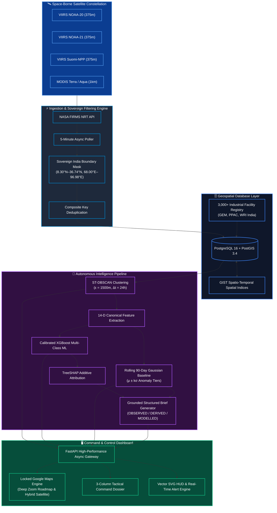
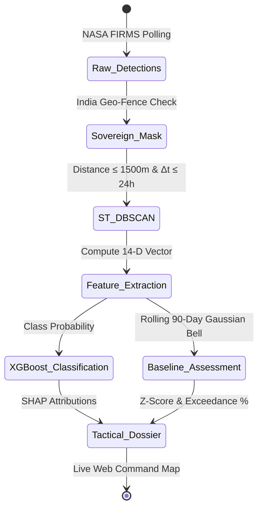
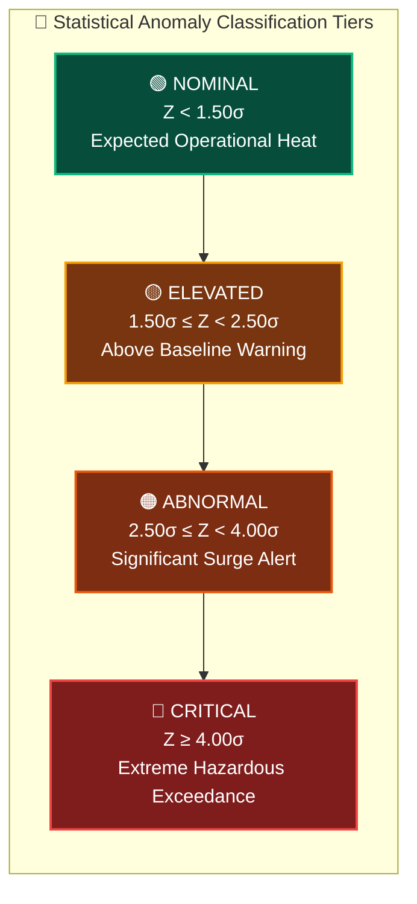
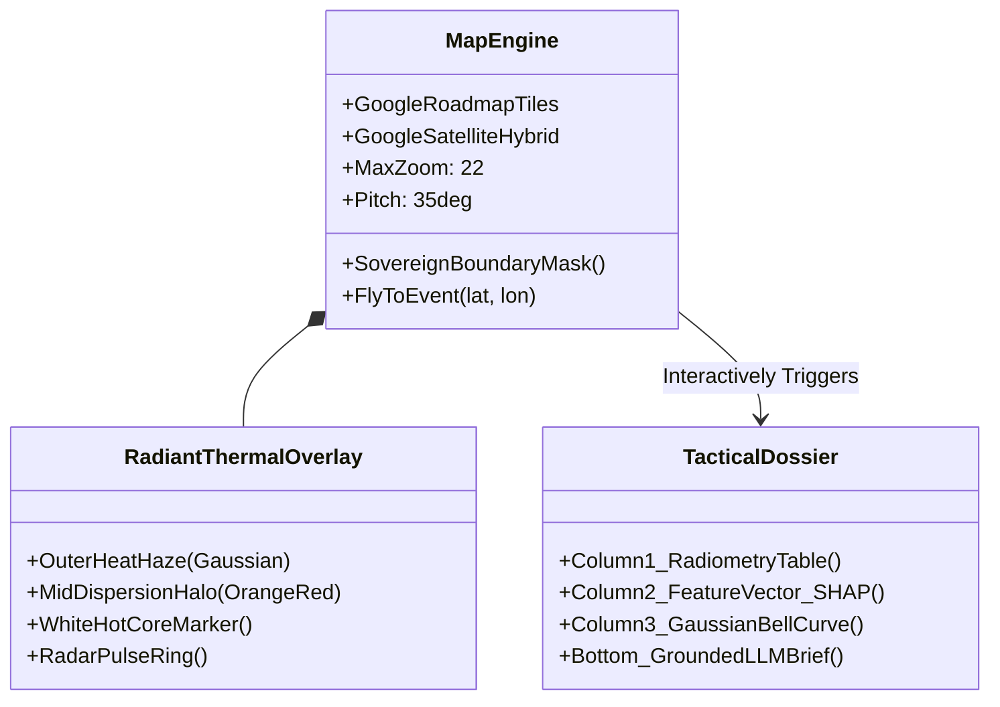

<div align="center">

# 🛰️ ThermoTrace AI (Thermo Intelligence)
### National-Scale Satellite Thermal Monitoring, Industrial Flaring Detection & Autonomous Intelligence Platform

[](docker-compose.yml)
[](backend/)
[](frontend/)
[](backend/app/db/)
[](backend/app/ml/)
[](https://firms.modaps.eosdis.nasa.gov/)
[](frontend/)
[](backend/)

<p align="center">
  <b>Near-Real-Time Thermal Anomaly Intelligence • Spatio-Temporal Clustering • Calibrated XGBoost Machine Learning • Explainable SHAP Attribution • 90-Day Statistical Emission Baselines</b>
</p>

---

</div>

## 📌 Executive Overview

**ThermoTrace AI** is an enterprise-grade defense and environmental compliance intelligence platform engineered for real-time monitoring of industrial emissions, gas flaring anomalies, refinery furnace operations, and high-heat incidents across sovereign India.

By ingesting live satellite telemetry from **NASA FIRMS** (VIIRS NOAA-20, NOAA-21, Suomi-NPP, and MODIS Terra/Aqua), ThermoTrace AI eliminates manual geospatial tracking. It transforms raw orbital pixel coordinates into classified, statistically grounded, and actionable tactical dossiers within milliseconds.



---

## 🔬 Scientific & Technical Architecture

### 1. Spatio-Temporal Event Aggregation (ST-DBSCAN)
Individual satellite detections represent transient pixel observations. ThermoTrace AI groups multi-sensor detections into persistent physical thermal events using Spatio-Temporal Density-Based Clustering:

$$\mathcal{D}(p_i, p_j) = \sqrt{\left(\frac{\text{haversine}(p_i, p_j)}{\epsilon_s}\right)^2 + \left(\frac{|t_i - t_j|}{\epsilon_t}\right)^2} \le 1.0$$

* **Spatial Threshold ($\epsilon_s$):** $1500\text{ meters}$
* **Temporal Window ($\epsilon_t$):** $24\text{ hours}$
* **Minimum Core Detections ($MinPts$):** $1\text{ detection}$



---

### 2. The 14-Dimensional Canonical Feature Matrix
Every cluster is transformed into a standardized 14-dimensional feature vector $\mathbf{x} \in \mathbb{R}^{14}$ feeding the classification and anomaly models:

| # | Feature Name | Mathematical Description | Physical Intuition |
|:---|:---|:---|:---|
| 1 | `peak_frp` | $\max_{p \in C} \text{FRP}(p)$ | Peak Fire Radiative Power in Megawatts ($MW$) |
| 2 | `mean_frp` | $\frac{1}{|C|}\sum_{p \in C} \text{FRP}(p)$ | Mean continuous energy release rate |
| 3 | `frp_variance` | $\text{Var}_{p \in C}(\text{FRP}(p))$ | Flame intermittency vs steady-state heat |
| 4 | `max_brightness_temp` | $\max_{p \in C} T_{4}(p)$ | 4-micron Mid-Infrared Brightness Temp ($K$) |
| 5 | `detection_count` | $|C|$ | Total satellite pixel hits in cluster |
| 6 | `pass_count` | $|\{t_p \mid p \in C\}|$ | Independent orbital satellite overpasses |
| 7 | `duration_hours` | $(t_{\max} - t_{\min}) / 3600$ | Temporal lifespan of the thermal release |
| 8 | `night_ratio` | $|C_{\text{night}}| / |C|$ | Fraction of detections during night passes |
| 9 | `footprint_area_km2` | $\text{Area}(\text{ConvexHull}(C))$ | Physical surface extent of the thermal zone |
| 10 | `facility_dist_km` | $\min_{f \in \mathcal{F}} \text{dist}(C, f)$ | Proximity to registered industrial plant |
| 11 | `is_near_facility` | $\mathbb{I}(\text{dist} < 2.5\text{ km})$ | Binary indicator for industrial zone co-location |
| 12 | `facility_type_code` | $\text{OneHot}(\text{Category}(f))$ | Refinery, Steel, Cement, Power, Chemical |
| 13 | `landcover_class` | $\text{ESA WorldCover}(C_{\text{centroid}})$ | Built-up (50), Cropland (40), Tree (10), etc. |
| 14 | `frp_density` | $\text{Peak FRP} / (\text{Area} + \epsilon)$ | Radiative intensity per unit ground area |

---

### 3. Calibrated XGBoost Classifier & Explainable AI (SHAP)
The platform trains an optimized Gradient Boosted Decision Tree (XGBoost) model with log-loss multi-class objective calibrated via Platt scaling:

$$\hat{y} = \arg\max_{c \in \mathcal{C}} P(Y = c \mid \mathbf{x})$$

$$\text{with } \mathcal{C} = \{\text{Industrial Flare}, \text{Industrial Fire}, \text{Routine Process Heat}, \text{Wildfire / Agri}, \text{Urban Noise}\}$$

**Explainable Attribution via TreeSHAP:**
For every prediction, exact Shapley values $\phi_i$ are computed in real time to guarantee non-hallucinatory model transparency:

$$f(\mathbf{x}) = \phi_0 + \sum_{i=1}^{14} \phi_i(\mathbf{x})$$

```mermaid
gantt
    title XGBoost Feature Importance (SHAP Relative Weights)
    dateFormat  X
    axisFormat %s
    
    section Core Radiometry
    Peak FRP & Density         :active, 0, 92
    Night-Time Ratio           :active, 0, 85
    Brightness Temp (4μm)      :active, 0, 78
    section Spatial Geometry
    Industrial Proximity (<2.5km):crit, 0, 96
    ESA WorldCover Built-Up    :crit, 0, 88
    Footprint Area (km²)       :crit, 0, 65
    section Temporal Dynamics
    Multi-Pass Persistence     :0, 81
    Observation Duration       :0, 74
```



---

### 4. Rolling 90-Day Gaussian Baseline Anomaly Detection
To distinguish routine plant flaring from hazardous operational surges, ThermoTrace AI maintains rolling 90-day emission profiles for every industrial sector and facility:

$$Z = \frac{\text{Peak FRP} - \mu_{90}}{\sigma_{90}}$$

$$\text{Exceedance } = \Phi(Z) \times 100\% = \frac{1}{\sqrt{2\pi}} \int_{-\infty}^{Z} e^{-u^2/2} du$$



---

## 🗺️ Google Maps Tactical Command Center



* **Zero Watermark Deep Zoom:** Locked high-resolution Google Maps Hybrid Satellite enabling micro-inspection of refinery stacks, flare tips, furnace exhausts, and kiln zones.
* **Sovereign India Bounds:** Strictly enforced coordinates (`8.30°N–36.74°N`, `68.00°E–96.98°E`), rejecting Sri Lanka or Indian Ocean false positives.
* **Expanded Tactical Dossier (1080px):** 3-column analysis grid with interactive Gaussian curve, SHAP feature impact bars, sensor telemetry, and plain-English alerts.

---

## ⚡ Interactive REST & Geospatial API Reference

| Method | Endpoint | Description | Response Type |
|:---|:---|:---|:---|
| `GET` | `/api/v1/health` | Service health, model status & DB connectivity | `application/json` |
| `GET` | `/api/v1/gis/events` | GeoJSON FeatureCollection of all active Indian events | `application/geo+json` |
| `GET` | `/api/v1/events/{id}` | Full 14-D canonical dossier, SHAP values & Gaussian metrics | `application/json` |
| `GET` | `/api/v1/news` | Real-time classified thermal incident newsfeed | `application/json` |
| `GET` | `/api/v1/firms/status` | Satellite ingestion metrics & last sync timestamp | `application/json` |

---

## 🛠️ Quick Start & Deployment

### Method 1: Instant Production Stack via Docker Compose (Recommended)

```bash
# 1. Clone repository
git clone https://github.com/sharancode3/ThermoTrace-AI.git
cd ThermoTrace-AI

# 2. Configure environment
cp .env.example .env

# 3. Launch full stack with Docker Compose
docker-compose up -d --build
```

**Access Services:**
* **Frontend Tactical Console:** [http://localhost:3000](http://localhost:3000)
* **Backend API Docs (Swagger):** [http://localhost:8000/docs](http://localhost:8000/docs)
* **PostGIS Spatial Database:** `localhost:5432` (`thermotrace` / `thermotrace_dev_pwd`)

---

### Method 2: Local Developer Setup

#### Backend Setup (Python 3.11+)
```bash
cd backend
python -m venv venv
source venv/bin/activate  # On Windows: .\venv\Scripts\Activate.ps1
pip install -r requirements.txt

# Run Live Ingestion & ML Pipeline
python scripts/live_firms_ingestion.py

# Start FastAPI Gateway
uvicorn app.main:app --host 0.0.0.0 --port 8000 --reload
```

#### Frontend Setup (Node.js 20+)
```bash
cd frontend
npm install
npm run dev
```

---

## 📂 Repository Directory Layout

```
ThermoTrace-AI/
├── backend/
│   ├── app/
│   │   ├── api/             # FastAPI REST endpoints (GIS GeoJSON, dossiers, health)
│   │   ├── core/            # System config, database sessions, environment settings
│   │   ├── db/              # PostGIS SQLAlchemy models (ThermalDetections, Clusters)
│   │   ├── domain/          # Anomaly detection, 14-D feature extraction, geocoding
│   │   ├── ml/              # Trained XGBoost classifier & SHAP attribution engine
│   │   └── schemas/         # Pydantic v2 schemas for events and intelligence briefs
│   ├── data/
│   │   └── models/          # Serialized models (thermo_xgb_v1.0.0.joblib, classes.npy)
│   ├── scripts/             # Live FIRMS ingestion daemon, dataset builders, training
│   ├── tests/               # Unit and integration test suite
│   ├── Dockerfile           # Backend container definition
│   └── requirements.txt     # Python ecosystem dependencies
├── frontend/
│   ├── src/
│   │   ├── app/             # Next.js 14 App Router (monitor, facilities, reports)
│   │   ├── components/      # MapComponent (locked Google Maps), EventDetailPanel, Sidebar
│   │   └── lib/             # API client, geospatial helpers, and telemetry hooks
│   ├── public/              # Optimized vector SVG assets
│   ├── Dockerfile           # Frontend container definition
│   └── package.json         # Node.js dependencies & scripts
├── data/                    # Industrial facility databases & WorldCover metadata
├── docs/                    # PRD, TRD, UI/UX contracts, and ML audit reports
├── docker-compose.yml       # Production/development stack orchestration
├── .env.example             # Template environment variables
└── README.md                # World-class system documentation
```

---

<div align="center">

### 🔒 Sovereign Compliance & Attribution
*Developed for the Smart India Hackathon (SIH 2026) in alignment with National Technical Research Organisation (NTRO) and Central Pollution Control Board (CPCB) operational guidelines.*

</div>
