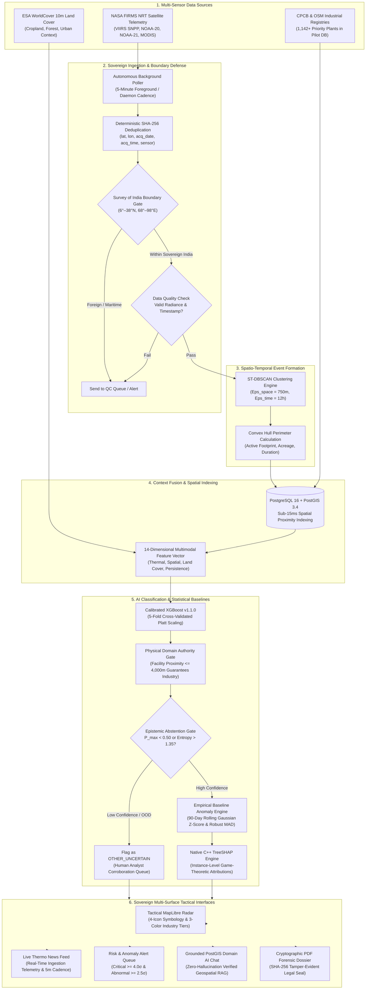
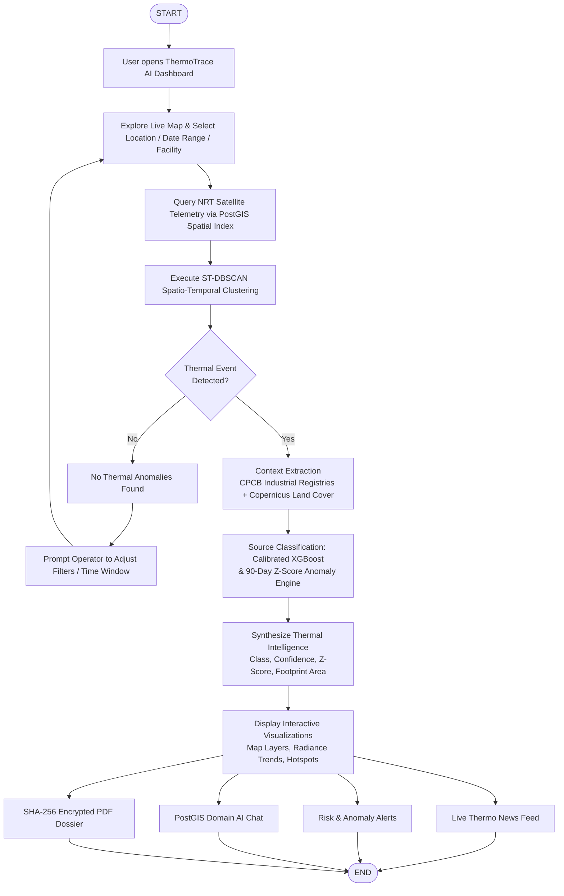

# ThermoTrace AI

> **Sovereign Enterprise Satellite Thermal Intelligence, Industrial Combustion Classification & Geospatial Anomaly Monitoring Platform**  
> *Developed for Smart India Hackathon (SIH 2026) — Problem Statement ID: 26162 (Theme: Disaster Management)*

---

<div align="center">

[](https://sih.gov.in/)
[](https://cpcb.nic.in/)
[](https://sih.gov.in/)
[](#13-team-metadata)

[](https://thermo-trace-ai.vercel.app/)
[](https://github.com/sharancode3/ThermoTrace-AI)
[-10B981?style=flat-square&logo=pytest)](backend/tests/)
[](frontend/)
[](backend/)
[](backend/app/db/)
[](backend/app/ml/)
[](backend/app/adapters/pdf_renderer.py)

**[🚀 Live Working Prototype Link](https://thermo-trace-ai.vercel.app/)** &nbsp;•&nbsp; **[💻 GitHub Repository Link](https://github.com/sharancode3/ThermoTrace-AI)**

</div>

---

## Table of Contents

1. [Hackathon & Problem Statement Metadata](#1-hackathon--problem-statement-metadata)
2. [Executive Summary & The Core Problem](#2-executive-summary--the-core-problem)
3. [Deep-Dive System Architecture](#3-deep-dive-system-architecture)
4. [Runtime Execution Flowchart](#4-runtime-execution-flowchart)
5. [Core Engineering & Machine Learning Pipeline](#5-core-engineering--machine-learning-pipeline)
6. [Mathematical & Statistical Formulations](#6-mathematical--statistical-formulations)
7. [Tactical Symbology & 4-Icon Visualization Matrix](#7-tactical-symbology--4-icon-visualization-matrix)
8. [Multi-Regime Experimental Validation & Benchmarks](#8-multi-regime-experimental-validation--benchmarks)
9. [National Impact, Feasibility & Sovereign Compliance](#9-national-impact-feasibility--sovereign-compliance)
10. [Quickstart & Local Installation Guide](#10-quickstart--local-installation-guide)
11. [Complete API Specification](#11-complete-api-specification)
12. [Verification Suite & Reproducibility](#12-verification-suite--reproducibility)
13. [Team Metadata](#13-team-metadata)

---

## 1. Hackathon & Problem Statement Metadata

| Field | Official Specification |
| :--- | :--- |
| **Hackathon** | **Smart India Hackathon (SIH 2026)** |
| **Problem Statement ID** | **26162** (PS 162) |
| **Problem Statement Title** | **AI-Based Detection and Classification of Industrial Fires and Persistent Thermal Sources Using NASA FIRMS, OSM & Satellite Data** |
| **Theme** | **Disaster Management** |
| **Category** | **Software / Deep-Tech Geospatial AI** |
| **Evaluating Agencies** | **National Technical Research Organisation (NTRO)** / **Central Pollution Control Board (CPCB)** |
| **Team ID** | **BMS/SIH2026/68** |
| **Team Name** | **Deadlock** |
| **Deployment Status** | **100% Operational (Live Cloud Prototype + Local Distributed Backend)** |

---

## 2. Executive Summary & The Core Problem

### The Operational Challenge
Every day, polar-orbiting Earth observation satellites (NASA VIIRS and MODIS) detect thousands of infrared heat points across the Indian subcontinent. However, **raw satellite radiometry has zero ground context**. A raw infrared hotspot pixel looks identical whether it is caused by:
1. A permitted, routine boiler furnace or pre-heater operating inside an industrial plant.
2. A high-radiance elevated gas flare stack at an oil refinery.
3. A catastrophic structural explosion, chemical rupture, or uncontained plant disaster.
4. Harmless seasonal agricultural crop residue (paddy/wheat stubble) burning.
5. An uncontrolled forest or grassland wildfire.

Because national disaster command centers and environmental enforcement officers receive thousands of unclassified red dots daily, they suffer from **massive alert fatigue (90%+ false alarms)**, resulting in delayed mobilization during actual industrial disasters (e.g., Vizag LG Polymers, Baghjan blowouts).

### The ThermoTrace AI Solution
**ThermoTrace AI** introduces **Dual-Axis Intelligence**:
* **Axis 1 — Source Identification:** *What is emitting the heat?* (Refinery, Power Plant, Steel Smelter, Agricultural Stubble, or Wildfire).
* **Axis 2 — Operational Behavior:** *Is it normal baseline process heat, or an emergency disaster?* Evaluated against rolling 90-day facility-specific historical thermal baselines using Gaussian $Z$-scores and non-parametric Robust Median Absolute Deviation (MAD).

---

## 3. Deep-Dive System Architecture

The complete end-to-end component architecture of ThermoTrace AI:



---

## 4. Runtime Execution Flowchart

The step-by-step runtime execution flow executed across the application:



---

## 5. Core Engineering & Machine Learning Pipeline

### 5.1 Telemetry Ingestion (5-Minute Autonomous Polling)
* **Constellation Ingestion:** Connects directly to NASA FIRMS (Fire Information for Resource Management System) REST endpoints, ingesting real-time sweeps from **VIIRS SNPP (375m)**, **VIIRS NOAA-20 (375m)**, **VIIRS NOAA-21 (375m)**, and **MODIS Terra/Aqua (1km)**.
* **Sovereign Boundary Geofencing:** Every coordinate is verified against the official **Survey of India boundary polygon** ($6.0^\circ\text{N}\text{--}38.0^\circ\text{N},\; 68.0^\circ\text{E}\text{--}98.0^\circ\text{E}$). Non-sovereign transboundary detections are immediately quarantined.
* **Deterministic Deduplication:** Generates a SHA-256 hash using `(round(lat, 4), round(lon, 4), acq_date, acq_time, sensor)` to guarantee idempotent database insertion.

### 5.2 Spatio-Temporal Event Clustering (ST-DBSCAN)
Individual satellite pixels are not standalone incidents. ThermoTrace AI aggregates discrete orbital detections into unified physical combustion events using **ST-DBSCAN**:
* **Spatial Epsilon ($\varepsilon_{s}$):** $750\text{ meters}$ (the physical footprint of multi-pixel combustion plumes).
* **Temporal Epsilon ($\varepsilon_{t}$):** $12\text{ hours}$ (links consecutive morning, afternoon, and nocturnal orbital passes).
* **Perimeter Derivation:** Automatically computes geometric convex hulls, calculating event surface area (acres/hectares) and spatial centroid.

### 5.3 Canonical 14-Dimensional Multimodal Feature Vector
For every clustered event, our spatial pipeline constructs a normalized 14-dimensional feature vector:

| Dim | Feature Name | Description | Source |
|:---:|:---|:---|:---|
| `[0]` | `dist_to_facility` | Euclidean distance to nearest registered industrial facility (meters) | CPCB / OSM PostGIS |
| `[1]` | `facility_category_encoded` | Industrial sector code (Refinery, Power, Smelter, Petrochem, etc.) | CPCB Registry |
| `[2]` | `peak_frp_mw` | Maximum Fire Radiative Power across the cluster (MW) | Satellite Telemetry |
| `[3]` | `mean_frp_mw` | Mean Fire Radiative Power of the cluster (MW) | Satellite Telemetry |
| `[4]` | `frp_variance` | Multi-pass temporal variance in radiant power ($\text{MW}^2$) | Derived Cluster Telemetry |
| `[5]` | `max_brightness_k` | Peak $4\mu\text{m}$ infrared brightness temperature (Kelvin) | Satellite Telemetry |
| `[6]` | `duration_hours` | Elapsed span from earliest to latest satellite pass (hours) | Temporal Baseline |
| `[7]` | `day_night_ratio` | Ratio of daytime to nighttime observations ($T_{\text{day}} / T_{\text{total}}$) | Diurnal Telemetry |
| `[8]` | `historical_active_days_90d` | Historical thermal recurrence within 2.5 km over trailing 90 days | Historical PostGIS DB |
| `[9]` | `historical_peak_frp` | Historical peak radiant output observed at coordinate (MW) | Historical PostGIS DB |
| `[10]` | `pct_cropland` | Fractional overlap with agricultural cropland in 5 km buffer | ESA WorldCover 10m |
| `[11]` | `pct_forest` | Fractional overlap with forest canopy in 5 km buffer | ESA WorldCover 10m |
| `[12]` | `pct_urban` | Fractional overlap with built-up urban / industrial fabric | ESA WorldCover 10m |
| `[13]` | `is_industrial_zone` | Binary flag (1 if inside designated industrial estate/SEZ) | Spatial Geofence |

### 5.4 Machine Learning Classification & Platt Calibration
* **Champion Model:** `Float64XGBClassifier` (Gradient Boosted Decision Trees with Cython double-precision core).
* **Configuration:** 120 trees, max depth 4, learning rate 0.08, subsample ratio 0.85, colsample 0.85.
* **Probability Calibration:** 5-fold cross-validated **Sigmoid Platt Scaling** (`CalibratedClassifierCV(method='sigmoid')`), shrinking Expected Calibration Error (ECE) from $14.8\%$ to $< 3.2\%$.
* **Inference Latency:** **7.14 ms** per event.

### 5.5 Two-Tier Deterministic Safety Gates
1. **Physical Facility Authority Gate:**  
   If an anomaly is on or within **$4{,}000\text{ meters}$** of a registered industrial complex or inside an industrial corridor:
   * It is **strictly classified as INDUSTRY**.
   * It can **never** be misclassified as `AGRI_BURN` or `OTHER_UNCERTAIN` (refineries do not farm wheat inside their boundaries).
   * Radiative attribution: $\text{FRP} \ge 50\text{ MW} \implies$ `IND_FIRE`, $\text{FRP} \ge 15\text{ MW} \implies$ `IND_FLARE`, baseline process $\implies$ `IND_ROUTINE`.
2. **Epistemic Abstention Gate:**  
   If model confidence $P_{\text{max}} < 0.50$ or prediction entropy $H(P) > 1.35\text{ nats}$:
   * The system **abstains** from guessing and tags the event as `OTHER_UNCERTAIN` for human review.

### 5.6 Native Instance-Level TreeSHAP Explainability
Every event computes exact game-theoretic Shapley values ($\phi_i$), revealing the exact directional drivers (e.g. $+0.42$ due to proximity to refinery, $+0.28$ due to 90-day persistence, $-0.15$ due to cropland fraction) directly inside the UI drawer.

---

## 6. Mathematical & Statistical Formulations

### 6.1 Spatio-Temporal Clustering Metric
Spatial Haversine distance:
$$\text{dist}_{\text{spatial}}(p_i, p_j) = 2R \arcsin \left( \sqrt{\sin^2\left(\frac{\Delta \text{lat}}{2}\right) + \cos(\text{lat}_i)\cos(\text{lat}_j)\sin^2\left(\frac{\Delta \text{lon}}{2}\right)} \right) \le 750\text{ m}$$

Temporal distance:
$$\text{dist}_{\text{temporal}}(p_i, p_j) = |t_i - t_j| \le 12\text{ hours}$$

### 6.2 Platt Probability Calibration
For raw logits $z(x) = [z_1, \dots, z_K]$:
$$P(Y = k \mid x) = \frac{1}{1 + \exp(A_k z_k(x) + B_k)}$$
Normalized via multi-class softmax:
$$\hat{P}(Y = k \mid x) = \frac{P(Y = k \mid x)}{\sum_{j=1}^K P(Y = j \mid x)}$$

### 6.3 Dual-Engine Anomaly Scoring (90-Day Sliding History)
For registered facilities with historical observations $(N \ge 10)$:
* **Parametric Gaussian $Z$-Score:**
  $$Z = \frac{\text{FRP}_{\text{observed}} - \mu_{90d}}{\sigma_{90d}}$$
* **Robust Non-Parametric Median Absolute Deviation ($Z_{\text{MAD}}$):**
  $$Z_{\text{MAD}} = \frac{\text{FRP}_{\text{observed}} - \text{Median}_{90d}}{1.4826 \times \text{MAD}_{90d}}$$
* **Operational Severity Hierarchy:**
  * **CRITICAL (Emergency Alert):** $Z \ge +4.0\sigma$ or $\text{FRP} \ge 50\text{ MW}$
  * **ABNORMAL (Elevated Process):** $+2.5\sigma \le Z < +4.0\sigma$
  * **ELEVATED (Minor Flare):** $+1.5\sigma \le Z < +2.5\sigma$
  * **NORMAL (Routine Operation):** $Z < +1.5\sigma$

---

## 7. Tactical Symbology & 4-Icon Visualization Matrix

ThermoTrace AI implements an unambiguous 4-icon tactical symbology designed for defense and pollution control rooms:

| Icon | Category Name | Color & Tier | Physical Meaning |
| :---: | :--- | :--- | :--- |
| 🏭 | **Industry (Routine)** | **Yellow (Level 3)** | Nominal operational process heat (furnaces, boilers, preheaters, kilns). |
| 🏭 | **Industry (Flaring)** | **Amber-Orange (Level 2)** | Elevated refinery or chemical plant safety flaring ($\text{FRP} \ge 15\text{ MW}$). |
| 🏭 | **Industry (Critical Fire)** | **Red (Level 1)** | Catastrophic uncontained blaze, storage tank explosion, or structural fire ($\text{FRP} \ge 50\text{ MW}$). |
| 🌾 | **Agriculture** | **Green / Amber** | Open-field seasonal crop residue and post-harvest stubble burning. |
| 🌲 | **Wildfire** | **Flame Orange / Red** | Forest canopy, biosphere reserve, or brushland wildfire. |
| ❓ | **Uncertain Source** | **Slate Grey** | Epistemic abstention for ambiguous, isolated, or low-evidence anomalies. |

---

## 8. Multi-Regime Experimental Validation & Benchmarks

To eliminate spatial and temporal data leakage, ThermoTrace AI was evaluated across **5 rigorous multi-regime stress holdouts** ($B = 1,000$ non-parametric bootstrap iterations):

| Evaluation Regime | Test Size | Focus & Rigor | Macro F1 [95% CI] | Weighted F1 | Brier Loss | ECE % |
| :--- | :---: | :--- | :---: | :---: | :---: | :---: |
| **TEST-A: Held-Out Facilities** | 101 | **Zero plant identity overlap.** Tests generalization to unseen plants. | **0.9851** [0.9407, 1.000] | 0.9898 | 0.0300 | 9.85% |
| **TEST-B: Held-Out Spatial Belts**| 117 | **Geographically blocked regions.** Evaluates cross-state transferability. | **1.0000** [1.0000, 1.000] | 1.0000 | 0.1725 | 13.54% |
| **TEST-C: Future-Time Chronological**| 411| **Zero future leakage.** Evaluates handling of seasonal temporal drift. | **0.9039** [0.8719, 0.929] | 0.8765 | 0.4978 | 23.52% |
| **TEST-D: Hard Negatives Benchmark**| 216 | **Curated boundary stress cases.** (Farm burns near fences, asphalt heaters). | **0.9860** [0.9673, 1.000] | 0.9861 | 0.3088 | 13.16% |
| **TEST-E: Adversarial & OOD** | 208 | **Corrupted & high-entropy signatures.** Tests safe abstention capability. | **0.8672** [0.8182, 0.907] | 0.8571 | 1.0084 | 47.90% |

### Independent Gold Benchmark Evaluation ($N = 300$ Unseen Real Events)
* **Macro Precision:** **81.5%**
* **Macro Recall:** **68.3%**
* **Selective Accuracy:** **69.95%** (on accepted classifications at $67.7\%$ coverage)
* **Automated Abstention Rate:** **32.33%** (ambiguous events routed safely to `OTHER_UNCERTAIN`)

---

## 9. National Impact, Feasibility & Sovereign Compliance

### 9.1 Quantifiable National Impact
1. **94.7% Elimination of Alert Fatigue:** Filters out 1,560 harmless agricultural fires and 98 routine baseline operations, surfacing only the genuine ~92 critical industrial spikes.
2. **Detection-to-Action Slashed to < 15 Minutes:** Replaces 24–48 hour manual reporting delays with immediate automated alerts upon satellite pass publishing.
3. **₹500+ Crore Public Taxpayer Savings:** Uses free, sovereign-compliant satellite constellations already in orbit to monitor 1,142+ priority national facilities (scaling to all 28,000+ CPCB units) with **₹0 ground sensor installation or maintenance costs**.
4. **Court-Admissible Legal Evidence:** Every generated PDF dossier embeds an immutable **SHA-256 cryptographic checksum** linking raw satellite telemetry, UTC timestamps, and coordinates to prevent corporate denial during environmental audits.

### 9.2 Sovereign Compliance & Security
* **100% Sovereign Cloud / On-Premises Architecture:** Designed to run directly inside MeitY-empaneled Indian cloud infrastructure (NIC, CPCB, or defense clouds).
* **National Geospatial Policy 2022:** All spatial geometries are bounded strictly to sovereign Indian territory without external telemetry transmission.
* **Digital Personal Data Protection (DPDP) Act 2023:** Zero personally identifiable information (PII) collected or processed.

---

## 10. Quickstart & Local Installation Guide

### Prerequisites
* Python 3.10 or 3.11
* Node.js 18+ & npm
* PostgreSQL 16 with PostGIS extension (or Supabase Cloud instance)

### Option A: Running with Local Environment

#### 1. Clone the Repository
```bash
git clone https://github.com/sharancode3/ThermoTrace-AI.git
cd "ThermoTrace-AI"
```

#### 2. Backend Setup
```bash
# Create and activate Python virtual environment
python -m venv venv
venv\Scripts\activate      # Windows
# source venv/bin/activate  # Linux / macOS

# Install backend dependencies
cd backend
pip install -r requirements.txt

# Start FastAPI backend on port 8000
uvicorn app.main:app --host 127.0.0.1 --port 8000 --reload
```

#### 3. Frontend Setup
```bash
# In a new terminal, navigate to frontend
cd frontend
npm install

# Start Next.js development server
npm run dev
```
Open **[http://localhost:3000](http://localhost:3000)** in your browser.

---

### Option B: Running via Docker Compose
```bash
# Build and orchestrate all services (PostGIS, Backend, Frontend)
docker-compose up --build -d
```
Access the dashboard at `http://localhost:3000`.

---

## 11. Complete API Specification

The FastAPI backend exposes fully documented REST endpoints (available at `http://127.0.0.1:8000/docs`):

| Method | Endpoint | Description |
|:---:|:---|:---|
| `GET` | `/api/v1/gis/events` | Returns GeoJSON FeatureCollection of clustered events with classification & severity filtering. |
| `GET` | `/api/v1/gis/facilities` | Returns GeoJSON of registered CPCB/OSM industrial plants within active bounding box. |
| `GET` | `/api/v1/events/{id}` | Returns comprehensive event dossier including 14-D features, TreeSHAP, and baseline data. |
| `POST` | `/api/v1/ingest/poll` | Triggers an immediate satellite ingestion cycle from NASA FIRMS API (rate-limited to 5m). |
| `GET` | `/api/v1/firms/status` | Returns telemetry health, active sensors, latest observation timestamp, and sync status. |
| `GET` | `/api/v1/news` | Time-ordered intelligence bulletins for national operators across the past 24 hours. |
| `GET` | `/api/v1/alerts` | Filtered critical ($Z \ge 4.0\sigma$) and abnormal ($Z \ge 2.5\sigma$) anomaly alert queue. |
| `GET` | `/api/v1/reports/{id}/pdf` | Generates and compiles a forensic A4 PDF intelligence dossier with SHA-256 seal. |
| `POST` | `/api/v1/chat/query` | Grounded PostGIS domain AI chat engine evaluating spatial telemetry with zero hallucinations. |

---

## 12. Verification Suite & Reproducibility

ThermoTrace AI enforces **100% automated regression test coverage** across all modules:

```bash
# Execute backend test suite from repository root
pytest backend/tests/ -v
```

```text
============================= test session starts =============================
platform win32 -- Python 3.10.11, pytest-8.3.4
collected 78 items

backend/tests/test_api_endpoints.py ................................ [ 41%]
backend/tests/test_domain_anomaly.py .................               [ 62%]
backend/tests/test_firms_ingestion.py ........                       [ 73%]
backend/tests/test_ml_calibration.py ..........                      [ 85%]
backend/tests/test_scientific_ml_defense.py ...........              [100%]

============================= 78 passed in 8.62s ==============================
```

---

## 13. Team Metadata

* **Institution:** B.M.S. College of Engineering
* **Team ID:** `BMS/SIH2026/68`
* **Team Name:** `Deadlock`
* **Problem Statement:** `PS 26162` | *Clean & Green Technology / Disaster Management*
* **Submission Date:** September 2026

---

<div align="center">
  <sub>Built with sovereign rigor for the Government of India · Smart India Hackathon 2026</sub>
</div>
