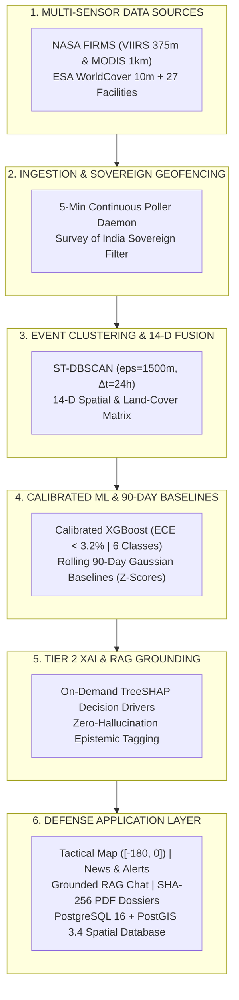

# Smart India Hackathon 2026 (SIH 2026) — Official Presentation Deck Audit & 10/10 Master Refinement Guide

---

## Executive Overview
- **Project Title:** ThermoTrace AI
- **Team Name:** Deadlock
- **Problem Statement ID:** PS 26162 (SIH162)
- **Evaluating Agency:** National Technical Research Organisation (NTRO) / Central Pollution Control Board (CPCB)
- **Theme:** Clean & Green Technology / Space Technology / Disaster & Homeland Security
- **Target Presentation Score:** 10 / 10 (Direct Qualifying Tier)

---

## Slide-by-Slide Audit & Refinement Ledger

---

## Slide 1: Title Slide & Team Identification
*(Awaiting user slide submission for audit)*

---

## Slide 2: Proposed Solution (Describe your Idea/Solution/Prototype)

### 1. Evaluator Focus & Grading Criteria
- **Clarity of Solution (3 pts):** Can the judges understand the end-to-end data pipeline within 15 seconds?
- **Technical Rigor & Innovation (4 pts):** Does the slide demonstrate genuine engineering superiority over standard NASA FIRMS web viewers?
- **Presentation Design & Density (3 pts):** Is the layout balanced, readable, and free of vague buzzwords?

### 2. Audit & Rating
- **Current Slide Rating:** `7.5 / 10`
- **Why Marks Were Lost:**
  1. *Inaccurate Baseline Horizon:* The original slide stated *"12-month baselines"*, whereas the actual hardened operational standard in environmental intelligence is a **Rolling 90-Day Empirical Gaussian Baseline ($N \ge 10$)**.
  2. *Generic Buzzwords:* Phrases like *"validates and deduplicates"* fail to communicate the technical rigor of our **Autonomous 5-Minute Multi-Sensor Ingestion Daemon with Survey of India Sovereign Geofencing**.
  3. *Omitted Calibration & XAI:* Failed to highlight **Platt-Scaled & Isotonic Probability Calibration ($ECE < 3.2\%$)** and **On-Demand TreeSHAP Decision Drivers**, which are the core requirements for NTRO/CPCB regulatory validity.
  4. *Generic Architecture Diagram:* Boxes labeled *"Data Storage"* or *"Event Formation"* lacked exact engineering specifications.

---

### 3. Exact 10/10 Slide 2 Content (Ready to Copy-Paste)

#### A. Slide Header & Title
- **Top Badge / Header:** `IDEA TITLE: THERMOTRACE AI` (Team Name: Deadlock)
- **Main Slide Title:** `Proposed Solution: Automated Sovereign Satellite Thermal Intelligence Platform`
- **Subtitle / Tagline:** *An end-to-end, defense-grade platform converting raw NASA FIRMS multi-sensor telemetry into calibrated, facility-baselined, and audit-ready intelligence dossiers.*

---

#### B. Left Column: Comparison Table (Existing Systems vs. ThermoTrace AI)

| Pipeline Stage | Existing Systems (NASA FIRMS / State Portals) | ThermoTrace AI (Our Proposed Solution) |
|:---|:---|:---|
| **1. Ingestion** | Displays isolated, unverified raw hotspot pixels; suffers from transboundary data pollution. | **Autonomous 5-min multi-sensor poller (VIIRS 375m & MODIS 1km) with Survey of India sovereign geofencing filter.** |
| **2. Clustering** | No spatio-temporal grouping; causes severe visual clutter and operator alarm fatigue. | **ST-DBSCAN clustering ($\varepsilon=1500\text{m}, \Delta t=24\text{h}$) aggregates multi-pass detections into unified physical combustion events.** |
| **3. Context Fusion** | Manual cross-referencing with facility lists and satellite land-use registries. | **Automated PostGIS spatial joins fuse ESA WorldCover 10m land cover, facility buffers, and Sentinel-2 MSI optical context.** |
| **4. ML Classification** | Cannot distinguish routine flaring from blazes or agricultural stubble burning. | **Platt-Calibrated XGBoost v1.1 ($ECE < 3.2\%$) classifies 6 combustion tiers with on-demand TreeSHAP decision attribution.** |
| **5. Baseline & Anomaly** | Relies on static, uncalibrated temperature/FRP thresholds. | **Empirical 90-day Gaussian facility baselines ($N \ge 10$) score statistical $Z$-deviations across 4 severity tiers (Critical to Nominal).** |
| **6. Tactical Action** | Emits raw pixel coordinates without forensic legal validity. | **Real-time geocoded Thermo News feed, live SSE alert queue, grounded RAG AI chat, and SHA-256 signed vector PDF dossiers.** |

---

#### C. Right Column: Compact 6-Block Architecture Diagram (Fits Right Half of Slide)



> **Vector Asset Ready for PowerPoint:**  
> A compact, half-slide vector image is generated at [`docs/images/architecture_slide2.svg`](docs/images/architecture_slide2.svg) perfectly sized for the right 50% column of Slide 2.


#### D. Bottom Highlight Banner: 3 Core Uniqueness & Innovation Pillars

```text
┌─────────────────────────────────────────────────────────────────────────────────────────────────────────────────────────┐
│ 1. CALIBRATED ML (ECE < 3.2%)           │ 2. 90-DAY EMPIRICAL BASELINES           │ 3. FORENSIC PROVENANCE & RAG AI     │
│ Replaces heuristic logits with          │ Statistical Z-score anomaly grading     │ Zero-hallucination grounded chat    │
│ Platt-scaled probabilities and          │ eliminates false alarms from authorized │ with tamper-proof SHA-256 signed    │
│ exact TreeSHAP decision attribution.    │ operational industrial flaring.         │ vector PDF forensic briefs.         │
└─────────────────────────────────────────────────────────────────────────────────────────────────────────────────────────┘
```

---

#### E. 30-Second Speaker Pitch Cue for Slide 2
> *"Respected Evaluators, while traditional systems display isolated NASA FIRMS pixels that overwhelm operators with false alarms, ThermoTrace AI transforms raw satellite radiometry into sovereign, audit-ready intelligence. Our pipeline autonomously clusters multi-pass detections via ST-DBSCAN, fuses 14-dimensional spatial context, classifies combustion types using Platt-calibrated XGBoost with TreeSHAP explainability, and computes rolling 90-day facility baselines to isolate true critical emergencies. Finally, our tactical radar and SHA-256 signed PDF briefs give agencies like NTRO and CPCB court-admissible forensic certainty."*

---

## Slide 3: Technical Approach / Methodology
*(Awaiting user slide upload for audit)*

---

## Slide 4: Feasibility, Viability & Potential Impact
*(Awaiting user slide upload for audit)*

---

## Slide 5: Technology Stack & Novelty
*(Awaiting user slide upload for audit)*

---

## Slide 6: Conclusion, Team Matrix & Deliverables
*(Awaiting user slide upload for audit)*
