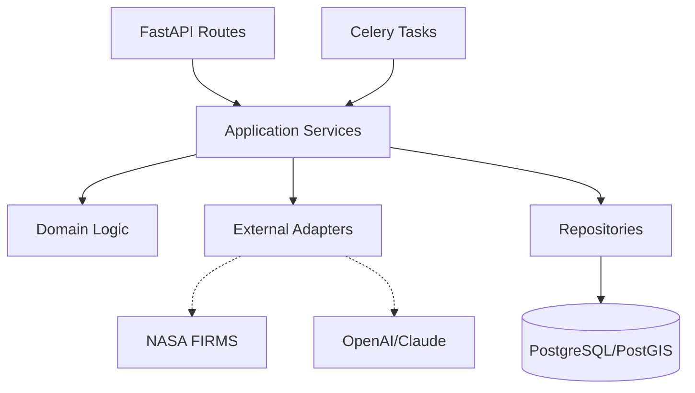
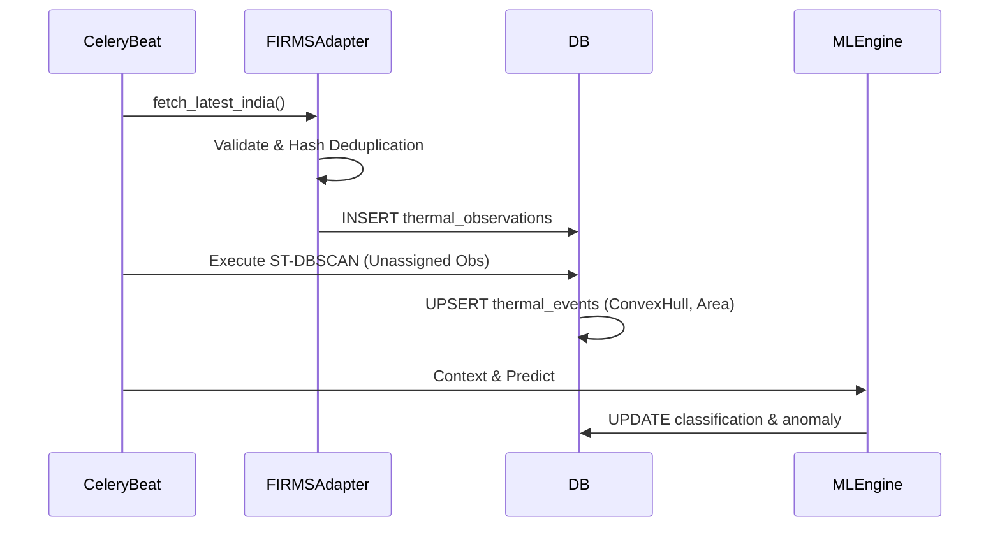
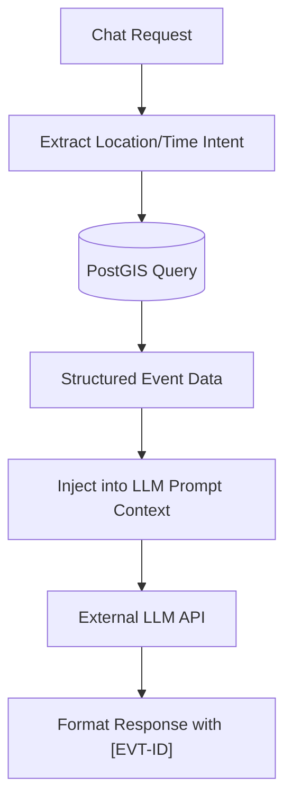
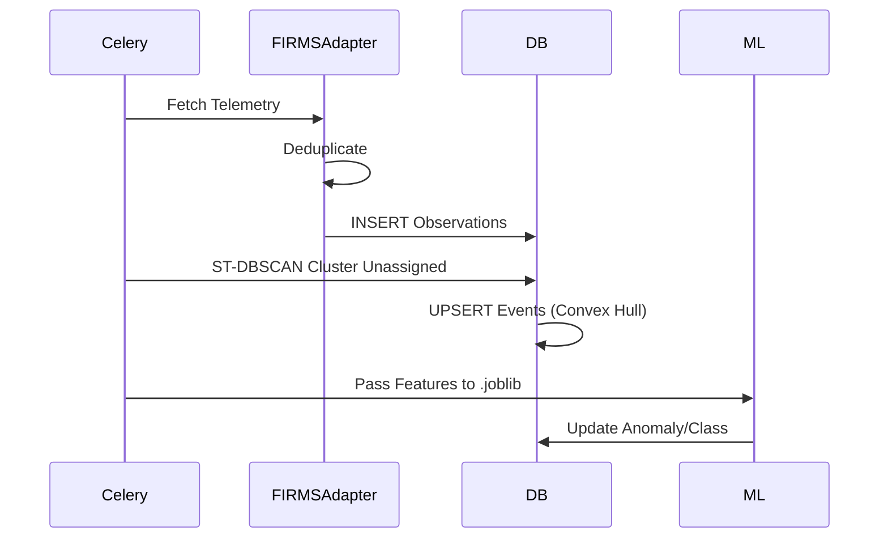

# BACKEND ARCHITECTURE DOCUMENT
## Thermo Intelligence — Industrial Fire & Persistent Thermal Source Detection

---

## 1. Purpose
This document establishes the structural architecture for the Thermo Intelligence backend application. It dictates how FastAPI, Celery workers, PostGIS interactions, ML inference, and external APIs are organized and isolated. It serves as the authoritative blueprint to prevent tightly coupled spaghetti code and ensure independent agents/developers can build features in parallel.

## 2. Source Documents
This architecture is constrained and guided by the following locked project contracts:
1. `Thermo_Intelligence_PRD.md`
2. `Thermo_Intelligence_TRD.md`
3. `Thermo_Intelligence_Workflow.md`
4. `Thermo_Intelligence_Database_Storage.md`
5. `Thermo_Intelligence_UIUX.md`
6. `Thermo_Intelligence_DB_API_Contract.md`
7. `openapi.yaml`
8. `Thermo_Intelligence_System_Architecture.md`
9. `Thermo_Intelligence_Frontend_Architecture.md`

## 3. Backend Principles
* **Routes are Thin**: FastAPI endpoints handle HTTP mapping, Pydantic validation, and auth. They delegate immediately to Services.
* **Services Coordinate**: Services stitch together Domain logic, external Adapters, and Repositories.
* **Domain Owns Logic**: Complex calculations (anomalies, ML mapping) live in pure Python domain modules.
* **Repositories Own Data**: Repositories abstract SQLAlchemy/PostGIS queries. Services never write raw SQL.
* **Workers Own Heavy Tasks**: Synchronous HTTP requests must not block on GIS clustering, PDF rendering, or LLM generation.
* **Adapters Isolate Vendors**: NASA FIRMS, LLMs, and object storage are hidden behind interfaces.

## 4. Technology Context
* **Core**: Python 3.11+, FastAPI, Pydantic, Uvicorn (ASGI).
* **Database**: PostgreSQL 16, PostGIS 3.4, `asyncpg`, SQLAlchemy 2.0 (Async Session).
* **Async Workers**: Celery with Redis broker.
* **Geospatial**: `geopandas`, `shapely`, `rasterio` (for Python-side transforms); PostGIS functions (`ST_Intersects`, `ST_ConvexHull`) for DB-side execution.
* **ML Inference**: `scikit-learn`, `xgboost`, loading `.joblib` artifacts directly.
* **Testing**: `pytest`, `httpx`.

## 5. Backend Architectural Overview & 6. Layering Model


## 7. Application Structure
```text
backend/
├── app/
│   ├── main.py                 # FastAPI Application Factory
│   ├── api/                    # HTTP Layer
│   │   ├── routes/             # Endpoints (e.g., v1/events.py)
│   │   ├── dependencies.py     # Auth, DB Session injections
│   │   └── errors.py           # Global exception handlers
│   ├── core/                   # Application Core
│   │   ├── config.py           # Pydantic BaseSettings
│   │   └── logging.py          # Structured logger config
│   ├── db/                     # Data Access Layer
│   │   ├── models/             # SQLAlchemy ORM classes
│   │   ├── repositories/       # Data access abstractions
│   │   └── session.py          # SQLAlchemy engine/sessionmaker
│   ├── domain/                 # Pure Business Logic
│   │   ├── anomaly.py          # Z-score math
│   │   ├── clustering.py       # ST-DBSCAN parameters
│   │   └── features.py         # 14-dim ML feature vector generation
│   ├── ml/                     # ML Integration
│   │   ├── model.py            # .joblib loader & inference wrapper
│   │   └── models/             # The physical .joblib artifacts
│   ├── schemas/                # Pydantic DTOs (Requests/Responses)
│   ├── services/               # Orchestration Layer
│   └── adapters/               # External System Integrations
│       ├── firms_client.py
│       └── llm_client.py
├── workers/                    # Celery Application
│   ├── celery_app.py           # Celery configuration
│   └── tasks/                  # Async jobs (ingest.py, reports.py)
└── tests/
```

## 8. API Architecture & 9. Route Organization
The API layer is strictly organized around the resources defined in `openapi.yaml`.
* `/api/v1/events` -> `app/api/routes/events.py`
* `/api/v1/gis` -> `app/api/routes/gis.py`
* `/api/v1/news` -> `app/api/routes/news.py`
* `/api/v1/search` -> `app/api/routes/search.py`
* `/api/v1/chat` -> `app/api/routes/chat.py`
* `/api/v1/reports` -> `app/api/routes/reports.py`

Routes are kept under 20 lines of code, delegating to injected application services.

## 10. Application Services
Coordinate multi-step business logic across repositories and domains.
* `EventService`: Coordinates fetching event details, history, and context.
* `GISService`: Coordinates viewport translation into PostGIS spatial queries.
* `NewsService`: Determines if state changes warrant a `thermo_news` record.
* `ChatService`: Coordinates intention extraction, DB querying, and LLM synthesis.

## 11. Domain Logic
Pure Python logic devoid of HTTP, Celery, or SQLAlchemy sessions.
* **Anomaly Engine**: Calculates `(obs - mean) / std` and maps it to `NORMAL`, `ELEVATED`, `ABNORMAL`, `CRITICAL`.
* **Feature Builder**: Transforms raw dict records into the exact `[lat, lon, frp, mean_frp, std_frp, ...]` 14-dimensional array for XGBoost.

## 12. Database Access & 13. PostGIS Architecture
* **SQLAlchemy 2.0**: Uses `geoalchemy2` for PostGIS column types (`Geometry('POINT', srid=4326)`).
* **Repositories**: Abstract the ORM. e.g., `EventRepository.get_events_in_bbox(bbox, filters)`.
* **Spatial Delegation**: Operations like `ST_DWithin`, `ST_MakeEnvelope`, and `ST_ConvexHull` are executed via SQLAlchemy `func` directly inside PostGIS to avoid pulling huge datasets into Python memory.

## 14. Event Processing & 15. FIRMS Ingestion

* **Execution**: Fully asynchronous via Celery background workers.

## 16. External Adapters
* `FIRMSClient`: Wraps `httpx` to handle NASA's API, rate limits (HTTP 429), retries, and API Key injection. Returns normalized Python dataclasses.
* `LLMClient`: Wraps OpenAI/Gemini SDKs to ensure standard interfaces regardless of the vendor.

## 17. Facility Context & 18. Land-Cover Context
* **Facility Context**: `GISService` queries `ST_Distance(event.centroid, facility.geom) < 2000m` to associate active events with refineries, steel plants, etc.
* **Land-Cover Context**: (Future/MVP Extension) GeoPandas/Rasterio queries localized TIFF indexes to check for forest vs. urban overlay.

## 19. ML Inference & 20. ML Versioning & 21. Failure Handling
* **Loader**: `app/ml/model.py` loads `thermo_xgb_v1.joblib` at module initialization (singleton) into FastAPI/Celery memory.
* **Inference**: Synch/Async wrapper `predict_classification(features: list[float]) -> str`.
* **Versioning**: A database table `ml_models` tracks the active model hash.
* **Failure Handling**: If the `.joblib` is missing or fails, the event is marked `OTHER_UNCERTAIN` and an error is logged. The system does not crash or hallucinate.

## 22. Baseline Engine & 23. Anomaly Engine
* **Baseline Engine**: A weekly Celery task (`tasks.baseline`) recalculates `facility_baselines` based on 30-60 days of historical `RESOLVED` events.
* **Anomaly Engine**: A fast synchronous calculation run during the Event Processing loop, querying the baseline and writing the Z-score and `anomaly_tier`.

## 24. Event Lifecycle
Events move linearly through:
`ACTIVE` -> `COOLING` (No observations for 24h) -> `RESOLVED` (No observations for 72h).
Managed entirely by scheduled Celery jobs.

## 25. Thermo News & 26. Notifications & 27. SSE
* **Trigger**: A state change (e.g., Event moves to `CRITICAL`).
* **Service**: `NewsService` generates a headline and inserts into `thermo_news`.
* **Broker**: Publishes a JSON payload to Redis channel `thermo:stream`.
* **API**: `GET /api/v1/stream` returns an `EventSourceResponse` (SSE) yielding Redis payloads to connected browsers.

## 28. Chat / RAG

* **Strict Boundary**: The LLM *cannot* execute SQL directly (Text2SQL is unsafe for MVP). The backend translates the intent, executes safe SQLAlchemy queries, and injects the results into the prompt context.

## 29. Search
`SearchService` executes a parallel `asyncio.gather` across:
1. Facilities (ILIKE match)
2. Events (Event ID match)
3. Regions (State name match)
Transforms results into the unified `SearchResponse` DTO.

## 30. Reports
* **Trigger**: API creates a `reports` record with status `PENDING`.
* **Worker**: Celery task fetches event data, renders `app/reports/templates/dossier.html` using Jinja2, converts to PDF using WeasyPrint/Playwright, uploads to Storage.
* **Complete**: Updates record to `COMPLETED` with download URL.

## 31. Satellite Imagery
* Future expansion. Architecture supports swapping `FIRMSAdapter` for `PlanetAdapter` using the same External Adapter patterns.

## 32. Workers & 33. Celery/Redis & 34. Scheduling
* **Celery App**: Standard initialization.
* **Tasks**:
  * `ingest_firms_india`: Runs every 30m.
  * `process_unassigned_observations`: Runs every 5m.
  * `update_event_lifecycle`: Runs hourly.
  * `generate_pdf_report`: Triggered on demand.
* **Redis**: Used as the Celery message broker and result backend.

## 35. Transactions & 36. Concurrency & 37. Idempotency
* **Transactions**: Enforced at the Application Service layer using SQLAlchemy's async Context Managers (`async with session.begin():`).
* **Concurrency**: PostGIS row-level locks used when updating `thermal_events` to prevent race conditions during high-volume ingestion.
* **Idempotency**: Celery tasks are designed to be run multiple times safely. The FIRMS SHA256 deduplication ensures duplicate observations are ignored at the DB level via `ON CONFLICT DO NOTHING`.

## 38. Caching
* **Redis**: Used to cache the `GET /api/v1/gis/events` response for 30-60 seconds, reducing load on PostGIS during massive map panning by users.

## 39. Configuration & 40. Secrets
* Uses `pydantic-settings`. Config is read from `.env` or system environment variables.
* Secrets (`FIRMS_MAP_KEY`, `OPENAI_API_KEY`, `DATABASE_URL`) are strongly typed in `core/config.py` but never logged or returned in API payloads.

## 41. Authentication
* **MVP**: simple static Admin token (`X-Admin-Key`) for triggering ingestions manually. General UI is read-only or session-based as defined in the UI/UX.

## 42. Error Handling & 43. Logging
* Global FastAPI Exception Handlers map custom exceptions (e.g., `EventNotFoundError`) to standard JSON envelopes:
  `{"error": {"code": "NOT_FOUND", "message": "..."}}`
* Uses standard `logging` with structured JSON output formatting (for Loki integration).

## 44. Observability & 72. Correlation
* Uses `prometheus_fastapi_instrumentator` to expose `/metrics`.
* Every request is injected with a `X-Request-ID` middleware, which is attached to all log lines via `contextvars` to trace requests across the API.

## 45. API Performance & 46. GIS Performance
* **Pagination**: Enforced on list endpoints.
* **Viewport Culling**: `/api/v1/gis/events` forces `bbox` input. PostGIS `ST_Intersects` uses GiST indexes. Returns lightweight GeoJSON `properties`, omitting large JSON telemetry blobs.

## 47. Event Detail Performance
* Fetches `Event`, `Observations`, `Facility`, and `Baseline` efficiently using SQLAlchemy `joinedload` options to prevent N+1 query problems.

## 48. API Contract & 49. DB Contract & 50. ML Contract Integration
* **API**: FastAPI routes return Pydantic `schemas/` that exactly match `openapi.yaml`.
* **DB**: SQLAlchemy `models/` exactly match `Thermo_Intelligence_DB_API_Contract.md`. Alembic migrations guarantee the database schema.
* **ML**: The feature extractor outputs exactly 14 features matching the ML contract.

## 51. Storage Abstraction
```python
class StorageAdapter(Protocol):
    async def upload(self, file_path: str, destination: str) -> str: ...
```
Implemented as `LocalStorageAdapter` for MVP (saving to `/app/data`). Can easily swap to `S3StorageAdapter` later without changing `ReportService`.

## 52. LLM Provider Abstraction
Similar `Protocol` pattern used to ensure `ChatService` does not depend directly on `openai.AsyncOpenAI` client.

## 53. Validation
* Handled strictly by Pydantic models at the API boundary, ensuring invalid types or missing parameters return a 422 Unprocessable Entity *before* touching application code.

## 54. Testing & 55. Mocking
* **Pytest**: Over 80% coverage target.
* **Mocks**: `FIRMSClient` and `LLMClient` are aggressively mocked in tests to prevent making outbound HTTP calls during CI/CD.

## 56. Rate Limiting
* FastApi `slowapi` extension used to rate-limit expensive endpoints like `/chat` and `/reports/generate` (e.g., 5 requests per minute per IP).

## 57. Health Checks
`GET /api/v1/health` probes PostGIS connection, Redis connection, and checks the timestamp of the latest `thermal_observation` to report ingestion freshness.

## 58. Admin Operations
Endpoints under `/api/v1/admin/` require `X-Admin-Key` header and allow triggering ad-hoc Celery tasks (e.g., forced ingestion, demo data replay).

## 59. Development/Agent Ownership
| Agent Role | Owns | Responsibilities |
| :--- | :--- | :--- |
| **API Dev** | `app/api/`, `app/schemas/` | HTTP mapping, OpenAPI compliance |
| **Data Eng** | `app/db/`, `app/adapters/` | PostGIS queries, NASA FIRMS ingestion |
| **ML Dev** | `app/ml/`, `app/domain/` | XGBoost `.joblib`, feature pipelines |
| **Workers** | `workers/` | Celery configuration, PDF generation |

## 60. Dependency Rules
1. `app/domain` imports NOTHING from `app/api` or `app/db`.
2. `app/db/repositories` imports NOTHING from `app/api`.
3. `workers/` can import from `app/services` and `app/db`.
4. Circular imports are prevented by strict top-down layering.

## 61. Module Responsibility Matrix
| Module | Responsibility | Reads | Writes | External Dependencies |
| :--- | :--- | :--- | :--- | :--- |
| `app.api` | HTTP Layer | None | None | FastAPI, Pydantic |
| `app.services` | Orchestration | Repositories, Adapters | Repositories | None |
| `app.domain` | Business Rules | None | None | Scikit-learn, Shapely |
| `app.db` | Data Access | PostGIS | PostGIS | SQLAlchemy, asyncpg |
| `app.adapters` | External Systems | FIRMS, LLM | None | HTTPX |

## 62. API-Service-Repository Matrix
| Endpoint | Route Module | Application Service | Repository | Background Job? |
| :--- | :--- | :--- | :--- | :--- |
| `GET /events` | `api/routes/events.py` | `EventService` | `EventRepository` | No |
| `GET /gis/events`| `api/routes/gis.py` | `GISService` | `EventRepository` | No |
| `POST /reports` | `api/routes/reports.py`| `ReportService` | `EventRepository` | Yes (PDF builder) |

## 63. Worker Task Matrix
| Task | Trigger | Input | Processing | Output | Retry |
| :--- | :--- | :--- | :--- | :--- | :--- |
| `ingest_firms` | Cron (30m) | None | HTTP GET FIRMS | DB Inserts | Exp Backoff |
| `process_events` | Cron (5m) | None | ST-DBSCAN, ML | Events, News | Yes |
| `generate_pdf` | API Trigger | `Event_ID` | Jinja2 + WeasyPrint| S3 URL | No |

## 64. Provider Matrix
| Provider | Adapter | Purpose | Authentication | Failure Behavior |
| :--- | :--- | :--- | :--- | :--- |
| NASA FIRMS | `FIRMSClient` | Telemetry Ingest | `MAP_KEY` header | Task Retry |
| OpenAI/Gemini| `LLMClient` | Chat Synthesis | Bearer Token | Return fallback msg |

## 65. Transaction/Side-Effect Matrix
| Operation | DB Transaction | External Calls | Async? | Idempotent? |
| :--- | :--- | :--- | :--- | :--- |
| `FIRMS Ingest` | Insert block | GET NASA API | Yes (Worker) | Yes (Hash Check) |
| `Chat Query` | Read Only | POST LLM API | No (API route)| Yes |

## 66. Sequence Diagrams

### FIRMS Ingestion & Event Processing


## 67. Failure Matrix
| Failure | Detection | Immediate Action | User Impact | Recovery |
| :--- | :--- | :--- | :--- | :--- |
| FIRMS Timeout | HTTPX Exception | Halt Ingest | Stale map data | Auto-retry next tick |
| DB Disconnect | SQLAlchemy Error| 503 Return | UI fails to load | Auto-reconnect pool |
| `.joblib` Missing| Startup check | Crash App | Service Down | DevOps deployment fix |

## 68. Startup / Shutdown
* **Startup**: Load environment config -> Initialize SQLAlchemy Connection Pool -> Initialize Redis Pool -> Load XGBoost `.joblib` to RAM.
* **Shutdown**: Close active HTTP requests -> Drain Celery tasks -> Disconnect DB/Redis safely.

## 69. Model Lifecycle & 70. Versioning
Trained models (`.joblib`) are built externally in Jupyter/Kubeflow. They are injected into the Docker image at build time (e.g., `COPY models/v1.joblib /app/ml/models/`). Changes to feature schema require coordinated backend PRs to update `app/domain/features.py`.

## 71. Security Architecture
* SQL Injection prevented by SQLAlchemy ORM usage.
* Protected endpoints verified via `Depends(verify_token)`.
* Pydantic enforces payload type strictness preventing NoSQL/JSON injection attacks.

## 73. Resource Management & 74. Graceful Degradation
* **GIL Locks**: Heavy ST-DBSCAN clustering in Python is handed off to Celery to prevent blocking the FastAPI ASGI event loop (which would halt all map tile requests).
* **Degradation**: If Redis crashes, the SSE stream fails gracefully with client-side reconnect logic, but standard HTTP API requests continue unaffected.

## 75. MVP vs Future
* **MVP**: SQLite/Local volume for models and reports. Celery and FastAPI running in docker-compose.
* **Future**: Kubernetes deployment, separate ML microservice for heavy PyTorch satellite image processing, Managed PostgreSQL (RDS/CloudSQL).

## 76. ADRs
* **ADR-01**: *Modular Monolith*. Speeds MVP development by sharing SQLAlchemy models between API and Workers.
* **ADR-03**: *Repositories*. Insulates the API from SQL syntax and allows easier testing via mock repositories.
* **ADR-04**: *Celery*. Ensures FastAPI remains perfectly responsive to rapid MapLibre GeoJSON viewport requests.
* **ADR-07**: *Grounded RAG*. Pre-fetching data from PostGIS before calling the LLM guarantees zero hallucinations and ensures defense-grade intelligence accuracy.

## 77. Architecture Validation
* **Flow C (Event Details)**: `GET /events/X` -> Route calls `EventService` -> Calls `EventRepository.get_event_with_context(X)` -> Executes `joinedload` query -> Returns Pydantic model. Clear, stateless, decoupled.
* **Flow E (Chat)**: Route calls `ChatService` -> Parses parameters -> `EventRepository.search(...)` -> Formats Markdown -> Passes to `LLMAdapter` -> Returns structured API response.

## 78. Final Architecture Principles
> **Routes are thin. Services coordinate use cases. Domain logic owns business rules. Repositories own database access. Adapters own external providers. Workers own expensive processing. PostGIS owns authoritative spatial storage. ML inference is integrated cleanly. The DB/API contract is never silently changed.**
