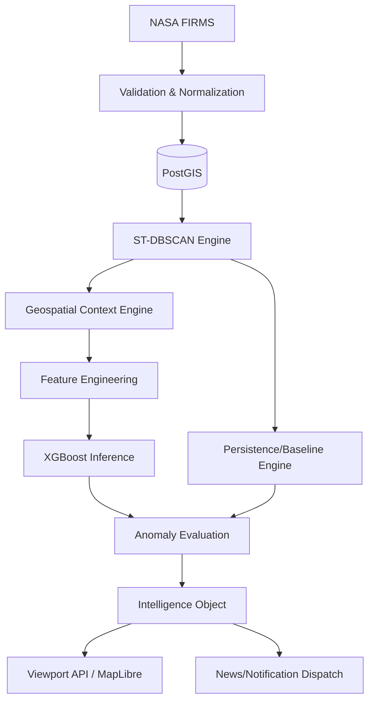

# DATA + ML + GIS PROCESSING ARCHITECTURE DOCUMENT
## Thermo Intelligence — Industrial Fire & Persistent Thermal Source Detection

---

## 1. Purpose
This document establishes the authoritative architecture for the data pipeline, geospatial processing, machine learning, and GIS delivery mechanisms within Thermo Intelligence. It defines how raw FIRMS observations are ingested, validated, clustered into events, enriched with spatial context, scored by ML, evaluated against historical baselines, and ultimately transformed into the Intelligence Object consumed by the GIS frontend.

## 2. Source Documents
This architecture strictly implements the contracts defined in:
1. `Thermo_Intelligence_PRD.md`
2. `Thermo_Intelligence_TRD.md`
3. `Thermo_Intelligence_Workflow.md`
4. `Thermo_Intelligence_Database_Storage.md`
5. `Thermo_Intelligence_UIUX.md`
6. `Thermo_Intelligence_DB_API_Contract.md`
7. `openapi.yaml`
8. `Thermo_Intelligence_System_Architecture.md`
9. `Thermo_Intelligence_Frontend_Architecture.md`
10. `Thermo_Intelligence_Backend_Architecture.md`

## 3. Data/ML/GIS Principles
* **Raw Data is Preserved**: Normalization never overwrites or destroys the original observation source provenance.
* **Proximity is Context, Not Truth**: A fire near a refinery is an agricultural burn until the ML model says otherwise. Spatial joins provide context, not classification.
* **Deterministic ML Contract**: The feature vector extracted from the DB exactly matches the schema expected by the `.joblib` model.
* **Separation of Dimensions**: Classification (`IND_FLARE`), Persistence (`PERSISTENT`), and Anomaly (`CRITICAL`) are strictly independent analytical calculations.

## 4. System Context & 5. Core Data Sources
The system integrates:
1. **NASA FIRMS**: The live thermal telemetry stream (VIIRS, MODIS).
2. **Industrial Facilities (GEM/WRI/OSM/PPAC)**: The static master registry of industrial points/polygons.
3. **Land-Cover**: High-resolution categorical rasters (e.g., ESA WorldCover) used for extracting crop/forest overlap.

## 6. Data Ownership & 7. Data Lifecycle
| Data Stage | Owner | Mutability | Storage Destination |
| :--- | :--- | :--- | :--- |
| **Stage 1 (External)** | NASA/Providers | Immutable | Source API |
| **Stage 2 (Raw Ingest)** | FIRMS Worker | Immutable | Logs/S3 (Optional) |
| **Stage 3 (Normalized)** | Ingestion Engine | Immutable | `thermal_observations` |
| **Stage 4 (Derived Event)**| ST-DBSCAN Engine | Mutable | `thermal_events` |
| **Stage 5 (Context)** | GIS Engine | Mutable | `thermal_events` |
| **Stage 6 (ML Class)** | ML Inference | Mutable | `event_classifications` |
| **Stage 7 (Anomaly)** | Baseline Engine | Mutable | `event_anomalies` |
| **Stage 8 (GIS Deliver)** | API Layer | Dynamic | JSON/API Payloads |

## 8. Ingestion Architecture & 9. FIRMS India Ingestion
The FIRMS Ingestion worker polls NASA APIs for India `(bbox=[68.0, 6.0, 97.0, 36.0])` every 30 minutes. 
* **Validation**: Drops null coordinates or FRP. Ensures bounds are within India.
* **Normalization**: Maps diverse sensor fields (VIIRS SNPP/NOAA-20) to the canonical schema.

## 10. Raw vs Normalized Data
The original FIRMS payload is discarded once normalized into the database `thermal_observations` schema, unless debugging is enabled, saving storage space. Provenance (`satellite_sensor`, `observation_timestamp_utc`) is preserved in the relational row.

## 11. Data Quality & 12. Deduplication
* **Quality**: Observations with impossible Tb (e.g., > 1000K or < 200K) or FRP < 0 are logged and dropped.
* **Deduplication**: Handled natively by PostgreSQL. A unique constraint exists on:
  `dedup_key = SHA256(round(lat, 4) || round(lon, 4) || acq_date || acq_time || sensor)`
  Repeated polling attempts silently ignore duplicates (`ON CONFLICT DO NOTHING`).

## 13. Spatial Indexing
PostGIS acts as the core spatial engine.
* **GiST Indexes**: Present on all `geometry` columns.
* **Backend Execution**: Bounding-box queries (`ST_Intersects`) and distance queries (`ST_DWithin(geography, geography, meters)`) run in the database.
* **Python Execution**: Advanced cluster hull manipulation or raster overlay happens in Python (`geopandas`, `shapely`).

## 14. Industrial Data Normalization & 15. Facility Geometry Strategy
The `industrial_facilities` table holds the master registry.
* **Point-only Facility**: Has `ST_Point` centroid. Analysis uses a predefined spatial buffer (e.g., 2km radius) as an approximation.
* **Polygon Facility**: Has `ST_Polygon`. Analysis uses precise intersection.
Points are never falsely cast to polygons.

## 16. Facility Association & 17. Land-Cover Processing & 18. Land-Cover Preparation
* **Facility**: A spatial query identifies if an event's `ST_ConvexHull` intersects a facility polygon or falls within 2km of a facility point.
* **Land-Cover**: Large TIFF rasters (ESA WorldCover) are partitioned/tiled. Python (`rasterio`) queries the event bounding box against the raster to calculate percentage overlaps (e.g., "45% Cropland").

## 19. Event Formation & 20. Event Updates
Unassigned observations are grabbed by the Event Processor.
* **Algorithm**: ST-DBSCAN.
* **Thresholds**: `eps_spatial = 750m`, `eps_temporal = 12h`, `MinPts = 1`.
* **Update**: If a new observation falls within the threshold of an active event, it is appended to the event. The event's geometry (`ST_ConvexHull(all_observations)`), `peak_frp_mw`, and `duration_hours` are updated.

## 21. Event Merge / Split & 22. Event Geometry
* **Merge**: If two distinct active events expand such that their bounding hulls intersect and overlap in time, the background worker merges the newer event ID into the older event ID.
* **Geometry**: A single observation creates a buffered point (approximating sensor pixel size). Multiple observations calculate a convex hull envelope. Area is calculated by casting to `Geography`.

## 23. Feature Engineering & 24. Feature Groups
The Feature Builder extracts 14 standardized features from the DB.
* **Spatial**: `dist_to_facility`, `facility_category_encoded`.
* **Radiometric**: `peak_frp_mw`, `mean_frp_mw`, `frp_variance`, `max_brightness_k`.
* **Temporal**: `duration_hours`, `day_night_ratio`.
* **Historical**: `historical_active_days_90d`, `historical_peak_frp`.
* **Land-cover**: `pct_cropland`, `pct_forest`, `pct_urban`.

## 25. Feature Validation
Before inference, the `FeatureBuilder` guarantees the array size matches the model expectations. Missing values (e.g., `dist_to_facility` if none) are filled with standard defaults (`-1` or `99999`) identical to the training set.

## 26. ML Training Architecture & 27. Training Dataset & 28. Dataset Versioning
* **Training Pipeline**: Runs in a Jupyter/Kubeflow environment.
* **Labels**: Uses a mix of weakly supervised (expert rules on historical FIRMS) and manually verified (active fire reports) labels. 
* **Versioning**: Code tracks the snapshot hash of the training data.

## 29. Geographic Leakage Prevention
Training uses **Spatial K-Fold Cross Validation**. Facilities/regions are grouped so that the exact same facility does not appear in both the training and validation sets, preventing the model from just "memorizing" locations.

## 30. Model Artifact & 31. ML Inference & 32. Classification Output
* **Artifact**: `thermo_xgb_v1.0.0.joblib`
* **Inference**: Synch call within the Celery Event Worker. 
* **Output**: Writes the primary class (e.g., `IND_FLARE`) and confidence score (`0.92`) to `event_classifications`.

## 33. Explainability
If requested, feature contributions are extracted using Tree SHAP directly on the XGBoost output to deterministically explain *why* it was classified as a specific class.

## 34. Persistence Engine & 35. Facility Baseline & 36. Separation
* **Persistence**: Looks backward for the specific coordinate cluster. "Was there fire here 15 times in the last 90 days?" -> `PERSISTENT`.
* **Baseline**: Aggregates all historical FRP for a *known facility* to establish what is "normal" for that facility (Mean and StdDev).

## 37. Anomaly Engine & 38. Classification vs Anomaly
* **Calculation**: $Z = \frac{FRP_{current} - \mu_{baseline}}{\sigma_{baseline}}$
* **Tiers**: `NORMAL` ($Z<1.5$), `ELEVATED`, `ABNORMAL`, `CRITICAL` ($Z \ge 4.0$).
* **Distinction**: A `PERSISTENT` `IND_FLARE` is completely `NORMAL` if its current FRP matches its baseline.

## 39. Event Intelligence Object & 77. Event State Consolidation
The final logical state consumed by downstream APIs:
`EventID + Geometry + Observations + Facility Context + Classification + Baseline + Anomaly Tier = Complete Intelligence Object`

## 40. GIS Processing & 41. Viewport Processing & 42. LOD
* **Request**: MapLibre sends `bbox` and `zoom`.
* **PostGIS**: Executes `ST_Intersects(bbox)`.
* **LOD**: If `zoom < 8`, returns simplified point centroids. If `zoom >= 12`, returns full polygon boundaries to minimize JSON payload size.

## 43. Vector Tiles & 44. GIS Layer Contracts & 45. GIS Filtering
* **Delivery**: The MVP uses GeoJSON `FeatureCollections` because PostGIS viewport queries combined with LOD are fast enough. MVT (ST_AsMVT) is reserved for future scalability.
* **Filtering**: Time range and severity filters are applied via `WHERE` clauses in PostGIS, not by shipping everything to JavaScript.

## 46. Temporal GIS & 47. Earlier vs Now
* **Map Filter**: Displays events active within the filter window.
* **Earlier vs Now**: A specific backend query fetching a historical satellite pass alongside the current pass to calculate the $\Delta \text{FRP}$ and $\Delta \text{Area}$ for visualization in the investigation drawer.

## 48. Satellite Imagery & 49. Image ML Boundary
Imagery (Sentinel/Landsat) is **supporting evidence**. It is fetched asynchronously when an investigation is opened. It is NOT the primary detection mechanism (which relies solely on FIRMS) and Image ML is out of scope for the MVP.

## 50. Real-Time Processing & 51. Processing Order & 52. Idempotency
Order of operations in the Celery task:
1. Deduplicate & Ingest
2. ST-DBSCAN Cluster
3. Extract Context
4. Extract Features
5. XGBoost Classify
6. Calculate Persistence & Baseline
7. Calculate Anomaly
8. Evaluate News/Alerts
Processing is strictly ordered and idempotent. Running it twice on the same data produces the same DB state.

## 53. Failure Handling & 54. Missing Data Strategy
| Stage | Failure | Fallback | User Impact |
| :--- | :--- | :--- | :--- |
| **FIRMS Ingest** | 429/Timeout | Retry w/ Backoff | Map stale |
| **Context** | No facility nearby | Dist = -1 | ML uses land-cover only |
| **ML Inference** | Missing .joblib | Set to `OTHER_UNCERTAIN` | No precise classification |
| **Baseline** | < 10 hist events | Z-score = 0 (`NORMAL`) | Anomaly unavailable |

## 55. Data Freshness & 56. Observability & 57. Metrics & 58. Lineage
* Freshness is calculated as `now() - max(observation_timestamp_utc)`.
* Every major pipeline step is wrapped in OpenTelemetry spans tracking latency.
* Lineage is guaranteed via the `event_observations` relational join table mapping every event back to its raw NASA points.

## 62. Data Module & 63. ML Module & 64. GIS Module Structures
* `app/domain/clustering.py`
* `app/domain/features.py`
* `app/domain/anomaly.py`
* `app/ml/model.py` (Loads `.joblib`)
* `app/services/gis.py` (Translates `bbox` to SQLAlchemy)

## 65. Training/Inference Contract
The exact same Pydantic schema used to serialize DB rows into the `predict()` function is used during the ML pipeline's Pandas DataFrame creation, preventing training/serving skew.

## 72. GIS/API Boundary & 73. Frontend Feed Contract & 74. Chat/Report Consumption
* The processing layer outputs strict DTOs.
* **Frontend Map**: Receives GeoJSON with standard properties (`class`, `anomaly`, `frp`).
* **Chat**: `ChatService` receives the exact same standard Pydantic models. Chat does *not* read raw ML tensors.

## 78. Required Diagrams (Conceptual)

## 80. ADRs
* **ADR-01 (Separation)**: FIRMS points never merge into Facility tables. Facilities are reference context only.
* **ADR-02 (PostGIS)**: PostGIS does all `ST_Intersects` queries to avoid pulling million-point datasets into Python memory.
* **ADR-04 (Context before ML)**: We use geographic joins to extract spatial features *before* classification to give the XGBoost model domain awareness.
* **ADR-06 (.joblib)**: Direct loading avoids HTTP network hops for inference, which is massive overkill for a 14-feature tabular model.

## 81. MVP Processing Architecture vs 82. Future
* **MVP**: FIRMS telemetry, WRI/GEM facilities, ST-DBSCAN, XGBoost tabular ML, GeoJSON delivery.
* **Future**: Convolutional Neural Networks on Sentinel-2 imagery, global scale pipelines with Apache Kafka, MVT vector tiles.

## 87. Final Architecture Principles
> **Raw data is preserved. Derived intelligence is traceable. Geospatial relationships are calculated systematically in PostGIS. ML receives a deterministic feature contract and runs synchronously in Celery. Classification, persistence, and anomaly remain distinct analytical dimensions. GIS receives only the data appropriate to the current viewport and zoom.**
