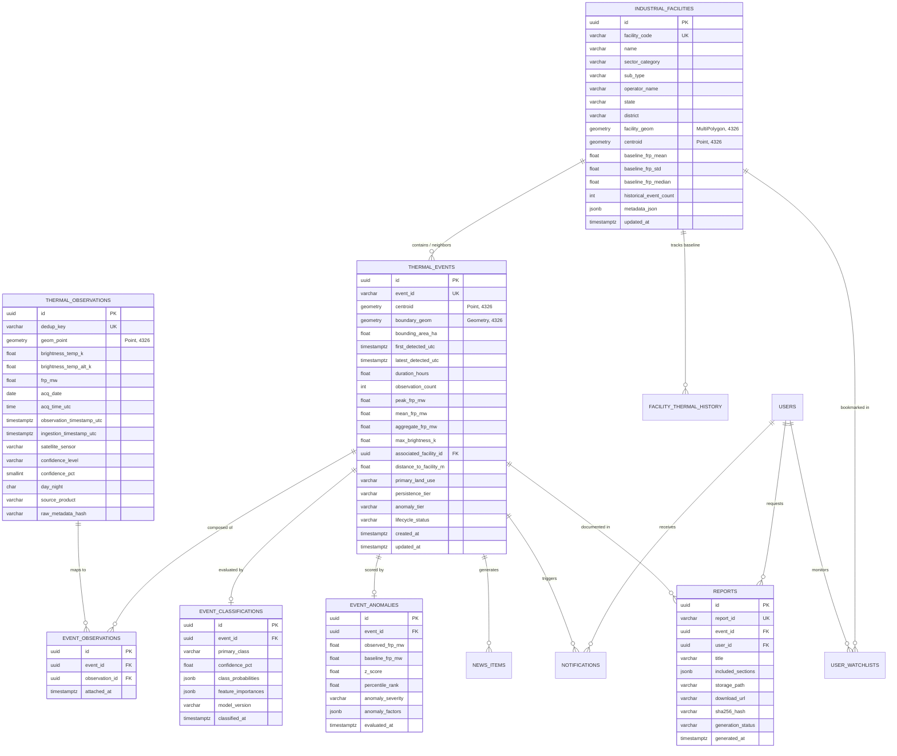

# Database & Storage Requirements Document

# Thermo Intelligence: Industrial Fire & Persistent Thermal Source Detection Platform

**Document Version:** 1.0.0  
**Project Identifier:** SIH-2026-PS26162 (National Technical Research Organisation — NTRO)  
**Product Specification Reference:** [Thermo_Intelligence_PRD.md](file:///c:/SHARAN%20PROJECTS/SiH%202026-THERMOSCAN%20AI/docs/Thermo_Intelligence_PRD.md)  
**Technical Specification Reference:** [Thermo_Intelligence_TRD.md](file:///c:/SHARAN%20PROJECTS/SiH%202026-THERMOSCAN%20AI/docs/Thermo_Intelligence_TRD.md)  
**Operational Workflow Reference:** [Thermo_Intelligence_Workflow.md](file:///c:/SHARAN%20PROJECTS/SiH%202026-THERMOSCAN%20AI/docs/Thermo_Intelligence_Workflow.md)  
**Status:** Approved / Authoritative  
**Last Updated:** August 2026  

---

## 1. Core Storage Decisions & Philosophy

This Database & Storage Requirements Document defines **what data the system stores, where it is stored, how it is indexed, how large geospatial datasets are queried, and how historical observations are preserved**.

### 1.1 Fundamental Storage Architecture Decisions
1. **Primary Geospatial & Relational Engine:** **PostgreSQL 16 with PostGIS 3.4 extension**. This serves as the single ACID-compliant system of record for all telemetry, spatial facilities, formed events, ML classifications, and operational logs.
2. **Local-First & Non-BaaS:** The database runs locally via Docker Compose or native PostgreSQL on developer workstations. The system is completely free of proprietary Backend-as-a-Service (BaaS) dependencies (e.g., Firebase, Supabase), ensuring full data sovereignty and trivial migration to air-gapped defense or cloud environments (e.g., AWS RDS PostGIS / NIC Cloud).
3. **Decoupled Binary/Object Storage:** PostgreSQL stores only structured metadata, spatial geometries, and vector embeddings. Large binary assets (generated tactical PDF reports, high-resolution satellite imagery tiles) are stored on a local filesystem volume (`/app/storage/`) during local development and seamlessly transition to S3-compatible object storage (**MinIO** / **AWS S3**) in production.
4. **Unified Vector Embeddings:** Semantic and RAG embeddings are stored natively inside PostgreSQL via the **pgvector** extension (utilizing HNSW/IVFFlat indexes), eliminating the need for a separate vector database.
5. **In-Memory Volatile Layer:** **Redis 7** handles short-lived spatial query caches, Celery message queues, distributed task locks, and real-time SSE pub/sub channels. Redis is strictly non-authoritative.

---

## 2. Storage Domains & Data Categorization

```
+----------------------------------------------------------------------------------------------------------------+
|                                           STORAGE DOMAIN TAXONOMY                                              |
+----------------------+--------------------------+------------------------------+-------------------------------+
| Storage Domain       | Description              | Primary Target Storage       | Retention / Lifecycle Policy  |
+----------------------+--------------------------+------------------------------+-------------------------------+
| **Domain A: Telemetry**| Raw & Normalized FIRMS   | PostgreSQL (`thermal_obs`)   | Permanent / Read-Only Archive |
|                      | VIIRS / MODIS records    | PostGIS Point geometries     | (Immutable Ground Truth)      |
+----------------------+--------------------------+------------------------------+-------------------------------+
| **Domain B: Events** | Grouped thermal clusters | PostgreSQL (`thermal_events`)| Indefinite (Active, Cooling,  |
|                      | & Spatio-temporal hulls  | PostGIS Polygons / Centroids | Resolved Lifecycles)          |
+----------------------+--------------------------+------------------------------+-------------------------------+
| **Domain C: Spatial**| Industrial boundaries,   | PostgreSQL (PostGIS vectors) | Static / Monthly OSM Sync     |
|                      | LULC masks, admin zones  | MVT Vector Tile Cache        | Versioned Spatial Registry    |
+----------------------+--------------------------+------------------------------+-------------------------------+
| **Domain D: ML / AI**| Feature vectors, model   | PostgreSQL (`event_class`,   | Historical Record per Model   |
|                      | probabilities, baselines | `event_anomalies`, pgvector) | Version (Auditable)           |
+----------------------+--------------------------+------------------------------+-------------------------------+
| **Domain E: Reports**| Tactical PDF dossiers &  | Object Storage (MinIO / S3)  | 1-Year Retention; Stored with |
|                      | Satellite imagery crops  | DB Metadata (`reports`)      | SHA-256 Checksum              |
+----------------------+--------------------------+------------------------------+-------------------------------+
| **Domain F: Comms**  | Thermo News bulletins &  | PostgreSQL (`news_items`,    | 90-Day Active History;        |
|                      | In-app notification logs | `notifications`)             | Auto-Archive Expired Items    |
+----------------------+--------------------------+------------------------------+-------------------------------+
| **Domain G: State**  | Viewport bbox caches,    | Redis 7 In-Memory            | Ephemeral (TTL: 60s – 24h)    |
|                      | Task queues, locks       | Celery Broker                | Non-Persistent                |
+----------------------+--------------------------+------------------------------+-------------------------------+
```

---

## 3. Authoritative Entity-Relationship Model



---

## 4. Production PostGIS Schema & Spatial DDL

```sql
-- ============================================================================
-- THERMO INTELLIGENCE DATABASE DDL SPECIFICATION
-- Target: PostgreSQL 16 + PostGIS 3.4 + pgvector
-- Spatial Reference System: WGS 84 (EPSG:4326)
-- ============================================================================

CREATE EXTENSION IF NOT EXISTS "uuid-ossp";
CREATE EXTENSION IF NOT EXISTS "postgis";
CREATE EXTENSION IF NOT EXISTS "pgvector";

-- 1. Raw Thermal Observations Table (Immutable Ground Telemetry)
CREATE TABLE thermal_observations (
    id UUID PRIMARY KEY DEFAULT uuid_generate_v4(),
    dedup_key VARCHAR(64) UNIQUE NOT NULL, -- SHA-256(lat, lon, date, time, sensor)
    geom GEOMETRY(Point, 4326) NOT NULL,
    brightness_temp_k REAL NOT NULL CHECK (brightness_temp_k BETWEEN 200.0 AND 600.0),
    brightness_temp_alt_k REAL CHECK (brightness_temp_alt_k BETWEEN 200.0 AND 600.0),
    frp_mw REAL NOT NULL CHECK (frp_mw >= 0.0),
    acq_date DATE NOT NULL,
    acq_time_utc TIME NOT NULL,
    observation_timestamp_utc TIMESTAMPTZ NOT NULL,
    ingestion_timestamp_utc TIMESTAMPTZ DEFAULT NOW() NOT NULL,
    satellite_sensor VARCHAR(32) NOT NULL, -- VIIRS_NOAA20, VIIRS_SNPP, MODIS_TERRA, MODIS_AQUA
    confidence_level VARCHAR(16),          -- low, nominal, high
    confidence_pct SMALLINT CHECK (confidence_pct BETWEEN 0 AND 100),
    day_night CHAR(1) NOT NULL CHECK (day_night IN ('D', 'N')),
    source_product VARCHAR(32) DEFAULT 'FIRMS_NRT' NOT NULL,
    raw_metadata_hash VARCHAR(64)
);

CREATE INDEX idx_obs_spatial ON thermal_observations USING GIST(geom);
CREATE INDEX idx_obs_temporal ON thermal_observations(observation_timestamp_utc DESC);
CREATE INDEX idx_obs_date_sensor ON thermal_observations(acq_date, satellite_sensor);

-- 2. Industrial Infrastructure Registry Table
CREATE TABLE industrial_facilities (
    id UUID PRIMARY KEY DEFAULT uuid_generate_v4(),
    facility_code VARCHAR(32) UNIQUE NOT NULL,
    name VARCHAR(255) NOT NULL,
    sector_category VARCHAR(64) NOT NULL, -- Refinery, Power, Steel, Chemical, Mining, LNG
    sub_type VARCHAR(64),
    operator_name VARCHAR(255),
    state VARCHAR(64) NOT NULL,
    district VARCHAR(64),
    facility_geom GEOMETRY(MultiPolygon, 4326) NOT NULL,
    centroid GEOMETRY(Point, 4326) NOT NULL,
    baseline_frp_mean REAL DEFAULT 0.0 NOT NULL,
    baseline_frp_std REAL DEFAULT 1.0 NOT NULL,
    baseline_frp_median REAL DEFAULT 0.0 NOT NULL,
    historical_event_count INT DEFAULT 0 NOT NULL,
    metadata_json JSONB DEFAULT '{}'::jsonb NOT NULL,
    updated_at TIMESTAMPTZ DEFAULT NOW() NOT NULL
);

CREATE INDEX idx_fac_geom ON industrial_facilities USING GIST(facility_geom);
CREATE INDEX idx_fac_centroid ON industrial_facilities USING GIST(centroid);
CREATE INDEX idx_fac_sector_state ON industrial_facilities(sector_category, state);

-- 3. Clustered Thermal Events Table (Derived Intelligence)
CREATE TABLE thermal_events (
    id UUID PRIMARY KEY DEFAULT uuid_generate_v4(),
    event_id VARCHAR(32) UNIQUE NOT NULL, -- e.g. EVT-IN-GUJ-202608-0042
    centroid GEOMETRY(Point, 4326) NOT NULL,
    boundary_geom GEOMETRY(Geometry, 4326) NOT NULL,
    bounding_area_ha REAL DEFAULT 0.0 NOT NULL,
    first_detected_utc TIMESTAMPTZ NOT NULL,
    latest_detected_utc TIMESTAMPTZ NOT NULL,
    duration_hours REAL GENERATED ALWAYS AS (
        EXTRACT(EPOCH FROM (latest_detected_utc - first_detected_utc)) / 3600.0
    ) STORED,
    observation_count INT DEFAULT 1 NOT NULL,
    peak_frp_mw REAL NOT NULL,
    mean_frp_mw REAL NOT NULL,
    aggregate_frp_mw REAL NOT NULL,
    max_brightness_k REAL NOT NULL,
    associated_facility_id UUID REFERENCES industrial_facilities(id) ON DELETE SET NULL,
    distance_to_facility_m REAL DEFAULT NULL,
    primary_land_use VARCHAR(64) DEFAULT 'Unknown' NOT NULL,
    persistence_tier VARCHAR(32) DEFAULT 'Transient' NOT NULL, -- Transient, Intermittent, Persistent
    anomaly_tier VARCHAR(32) DEFAULT 'Normal' NOT NULL,        -- Normal, Elevated, Abnormal, Critical
    lifecycle_status VARCHAR(32) DEFAULT 'Active' NOT NULL,    -- Active, Cooling, Resolved
    embedding VECTOR(384),                                     -- pgvector RAG semantic search
    created_at TIMESTAMPTZ DEFAULT NOW() NOT NULL,
    updated_at TIMESTAMPTZ DEFAULT NOW() NOT NULL
);

CREATE INDEX idx_evt_centroid ON thermal_events USING GIST(centroid);
CREATE INDEX idx_evt_boundary ON thermal_events USING GIST(boundary_geom);
CREATE INDEX idx_evt_temporal ON thermal_events(latest_detected_utc DESC);
CREATE INDEX idx_evt_anomaly_status ON thermal_events(anomaly_tier, lifecycle_status);
CREATE INDEX idx_evt_embedding ON thermal_events USING hnsw (embedding vector_cosine_ops);

-- 4. Event-Observation Junction Table (Traceability)
CREATE TABLE event_observations (
    id UUID PRIMARY KEY DEFAULT uuid_generate_v4(),
    event_id UUID NOT NULL REFERENCES thermal_events(id) ON DELETE CASCADE,
    observation_id UUID NOT NULL REFERENCES thermal_observations(id) ON DELETE RESTRICT,
    attached_at TIMESTAMPTZ DEFAULT NOW() NOT NULL,
    CONSTRAINT uq_event_obs UNIQUE(event_id, observation_id)
);

CREATE INDEX idx_rel_event ON event_observations(event_id);
CREATE INDEX idx_rel_observation ON event_observations(observation_id);

-- 5. Machine Learning Classification Table
CREATE TABLE event_classifications (
    id UUID PRIMARY KEY DEFAULT uuid_generate_v4(),
    event_id UUID UNIQUE NOT NULL REFERENCES thermal_events(id) ON DELETE CASCADE,
    primary_class VARCHAR(32) NOT NULL, -- IND_FIRE, IND_FLARE, IND_ROUTINE, AGRI_BURN, WILDFIRE, OTHER_UNCERTAIN
    confidence_pct REAL NOT NULL CHECK (confidence_pct BETWEEN 0.0 AND 100.0),
    class_probabilities JSONB NOT NULL, -- {"IND_FIRE": 0.942, "IND_FLARE": 0.038, ...}
    feature_importances JSONB NOT NULL, -- {"dist_ind_m": 0.38, "frp_surge": 0.31, ...}
    model_version VARCHAR(32) NOT NULL, -- thermo_xgb_v1.0.0
    classified_at TIMESTAMPTZ DEFAULT NOW() NOT NULL
);

-- 6. Baseline Anomaly & Escalation Table
CREATE TABLE event_anomalies (
    id UUID PRIMARY KEY DEFAULT uuid_generate_v4(),
    event_id UUID UNIQUE NOT NULL REFERENCES thermal_events(id) ON DELETE CASCADE,
    observed_frp_mw REAL NOT NULL,
    baseline_frp_mw REAL NOT NULL,
    z_score REAL NOT NULL,
    percentile_rank REAL NOT NULL,
    anomaly_severity VARCHAR(32) NOT NULL, -- Normal, Elevated, Abnormal, Critical
    anomaly_factors JSONB NOT NULL,
    evaluated_at TIMESTAMPTZ DEFAULT NOW() NOT NULL
);

-- 7. Thermo News Feed Table
CREATE TABLE news_items (
    id UUID PRIMARY KEY DEFAULT uuid_generate_v4(),
    event_id UUID NOT NULL REFERENCES thermal_events(id) ON DELETE CASCADE,
    headline VARCHAR(255) NOT NULL,
    summary TEXT NOT NULL,
    severity_tag VARCHAR(32) NOT NULL, -- CRITICAL, ALERT, NOTICE, PERSISTENCE_UPDATE
    published_at TIMESTAMPTZ DEFAULT NOW() NOT NULL,
    is_active BOOLEAN DEFAULT TRUE NOT NULL
);
CREATE INDEX idx_news_published ON news_items(published_at DESC);

-- 8. Users & Access Management Table
CREATE TABLE users (
    id UUID PRIMARY KEY DEFAULT uuid_generate_v4(),
    email VARCHAR(255) UNIQUE NOT NULL,
    hashed_password VARCHAR(255) NOT NULL,
    full_name VARCHAR(255) NOT NULL,
    role VARCHAR(32) DEFAULT 'Analyst' NOT NULL, -- Analyst, Supervisor, Administrator
    notification_preferences JSONB DEFAULT '{"critical_only": true, "push_enabled": true}'::jsonb NOT NULL,
    created_at TIMESTAMPTZ DEFAULT NOW() NOT NULL
);

-- 9. Tactical Intelligence Reports Table
CREATE TABLE reports (
    id UUID PRIMARY KEY DEFAULT uuid_generate_v4(),
    report_id VARCHAR(64) UNIQUE NOT NULL, -- RPT-EVT-IN-GUJ-0042-20260829
    event_id UUID NOT NULL REFERENCES thermal_events(id) ON DELETE CASCADE,
    user_id UUID REFERENCES users(id) ON DELETE SET NULL,
    title VARCHAR(255) NOT NULL,
    included_sections JSONB NOT NULL,
    storage_path VARCHAR(512) NOT NULL,
    download_url VARCHAR(512) NOT NULL,
    sha256_hash VARCHAR(64) NOT NULL,
    generation_status VARCHAR(32) DEFAULT 'COMPLETED' NOT NULL,
    generated_at TIMESTAMPTZ DEFAULT NOW() NOT NULL
);

-- 10. Ingestion State & Job Audit Table
CREATE TABLE ingestion_jobs (
    id UUID PRIMARY KEY DEFAULT uuid_generate_v4(),
    source_feed VARCHAR(32) NOT NULL,
    time_window_start TIMESTAMPTZ NOT NULL,
    time_window_end TIMESTAMPTZ NOT NULL,
    records_received INT DEFAULT 0 NOT NULL,
    records_inserted INT DEFAULT 0 NOT NULL,
    records_duplicated INT DEFAULT 0 NOT NULL,
    status VARCHAR(32) NOT NULL, -- SUCCESS, FAILED, RETRYING
    error_message TEXT,
    execution_duration_ms INT NOT NULL,
    executed_at TIMESTAMPTZ DEFAULT NOW() NOT NULL
);
CREATE INDEX idx_ingestion_exec ON ingestion_jobs(executed_at DESC);
```

---

## 5. Raw vs. Derived vs. User Data Boundaries

```
+----------------------------------------------------------------------------------------------------------------+
|                                           DATA BOUNDARY MATRIX                                                 |
+---------------------+-------------------------------+---------------------------------+------------------------+
| Classification      | Data Entities                 | Authoritative Source            | Mutability Rule        |
+---------------------+-------------------------------+---------------------------------+------------------------+
| **Raw Telemetry**   | `thermal_observations`        | NASA FIRMS Satellites           | **100% Immutable**     |
|                     | (Coordinates, FRP, Tb, Time)  | (NOAA-20, S-NPP, MODIS)         | Append-Only.           |
+---------------------+-------------------------------+---------------------------------+------------------------+
| **External GIS**    | `industrial_facilities`,      | OpenStreetMap, Global Energy    | Versioned Periodic     |
|                     | `land_cover_zones`            | Monitor, ESA WorldCover         | Ingestion Updates.     |
+---------------------+-------------------------------+---------------------------------+------------------------+
| **Derived Analytics**| `thermal_events`,             | Spatio-Temporal Clusterer,      | Re-computed upon new   |
|                     | `event_classifications`,      | XGBoost Model (`v1.0.0`),       | satellite pass or      |
|                     | `event_anomalies`             | Facility Baseline Engine        | baseline recalibration.|
+---------------------+-------------------------------+---------------------------------+------------------------+
| **User Generated**  | `users`, `user_watchlists`,   | Tactical Analysts, Emergency    | Read/Write by User;    |
|                     | `reports`, `notifications`    | Coordinators                    | Cascade on User Delete.|
+---------------------+-------------------------------+---------------------------------+------------------------+
```

---

## 6. FIRMS Storage & Deduplication Protocol

### 6.1 Deterministic SHA-256 Deduplication Hash
To prevent duplicate records from overlapping satellite passes or retried API requests, every incoming observation is stamped with an immutable hash:
```text
dedup_key = SHA256(Round(lat, 4) || Round(lon, 4) || acq_date || acq_time_utc || satellite_sensor)
```

```python
# Backend Python Implementation
import hashlib

def generate_dedup_key(lat: float, lon: float, acq_date: str, acq_time: str, sensor: str) -> str:
    payload = f"{lat:.4f}_{lon:.4f}_{acq_date}_{acq_time}_{sensor}".encode('utf-8')
    return hashlib.sha256(payload).hexdigest()
```

### 6.2 Upsert SQL Execution
```sql
INSERT INTO thermal_observations (
    dedup_key, geom, brightness_temp_k, brightness_temp_alt_k, 
    frp_mw, acq_date, acq_time_utc, observation_timestamp_utc, 
    satellite_sensor, confidence_level, confidence_pct, day_night
) VALUES (
    :dedup_key, ST_SetSRID(ST_Point(:lon, :lat), 4326), :bt, :bt_alt,
    :frp, :acq_date, :acq_time, :obs_ts,
    :sensor, :conf_level, :conf_pct, :day_night
) ON CONFLICT (dedup_key) DO NOTHING;
```

---

## 7. Geospatial Indexing & Query Execution Engine

### 7.1 Coordinate Reference System (CRS) Standards
- **Storage & Ingestion CRS:** Standard **WGS 84 (`EPSG:4326`)** representing planar latitude/longitude coordinates.
- **Accurate Metric Distance Calculations:** Handled dynamically via PostGIS geography casts:
```text
ST_DWithin(geom_a::geography, geom_b::geography, distance_meters)
ST_Area(geom::geography) / 10000.0 => Hectares
```

### 7.2 High-Frequency Spatial Query Patterns

#### Query 1: Bounding-Box Viewport Event Stream (MapLibre Viewport)
```sql
SELECT 
    event_id,
    ST_AsGeoJSON(centroid)::json AS centroid,
    ST_AsGeoJSON(boundary_geom)::json AS boundary,
    bounding_area_ha, peak_frp_mw, duration_hours,
    observation_count, anomaly_tier, primary_land_use
FROM thermal_events
WHERE latest_detected_utc >= NOW() - INTERVAL '24 HOURS'
  AND centroid && ST_MakeEnvelope(:min_lon, :min_lat, :max_lon, :max_lat, 4326)
ORDER BY peak_frp_mw DESC
LIMIT 500;
```

#### Query 2: Nearest Industrial Facility & Distance Lookup
```sql
SELECT 
    f.id, f.facility_code, f.name, f.sector_category,
    ST_Distance(f.facility_geom::geography, e.centroid::geography) AS distance_meters
FROM industrial_facilities f, thermal_events e
WHERE e.event_id = :event_id
  AND ST_DWithin(f.facility_geom::geography, e.centroid::geography, 5000) -- 5km radius buffer
ORDER BY distance_meters ASC
LIMIT 1;
```

---

## 8. Object & File Storage Organization (Local & S3 / MinIO)

Large binary assets are stored in a hierarchical S3-compatible bucket structure (`thermo-intelligence-assets`):

```
thermo-intelligence-assets/
├── reports/
│   ├── 2026/
│   │   ├── 08/
│   │   │   ├── RPT-EVT-IN-GUJ-0042-20260829.pdf
│   │   │   └── RPT-EVT-IN-ODI-0012-20260829.pdf
├── satellite_imagery/
│   ├── sentinel2_crops/
│   │   ├── EVT-IN-GUJ-0042/
│   │   │   ├── 20260829_RGB_10m.tif
│   │   │   └── 20260829_SWIR_20m.tif
├── static_layers/
│   ├── india_industrial_polygons_v1.geojson
│   └── india_admin_boundaries_l2.geojson
└── raw_firms_archives/
    └── 2026-08/
        └── firms_viirs_noaa20_20260829_india.csv.gz
```

---

## 9. Redis In-Memory Caching & Key Naming Conventions

```
+----------------------------------------------------------------------------------------------------------------+
|                                           REDIS CACHE KEY ARCHITECTURE                                         |
+--------------------------------------+---------------+---------------------+-----------------------------------+
| Key Pattern                          | Data Type     | Default TTL         | Purpose                           |
+--------------------------------------+---------------+---------------------+-----------------------------------+
| `cache:gis:bbox:{hash}`              | String (JSON) | 60 Seconds          | Viewport GeoJSON event clusters   |
+--------------------------------------+---------------+---------------------+-----------------------------------+
| `cache:event:{event_id}:telemetry`   | String (JSON) | 5 Minutes           | Investigation drawer telemetry    |
+--------------------------------------+---------------+---------------------+-----------------------------------+
| `cache:facility:{code}:baseline`     | Hash          | 1 Hour              | Running mean and std FRP values   |
+--------------------------------------+---------------+---------------------+-----------------------------------+
| `lock:clustering:execution`          | String (Lock) | 30 Seconds          | Distributed lock for ST-DBSCAN    |
+--------------------------------------+---------------+---------------------+-----------------------------------+
| `stream:news:realtime`               | Redis Pub/Sub | Real-time Stream    | SSE broadcast channel to frontend |
+--------------------------------------+---------------+---------------------+-----------------------------------+
```

---

## 10. Data Retention, Archival & Purging Policies

```
+----------------------------------------------------------------------------------------------------+
|                                      DATA RETENTION TIMELINE                                       |
+--------------------------+-----------------------+-------------------------------------------------+
| Data Entity / Table      | Retention Duration    | Enforcement Mechanism                           |
+--------------------------+-----------------------+-------------------------------------------------+
| `thermal_observations`   | **Permanent**         | Compressed historical partitions; read-only.    |
| `thermal_events`         | **Indefinite**        | Active -> Cooling -> Resolved lifecycle.|
| `news_items`             | **180 Days**          | Celery cron drops items older than 6 months.    |
| `ingestion_jobs` (Logs)  | **90 Days**           | Rolling purge of successful job logs.           |
| `reports` (PDF Files)    | **1 Year**            | Object lifecycle rule deletes raw PDF after 1y. |
| Redis Query Caches       | **60s to 3600s**      | Automatic Redis key TTL expiration.             |
+--------------------------+-----------------------+-------------------------------------------------+
```

---

## 11. Scalability Tiers: SIH Prototype to Enterprise Production

```
+----------------------------------------------------------------------------------------------------+
|                                    SCALABILITY PROGRESSION MATRIX                                  |
+----------------------+-----------------------------+-----------------------------------------------+
| Tier Level           | Scale Target                | Architecture Configuration                    |
+----------------------+-----------------------------+-----------------------------------------------+
| **Level 1: Prototype**| India Active Feeds          | Single Dockerized PostgreSQL 16 + PostGIS 3.4 |
| (Current SIH Scope)  | (~50,000 observations/mo)   | Local volume storage (`/app/storage/`)        |
|                      |                             | Single Redis instance; 4GB RAM footprint.     |
+----------------------+-----------------------------+-----------------------------------------------+
| **Level 2: National**| Full India 5-Year History   | PostgreSQL with monthly time partitions       |
| (Production NTRO)    | (~20,000,000 observations)  | Managed MinIO / AWS S3 Object Store           |
|                      |                             | Read-Replicas for MapLibre vector tile queries|
+----------------------+-----------------------------+-----------------------------------------------+
| **Level 3: Global**  | Worldwide Satellite Feeds   | Distributed Citus / PostGIS Sharded Clusters  |
| (Global C4I Scale)   | (~500,000,000 observations) | CDN-cached Mapbox Vector Tiles (MVT)          |
|                      |                             | Cold data tiering to S3 Glacier Deep Archive  |
+----------------------+-----------------------------+-----------------------------------------------+
```

---

## 12. Backup, Recovery & Disaster Resilience

### 12.1 Local Prototype Backup Script (`scripts/backup_db.sh`)
```bash
#!/bin/bash
# Local PostGIS Daily Dump Script
TIMESTAMP=$(date +"%Y%m%d_%H%M%S")
BACKUP_DIR="./backups"
mkdir -p $BACKUP_DIR

docker exec -t thermo_postgis pg_dump -U thermo_admin -d thermo_intelligence \
  --format=custom --blobs --verbose \
  --file=/var/lib/postgresql/data/thermo_backup_${TIMESTAMP}.dump

echo "Backup completed: `BACKUP_DIR/thermo_backup_`{TIMESTAMP}.dump"
```

### 12.2 Production Disaster Recovery (RTO & RPO)
- **Recovery Point Objective (RPO):** `< 15 minutes` (continuous Write-Ahead Logging / WAL-G archiving to S3).
- **Recovery Time Objective (RTO):** `< 30 minutes` (automated container re-provisioning via Terraform / Docker Compose).

---

## 13. Data Quality, Constraints & Hygiene Engine

The database enforces strict validation checks at the schema level:
1. **Coordinate Bounding Check:** All points must satisfy `-90.0 <= lat <= 90.0` and `-180.0 <= lon <= 180.0`.
2. **Radiometry Range Check:** `200.0 K <= T_b <= 600.0 K` and `FRP >= 0.0 MW`.
3. **Temporal Sanity Check:** `T_obs <= NOW() + 2 hours` (rejecting corrupted future satellite metadata).
4. **Foreign Key Integrity:** Deleting an industrial facility sets `thermal_events.associated_facility_id = NULL`, ensuring historical events are never deleted.

---

## 14. Database & Storage Acceptance Criteria (DB-AC)

| Acceptance Code | Verification Criteria | Expected Result |
| :--- | :--- | :--- |
| **DB-AC-1: Dedup** | Insert 1,000 FIRMS records with 200 exact duplicates. | Exactly 800 distinct rows saved; 200 duplicates skipped via `ON CONFLICT DO NOTHING`. |
| **DB-AC-2: Spatial** | Execute `ST_DWithin` query across 50,000 points. | Spatial query returns in `<25ms` utilizing GiST spatial index. |
| **DB-AC-3: Event Link** | Query all underlying FIRMS points for a clustered event. | Returns exact list of observation IDs from `event_observations` with zero orphaned rows. |
| **DB-AC-4: Baseline** | Update facility with 50 historical events. | Baseline `μ_FRP` and `σ_FRP` compute accurately without precision loss. |
| **DB-AC-5: pgvector** | Query semantic embedding vector for a natural language prompt. | HNSW index returns top-5 closest events in `<15ms`. |
| **DB-AC-6: Report Ref**| Store a 1.2MB PDF report in object storage. | File hash and valid download URL persist in `reports` table; binary is not stored in DB. |

---

## 15. Storage Sign-Off & Approvals

| Role | Name / Identifier | Decision | Date |
| :--- | :--- | :--- | :--- |
| **Principal Database Architect** | Lead Spatial Data Engineer | Approved | August 2026 |
| **Lead Backend Engineer** | API & Cloud Infrastructure Lead | Approved | August 2026 |
| **SIH Technical Lead** | Thermo Intelligence Team | Approved | August 2026 |

---
*End of Database & Storage Requirements Document. This document serves as the authoritative implementation guide for all PostgreSQL/PostGIS schemas, indexing strategies, storage directories, retention policies, and data lifecycle management.*
