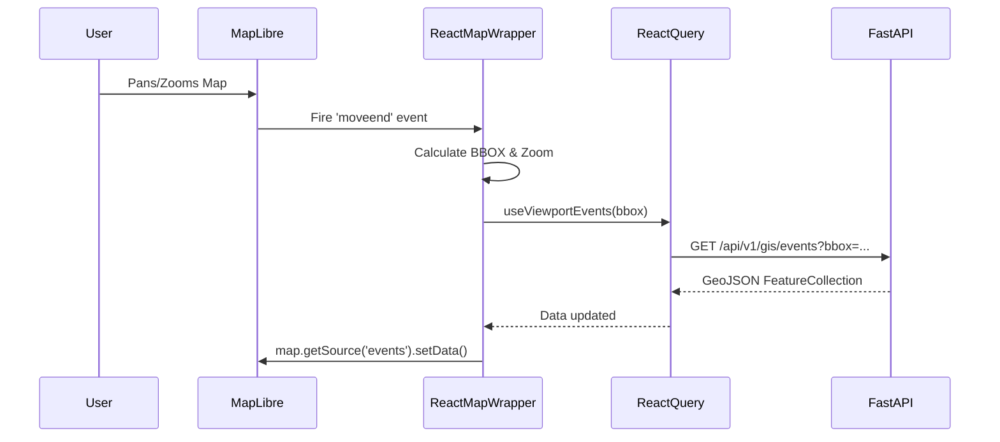
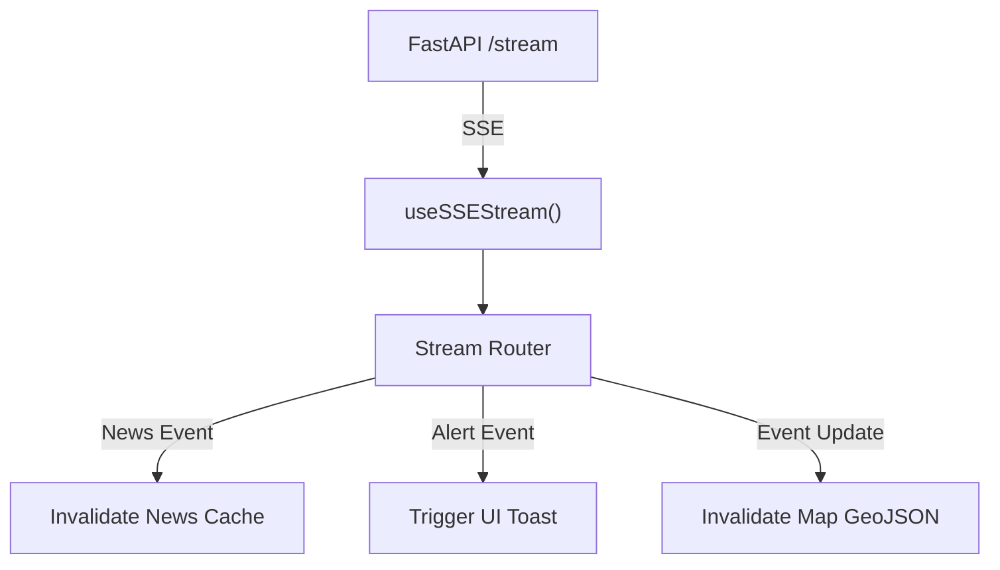
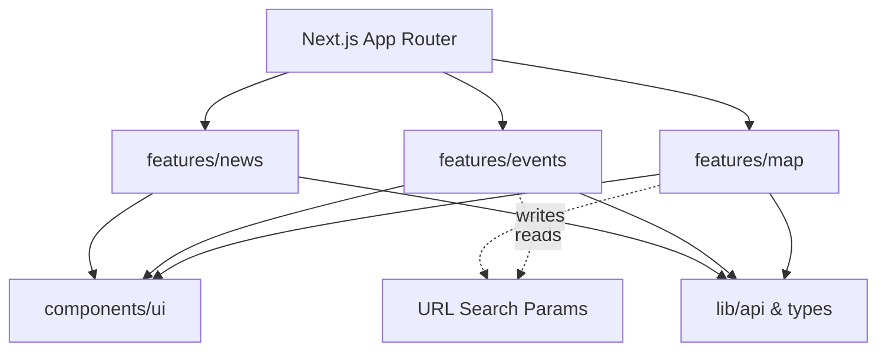

# FRONTEND ARCHITECTURE DOCUMENT
## Thermo Intelligence — Industrial Fire & Persistent Thermal Source Detection

---

## 1. Purpose
This document defines the structural architecture of the Thermo Intelligence frontend application. It specifies how the Next.js application is organized, how components and state are managed, how MapLibre is integrated, and how the frontend communicates with the FastAPI backend without architectural coupling. It serves as the primary blueprint for building the presentation layer.

## 2. Source Documents
This architecture strictly implements and adheres to the following project contracts:
1. `Thermo_Intelligence_PRD.md`
2. `Thermo_Intelligence_TRD.md`
3. `Thermo_Intelligence_Workflow.md`
4. `Thermo_Intelligence_Database_Storage.md`
5. `Thermo_Intelligence_UIUX.md`
6. `Thermo_Intelligence_DB_API_Contract.md`
7. `openapi.yaml`
8. `Thermo_Intelligence_System_Architecture.md`

## 3. Frontend Architectural Principles
* **Feature-Oriented Modularity**: Code is organized by domain features (map, events, news) rather than by technical type (components, hooks).
* **MapLibre Isolation**: The GIS engine is treated as a specialized subsystem. It is not mixed indiscriminately with React UI business logic.
* **Server State vs Client State Separation**: Data from the backend is cached predictably; transient UI state is managed via lightweight React state.
* **Centralized API Client**: No scattered `fetch` calls. All backend communication goes through a typed, generated/contract-derived API layer.
* **Responsive Presentation over Duplication**: Desktop and mobile share domain logic and hooks, but utilize different presentation components (e.g., Drawer vs Bottom Sheet) to fulfill the UI/UX contract.

## 4. Technology Context
* **Core**: Next.js (App Router), React, TypeScript.
* **UI/Styling**: Tailwind CSS, shadcn/ui.
* **GIS**: MapLibre GL JS.
* **State Management**: React Query (for server state caching) + Zustand (for lightweight global UI state).
* **Testing**: Playwright (E2E).

## 5. Application Structure
The codebase follows a feature-driven module architecture:

```text
frontend/
├── app/                      # Next.js App Router (Pages & Layouts)
│   ├── layout.tsx            # Global providers & App Shell
│   ├── page.tsx              # Landing / Onboarding routing
│   ├── (workspace)/          # Route group for authenticated/core app
│   │   ├── monitor/page.tsx  # Main GIS canvas
│   │   ├── facilities/       # Facilities directory
│   │   └── reports/          # Report generation interface
│   └── api/                  # Next.js local API routes (if needed for auth/proxy)
│
├── components/               # Global / Shared UI Components
│   ├── ui/                   # shadcn/ui base components
│   ├── layout/               # Shell elements (Sidebar, Topbar)
│   └── icons/                # Lucide icon wrappers
│
├── features/                 # Domain-specific modules
│   ├── map/                  # MapLibre wrappers, controls, layers
│   ├── events/               # Event detail, timeline, history UI
│   ├── news/                 # Thermo News feed & SSE handlers
│   ├── alerts/               # Notification drop-downs
│   ├── chat/                 # RAG terminal interface
│   └── reports/              # PDF builder forms
│
├── lib/                      # Pure utilities and Core Services
│   ├── api/                  # Axios/Fetch OpenAPI client
│   ├── store/                # Zustand client state stores
│   ├── utils/                # Tailwind merge (cn), formatting
│   └── types/                # Types generated from openapi.yaml
│
└── public/                   # Static assets, fonts, base map styles
```
* **`app/`**: Owns routing and layout assembly.
* **`components/`**: Owns reusable, domain-agnostic UI blocks.
* **`features/`**: Owns domain-specific business logic, internal components, and data fetching hooks.
* **`lib/`**: Owns pure functions and the API communication boundary.

## 6. Routing Architecture
* **`/`**: Onboarding / Landing. Redirects to `/monitor` if onboarding is complete.
* **`/monitor`**: The primary GIS workspace. MapLibre canvas is persistent here.
* **Overlays/Drawers**: Deep-linked state via URL params (e.g., `/monitor?eventId=EVT-123`). The Event Investigation, Thermo News, Alerts, and Chat are rendered as Drawers/Sheets *over* the `/monitor` route to prevent destroying the MapLibre instance.
* **`/facilities`**: Dedicated list/table view for facilities (can also deep-link to `/monitor?facilityId=...`).
* **`/reports`**: Dedicated route for the PDF builder.

## 7. Desktop Shell
The Desktop Shell wraps the `/monitor` route:
* **Top Bar**: Global search (omnibox), theme toggle, notification bell. Persistent.
* **Left Navigation**: Collapsed vertical rail (Monitor, Facilities, Reports, Settings). Persistent.
* **Main Workspace**: MapLibre Canvas. Fills remaining space.
* **Right Investigation Drawer**: Conditionally rendered over the map when `?eventId=` is present in the URL.
* **News Panel**: Expandable panel from the bottom or left, based on UI/UX spec.

## 8. Mobile Shell
* **Mobile Header**: Condensed top bar with Search icon and Hamburger menu.
* **Fullscreen Map**: The canvas occupies 100% of the screen under the header.
* **Floating Controls**: Zoom/Location buttons overlaying the map.
* **Bottom Sheets**: The Right Investigation Drawer and Filters convert seamlessly into draggable bottom sheets (via shadcn/vaul).
* **Bottom Navigation**: Core routes (Monitor, News, Chat) move to a persistent bottom tab bar.

## 9. Responsive Architecture
Breakpoints: `sm` (640px), `md` (768px), `lg` (1024px), `xl` (1280px).
* **< 768px (Mobile)**: Bottom navigation, bottom sheets for events, hidden sidebars.
* **>= 768px (Tablet/Desktop)**: Left rail navigation, right sliding drawers for events.
* **Implementation**: We use a `useMediaQuery` hook combined with conditional rendering (e.g., `<Drawer>` for mobile vs `<Sheet>` for desktop) wrapping the *exact same* domain components.

## 10. Component Architecture
```text
App (RootLayout)
├── SidebarNav
├── Topbar (Omnibox)
└── MonitorPage
    ├── MapWorkspace
    │   ├── MapLibreInstance
    │   ├── LayerManager (Reads selected layers state)
    │   └── MapControls
    └── Overlays
        ├── EventInvestigationPanel (Desktop: Sheet, Mobile: Drawer)
        │   ├── EventHeader
        │   ├── TelemetryTabs
        │   └── BaselineChart
        ├── ChatTerminal
        └── ThermoNewsFeed
```

## 11. Design-System Architecture
* Built on **shadcn/ui** (Radix UI primitives + Tailwind CSS).
* **Tokens**: Colors defined in `globals.css` using HSL variables (`--background`, `--primary`, `--destructive`).
* **Typography**: Inter (UI) and JetBrains Mono (Data/Logs) defined via Next.js `next/font`.
* **Semantics**: `IND_FIRE` uses warning colors, `CRITICAL` uses destructive colors, consistently applied via utility variants (e.g., `cva` button/badge variants).

## 12. MapLibre Architecture
* **MapLibre Engine**: Initialized once in a `useEffect` inside a singleton-like `MapCanvas` component.
* **Map State**: `useMapStore` (Zustand) holds `viewport`, `zoom`, `activeLayers`.
* **Data Binding**: The Map component reacts to data changes and imperative calls `map.current.getSource('events').setData(geojsonData)`.
* **Backend Integration**: MapLibre is *not* aware of FastAPI. The React layer fetches GeoJSON from `lib/api`, and passes it to the MapLibre wrapper.

## 13. GIS Data Flow


## 14. GIS Layer Architecture
MapLibre layers are logically separated:
1. `events-heat`: Heatmap layer (visible zoom < 8).
2. `events-point`: Circle/Icon markers (visible zoom >= 8).
3. `events-hull`: Polygon footprints (visible zoom >= 12).
4. `facilities-point`: Industrial facility markers.
5. `facilities-buffer`: 2km contextual radius.
* **Visibility**: Toggled via Zustand `useMapStore`.

## 15. Event Visualization Architecture
* **Symbology**: Driven by GeoJSON properties injected by the backend. 
  * `properties.anomaly_tier == 'CRITICAL'` -> Red pulse animation.
  * `properties.classification == 'IND_FLARE'` -> Orange icon.
* **Implementation**: Uses MapLibre Data-Driven Styling (`match`, `get`, `step` expressions) rather than rendering thousands of React DOM nodes.

## 16. Server State vs Client State
* **Server State**: Data owned by PostGIS (Events, Facilities, History). Managed by **React Query**. Handles caching, background refetching, and loading states.
* **Client State**: Data owned by the browser (Selected Event ID, Active Map Layers, Sidebar Open/Close). Managed by **Zustand** and URL search params.

## 17. State Management
* **React Query**: For all `/api/v1/*` data fetches.
* **Zustand**: For global UI toggles that cross component boundaries (e.g., opening the chat terminal from a map click).
* **URL Search Params (`nuqs`)**: For serializable state like `?eventId=EVT-123` or `?q=searchterm`. Enables deep linking.

## 18. API Client Architecture
```typescript
// lib/api/client.ts
import axios from 'axios';
export const apiClient = axios.create({
  baseURL: process.env.NEXT_PUBLIC_API_URL || '/api/v1',
  timeout: 10000,
});
// Centralized response/error interceptor for handling 401s, 429s.
```
* **Domain APIs**: `features/events/api.ts` exports typed functions: `getEventDetails(id: string): Promise<EventDetailResponse>`.

## 19. Type Safety
* Types are manually maintained in `lib/types/api.ts` to strictly mirror the OpenAPI 3.0.3 schema defined in `openapi.yaml`. (Alternatively, generated via `openapi-typescript`).
* The frontend will never invent fields. If it's not in the contract, it doesn't exist.

## 20. API Error Handling
* **Axios Interceptor**: Catches network/500 errors and routes them to a global toast notification.
* **React Query**: Exposes `isError` and `error` objects to UI components.
* **UI**: Components render Fallback/Error states (e.g., "Failed to load event timeline") rather than crashing the page.

## 21. Data Fetching
* **Viewport Data**: Fetched on map `moveend` via React Query (debounced by 300ms).
* **Event Details**: Fetched on-demand when `?eventId=` is set.
* **Caching**: Map GeoJSON cached for 30s. Event Details cached for 2 mins.
* **Invalidation**: Real-time SSE events will invalidate specific React Query cache keys to trigger automatic refetches.

## 22. Real-Time SSE

* A single, global hook `useSSEStream` connects to the backend on app load. It dispatches updates to React Query to silently refresh data.

## 23. Event Investigation
* **Trigger**: Clicking a map marker sets `?eventId=...` in the URL.
* **Component**: `EventInvestigationDrawer` detects the URL parameter, slides open, and mounts.
* **Data**: `useEventDetails(eventId)` hook fetches the 360° payload.
* **Tabs**: "Overview", "Timeline", "Geographic Context", "Historical Baseline".

## 24. Deep-Link State
* Selected Event: `?eventId=EVT-123`
* Map Viewport: `?lat=22.4&lng=70.0&z=10`
* Active Tab: `?tab=history`
* This allows users to share a URL that reconstructs the exact investigation context.

## 25. Search
* **Omnibox**: Global search input in Topbar.
* **Debounce**: 300ms delay before hitting `GET /api/v1/search`.
* **Selection**: Clicking a facility result updates map viewport to `[lat, lng]` and opens the facility drawer via URL state.

## 26. Filters
* Global filter state (Time range, Anomaly Tier, Classification) is stored in the URL (`?time=24h&tier=CRITICAL`).
* Passed into both `useViewportEvents` (map) and `useEventList` (tables) to ensure consistency.

## 27. Thermo News & 28. Alerts
* **News Panel**: Fetches from `/api/v1/news`. Auto-refreshes via SSE invalidation. Clicking a news item sets the map viewport and opens the event drawer.
* **Alerts**: Fetches from `/api/v1/notifications`. Bell icon shows unread count.

## 29. Facilities & 30. History
* **Facility Detail**: Similar sliding drawer pattern as Events, showing baseline metrics.
* **History**: The Event Investigation Drawer contains a Timeline tab rendering Recharts/Visx charts to show `Earlier vs Now` FRP deltas.

## 31. Reports
* **UI**: A dedicated `/reports` route or modal. User selects an active Event ID and checkboxes for sections.
* **Action**: `POST /api/v1/reports/generate`.
* **State**: UI enters a polling or SSE-waiting state until the PDF `download_url` is returned.

## 32. Chat
* **UI**: A collapsible terminal panel.
* **Flow**: User types -> POST `/api/v1/chat/query` -> Backend responds with Markdown and `grounded_events`.
* **Rendering**: Frontend renders Markdown (using `react-markdown`). `[EVT-123]` links are intercepted to update the URL `?eventId=EVT-123`, navigating the map to the event seamlessly.

## 33. Onboarding
* `localStorage.getItem('thermo_onboarded')`. If null, show the multi-step welcome modal explaining the dual-axis classification system.

## 34. Theme
* `next-themes` manages `dark` class on the `<html>` tag.
* MapLibre style URLs swap between dark and light basemaps dynamically based on the active theme.

## 35. Accessibility
* Use shadcn/ui (Radix) for ARIA-compliant dialogs, tabs, and dropdowns.
* Keyboard navigation for the omnibox and drawers.
* Map markers rely on distinct shapes (not just color) to differentiate fire vs flare.

## 36. Performance & 37. Map Performance
* **Dynamic Imports**: Charting libraries (Recharts) and PDF libraries are lazy-loaded via `next/dynamic`.
* **Map Viewport Culling**: Handled naturally by the backend bounding box query.
* **Map Updates**: Use `setData()` on existing sources. NEVER destroy and recreate the MapLibre instance during navigation.

## 38. Responsive Component Strategy
* **Shared Logic**: `useEventDetails()` is called regardless of screen size.
* **Presentation**: 
  ```tsx
  if (isMobile) return <Sheet><EventContent /></Sheet>;
  return <Drawer><EventContent /></Drawer>;
  ```

## 39. Module Dependency Rules
* `features/` cannot import from other `features/`. (e.g., `features/news` cannot import from `features/events`). If they must share data, they share via URL state or global `lib/` utilities.
* `components/ui` cannot import from `features/`.

## 40. Domain Logic Boundary
* The frontend **does not** calculate Z-scores, clustering, or anomalies.
* The frontend **does** format numbers, parse dates to local timezones, and map API enums (`IND_FIRE`) to human-readable strings and colors.

## 41. Security
* Environment variables prefixed with `NEXT_PUBLIC_` are exposed to the browser (e.g., `NEXT_PUBLIC_API_URL`).
* **NO** API keys for FIRMS or LLMs exist in the frontend codebase.

## 42. Logging/Error Reporting
* Console errors are suppressed in production.
* Unhandled promise rejections are caught by a global Error Boundary and logged to Sentry (if configured).

## 43. Testing
* **Unit Tests**: `vitest` for formatters, utils, and hooks in `lib/`.
* **Component Tests**: Not heavily required unless a highly complex custom UI element is built.
* **E2E**: `playwright` scripts to test "Search -> Click Map -> Open Drawer -> Export Report" flows.

## 44. Mock/Development Mode
* Run Next.js with `NEXT_PUBLIC_USE_MOCKS=true`.
* `msw` (Mock Service Worker) intercepts Axios requests and returns fixture data matching `openapi.yaml`. Prevents frontend from being blocked by backend development.

## 45. Environment Configuration
* `.env.development`: `NEXT_PUBLIC_API_URL=http://localhost:8000/api/v1`
* `.env.production`: `NEXT_PUBLIC_API_URL=https://api.thermoscan.ai/api/v1`

## 46. Multi-Agent Development & 47. Agent Ownership
| Area | Owner Module | Shared Dependencies | Contract |
| :--- | :--- | :--- | :--- |
| **Shell & UI Base** | `app/`, `components/ui/` | None | UI/UX Spec |
| **GIS Workspace** | `features/map/` | `lib/api/` | OpenAPI GeoJSON |
| **Investigation** | `features/events/` | UI Base | OpenAPI `EventDetail` |
| **News & Chat** | `features/news/`, `chat/`| UI Base | OpenAPI `ChatResponse`|

*Agents can work independently because the OpenAPI types and URL state act as the hard boundaries between modules.*

## 48. Architecture Diagrams

### Frontend Module Dependency


## 49. Data-Flow Matrix
| Data | Source | API | Frontend Owner | State Type | Consumers |
| :--- | :--- | :--- | :--- | :--- | :--- |
| **Events BBox** | PostGIS | `GET /gis/events` | `features/map` | Server (React Query) | MapLibre Layer |
| **Event Detail** | PostGIS | `GET /events/{id}` | `features/events` | Server (React Query) | Investigation Drawer |
| **Selected ID** | User | N/A | URL Params | Client (URL) | MapLibre, Drawer |

## 50. Component Matrix
| Component | Responsibility | Owns State? | API Access? | Map Dependency? |
| :--- | :--- | :--- | :--- | :--- |
| `MapWorkspace` | Orchestrates map & data | Yes (viewport) | Yes (hooks) | High |
| `EventDrawer` | Displays event context | No (reads URL) | Yes (hooks) | None |
| `FilterBar` | Updates URL params | Yes (local form) | No | None |

## 51. Performance Rules
1. Never place the MapLibre instance inside a React component that re-renders frequently (e.g., ticking clocks, typing inputs).
2. Use `useMemo` for transforming GeoJSON properties if needed.
3. Debounce viewport updates to the API to 300ms.

## 52. Architecture Decisions
* **ADR-01**: *Next.js App Router*. Provides optimal routing, layouts, and future-proof server components.
* **ADR-02**: *Feature-oriented structure*. Prevents the `components/` folder from becoming a 500-file mess.
* **ADR-03**: *MapLibre Isolation*. The map is treated as an uncontrolled component managed by imperative refs, maximizing WebGL performance.
* **ADR-04**: *Zustand + React Query*. Prevents the boilerplate of Redux while perfectly separating server caching from UI toggles.
* **ADR-05**: *URL State for Deep Linking*. Allows the chat LLM to return `[EVT-123]` which the UI turns into an `<a>` tag that seamlessly opens the drawer.

## 53. MVP vs Future
* **MVP**: Polling/SSE for news. Standard MapLibre vector tiles.
* **Future**: WebGL deck.gl integrations for 3D plumes, WebSockets for high-frequency drone telemetry. The feature-module architecture allows replacing `features/map` without touching `features/events`.

## 54. Architecture Validation
* **Flow C (User clicks event)**: Map marker clicked -> URL updated to `?eventId=X` -> `EventDrawer` detects URL -> `useEventDetails(X)` fetches data -> Drawer renders content. No circular dependencies.
* **Flow H (Desktop to Mobile)**: Same URL `?eventId=X` triggers same fetch hook. The only difference is the Root Layout renders `<Sheet>` instead of `<Drawer>` based on `window.innerWidth`.

## 55. Final Principles
> **One shared design system. One API contract. MapLibre isolated as a GIS subsystem. Server data separated from UI state. Desktop and mobile as intentional layouts of the same product. No duplicated domain logic.**
