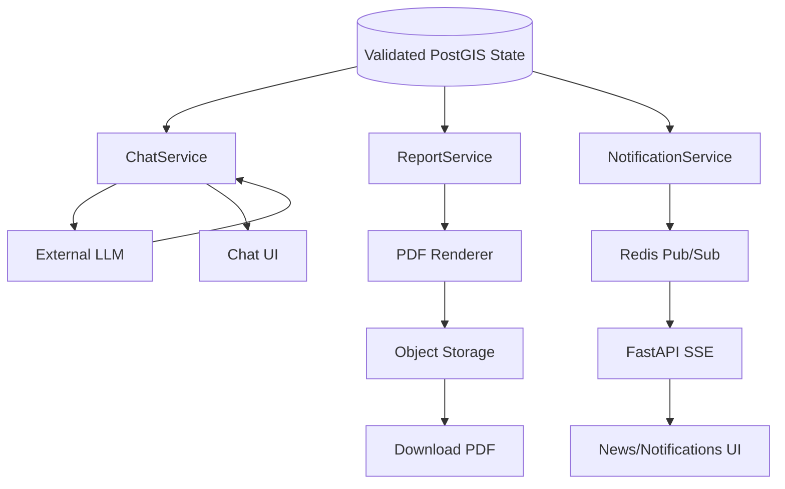
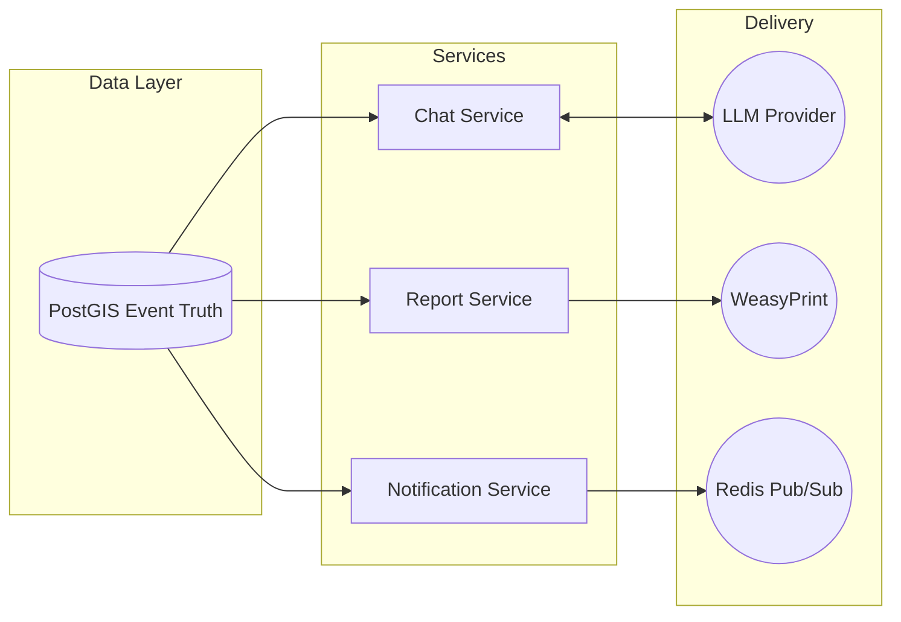

# LLM + REPORTS + NOTIFICATION ARCHITECTURE DOCUMENT
## Thermo Intelligence — Industrial Fire & Persistent Thermal Source Detection

---

## 1. Purpose
This document establishes the architecture for the **downstream intelligence layer** of Thermo Intelligence: the Grounded LLM (RAG), Tactical Reports, and Notifications/News. It dictates how these systems securely consume validated thermal intelligence without independently recomputing truth, hallucinating data, or bypassing established contracts.

## 2. Authoritative Documents
This architecture strictly implements the contracts defined in:
1. `Thermo_Intelligence_PRD.md`
2. `Thermo_Intelligence_TRD.md`
3. `Thermo_Intelligence_Workflow.md`
4. `Thermo_Intelligence_Database_Storage.md`
5. `Thermo_Intelligence_UIUX.md`
6. `Thermo_Intelligence_DB_API_Contract.md`
7. `openapi.yaml`
8. `Thermo_Intelligence_System_Architecture.md`
9. `Thermo_Intelligence_Frontend_Architecture.md`
10. `Thermo_Intelligence_Backend_Architecture.md`
11. `Thermo_Intelligence_Data_ML_GIS_Architecture.md`

## 3. Core Principles
The central rule for the downstream intelligence layer is: **Retrieve → Validate → Explain / Document / Alert**. 
* **The analytical pipeline determines the truth.**
* **The downstream systems consume it.**
None of these downstream systems become an independent source of truth.

## 4. Source of Truth
All downstream systems must pull from the exact same frozen PostgreSQL schemas:
* **Raw thermal truth**: `thermal_observations`
* **Event truth**: `thermal_events`
* **Classification truth**: `event_classifications`
* **Anomaly truth**: `event_anomalies`
* **Facility truth**: `industrial_facilities`
* **Historical/baseline truth**: `facility_baselines`

## 5. Overall Downstream Architecture


## 6. LLM/RAG Architecture & 7. Chat Lifecycle
The LLM acts as an explainer of database records, not a database itself.
1. `POST /api/v1/chat/query` receives natural language.
2. `ChatService` extracts intention parameters (using lightweight NLP or a fast structured LLM call).
3. Backend validates parameters and executes parameterized PostGIS queries.
4. Verified DB records are serialized into a text context block.
5. The LLM receives the system prompt + DB context + User query.
6. The LLM synthesizes a structured markdown response.
7. Backend validates the LLM response against the DB context.
8. Frontend renders the response and map actions.

## 8. Intent Extraction & 9. Query Safety
Natural language like *"Show abnormal flares in Gujarat"* is extracted into:
`{"state": "Gujarat", "classification": ["IND_FLARE"], "anomaly_tier": ["ABNORMAL", "CRITICAL"]}`
* **Safety**: The LLM *never* writes raw SQL (Text2SQL is strictly prohibited). The backend maps the extracted JSON to safe SQLAlchemy parameterized queries using predefined enums.

## 10. Domain Limits & 11. No-Data Behavior
* **Domain Limits**: System prompts enforce answering *only* about Thermo Intelligence data.
* **No-Data**: If the structured query returns 0 rows, the prompt is skipped entirely. The backend instantly returns: *"No events matching your criteria were found in the current timeframe."*

## 12. Grounding Contract & 13. Response Validation
```text
SYSTEM: You are Thermo Intelligence. Use ONLY the verified data below to answer. Do not guess.
DATA: [Event ID: EVT-102 | Class: IND_FLARE | FRP: 120 MW | Anomaly: CRITICAL]
USER: What's the status of EVT-102?
```
* **Validation**: The backend parses the LLM output. If the LLM mentions an `event_id` that was *not* provided in the `DATA` block, the reference is scrubbed to prevent hallucinations.

## 14. Structured Chat Response
Returns the exact schema from `openapi.yaml`:
```json
{
  "answer": "EVT-102 is currently a critical industrial flare...",
  "events": [...exact DB objects...],
  "map_targets": [{"event_id": "EVT-102", "lat": 23.0, "lon": 72.0}]
}
```

## 15. Chat Context & 16. Chat History
* **Context**: Only the active viewport `bbox` and time filter are passed automatically to the `ChatService`.
* **History**: Stores the last 5 turns in the backend session to support follow-up questions, discarding older context to prevent token bloat.

## 17. LLM Provider Architecture & 18. LLM Failure Handling
* **Adapter**: `LLMProvider(Protocol)` hides whether OpenAI or Gemini is used.
* **Failure**: If the provider times out (5s), the backend bypasses synthesis and returns the structured `events` payload directly with a fallback message: *"Analysis unavailable. Showing raw records."*

## 19. LLM Security & 51. Prompt Security
* DB data is injected below a strict XML delimiter (`<VERIFIED_DATA>`) to separate instructions from payload, preventing prompt injection attacks hidden inside facility names.
* API keys live in `.env` and never leak to the client.

## 20. Report Architecture & 21. Report Data Sources
Reports (`POST /api/v1/reports/generate`) are tactical PDFs. They query `thermal_events`, `event_classifications`, `event_anomalies`, and `facility_baselines` to assemble a complete dossier.

## 22. Snapshot Principle & 23. Report Sections
A report is an immutable snapshot at `generation_timestamp`.
Sections include: Executive Summary, Telemetry, Historical Baseline, Contextual Geography, Satellite Evidence (if available), and Assessment.

## 24. Async Report Generation & 25. Report Data Model
* **Async**: Generation happens via a Celery worker to prevent blocking the API. The API returns `{"status": "PENDING", "report_id": "uuid"}`.
* **Model**: Raw DB models are mapped into a flat `ReportViewModel` dictionary, ensuring the Jinja template does zero data manipulation.

## 26. Report Templates & 27. PDF Generation
The `ReportViewModel` is injected into `dossier_template.html`. A PDF renderer (e.g., WeasyPrint) converts the HTML to PDF.

## 28. Report Storage & 29. Security & 30. Failure Handling
* **Storage**: Saved to local `/app/data/reports` (or S3 in production). DB stores the URL path.
* **Security**: Files are served via a protected route verifying user session/token. No direct static directory access.
* **Failure**: If renderer crashes, DB status changes to `FAILED`. No partial files are exposed.

## 31. Notification Architecture & 32. Qualification Rules
Triggered *only* by the background Event Processor after the anomaly pipeline finishes.
* **Rule**: E.g., `if event.anomaly_tier == 'CRITICAL' and event.classification == 'IND_FLARE'`

## 33. Anti-Fatigue & 34. Notification Types & 35. Notification Records
* **Anti-Fatigue**: Prevents spam. An event escalating to `CRITICAL` triggers an alert. Updating the FRP 30 minutes later while remaining `CRITICAL` does *not* trigger a new alert.
* **Record**: Inserts into `notifications` table: `id`, `event_id`, `type`, `severity`, `message`, `is_read`.

## 36. Delivery Channels & 37. Thermo News
* **Delivery**: In-app Notification Drawer, Server-Sent Events (SSE) for realtime UI popups, Web Push (future).
* **Thermo News**: A curated feed of state changes (`thermo_news` table), intended for situational awareness rather than direct alerts.

## 38. News Content Generation & 39. News vs Notification
* **News**: Uses deterministic templates: `[CRITICAL] Industrial Flare detected near Reliance Refinery, Gujarat.` (No LLM required for MVP).
* **Distinction**: 1 Event -> 1 News Feed update. 1 Event -> N Notifications (to specific subscribed users).

## 40. Realtime Event Bus & 41. SSE
Backend publishes JSON to Redis channel `thermo:events`.
FastAPI `GET /api/v1/stream/news` subscribes to Redis and yields `text/event-stream` chunks to the browser.

## 42. Realtime Event Types & 43. Event Update Delivery
Types: `NEWS_PUBLISHED`, `NOTIFICATION_CREATED`, `EVENT_SEVERITY_CHANGED`.
Events broadcast only the IDs and minimal state. The frontend invalidates its React Query cache and fetches the full updated record.

## 44. Notification Preferences & 45. Delivery Retries & 46. Duplicate Prevention
* **Retries**: If Redis crashes, the SSE drops, but the `notifications` table remains authoritative. The browser fetches the `/notifications` endpoint upon reconnect.
* **Duplicates**: PostGIS `UNIQUE` constraints on `(event_id, notification_type)` prevent duplicate alerting during Celery retries.

## 47. Async Boundaries & 48. Transaction Boundaries
* **Async**: LLM network calls and PDF rendering run asynchronously.
* **Transactions**: `NotificationService` commits the DB row *before* publishing to Redis to prevent race conditions where SSE arrives before the API can read the row.

## 49. Failure Architecture & 50. Security Architecture
| Component | Failure | Fallback / Recovery |
| :--- | :--- | :--- |
| **LLM Provider** | 503 Timeout | Structured DB response only |
| **PDF Renderer** | OOM / Crash | `FAILED` status, manual UI retry |
| **Redis (SSE)** | Disconnected | UI falls back to HTTP polling |
| **FIRMS Ingest** | Invalid JSON | Skips record, News/Reports unaffected |

## 52. Provider Timeouts & 53. Caching & 54. Observability
* **Timeout**: LLM HTTP calls strictly bounded to 10 seconds.
* **Caching**: News feed API cached in Redis for 10s. Chat API is never cached to prevent cross-user contamination.
* **Observability**: Prometheus metrics track `report_generation_seconds` and `llm_latency_seconds`.

## 55. Auditing & 56. Data Lineage
Everything flows downstream:
`thermal_observations` -> `thermal_events` -> `Report`/`Notification`/`News`/`Chat`.
Every artifact stores the exact `event_id` it was derived from.

## 57. Chat → Map & 58. News → Map & 59. Notification → Map
Clicking an event in Chat, News, or Notifications triggers the frontend to parse the `event_id`, execute a MapLibre `flyTo(lng, lat)`, and open the Right Drawer to fetch the `/events/{id}` details.

## 60. Report → Event & 61. Cross-Feature Consistency
The exact FRP value calculated by `EventProcessor` is what appears in the DB, the PDF Report, the News feed, and the Chat response. No downstream system runs `.mean()` or `.max()` on raw observations themselves.

## 62. Versioning & 63. MVP vs Future
* **Versioning**: Chat prompts are tracked in Git.
* **MVP**: Grounded RAG, Template PDF Reports, SSE Realtime, In-app Notifications.
* **Future**: Voice interaction, SMS/WhatsApp alerts, complex LLM-driven report narratives.

## 64. Multi-Agent Development & 65. Module Structure
```text
app/
├── api/routes/
│   ├── chat.py
│   ├── reports.py
│   └── stream.py
├── services/
│   ├── chat_service.py (Intent extraction, grounding)
│   ├── report_service.py (Data mapping, Jinja2)
│   └── notification_service.py (Rules, Redis pub)
└── adapters/
    ├── llm_client.py
    └── pdf_renderer.py
```
Agents can work on `chat_service.py` entirely independently of `report_service.py`.

## 66. Dependency Rules & 67. API Integration & 68. Data Contract Integration
Downstream modules *must* import `EventRepository` to read data. They *must not* write to `thermal_events`. They map perfectly to the schemas in `openapi.yaml`.

## 69. Required Diagrams (Conceptual)


## 71. ADRs
* **ADR-01 (LLM Isolation)**: LLM cannot query the DB directly to prevent Text2SQL security risks and hallucinations.
* **ADR-03 (Template News)**: News generation uses templates, not LLMs, guaranteeing latency < 100ms and 100% deterministic reliability.
* **ADR-06 (SSE)**: Server-Sent Events are used instead of WebSockets because the data flow is strictly unidirectional (Server -> Browser).

## 72. End-to-End Validation
* **Scenario J (Consistency)**: If an event peaks at 120 MW, the `FeatureBuilder` writes `120.0` to DB. `ChatService` retrieves it as `120.0`. `ReportService` renders `120.0`. `NotificationService` alerts on `120.0`. Zero drift.

## 73. Final Architecture Principles
> **The analytical pipeline determines the truth. The LLM explains retrieved truth. The report documents retrieved truth. News communicates meaningful changes in truth. Notifications alert users to meaningful changes in truth. SSE transports application events. None of these downstream systems becomes an independent source of truth.**
