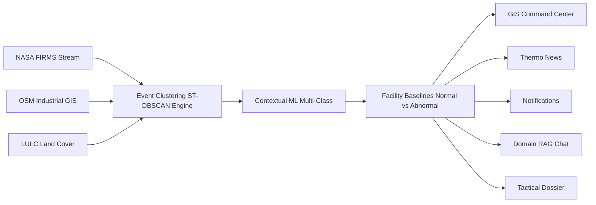

# Product Requirements Document (PRD)

# Thermo Intelligence: Industrial Fire & Persistent Thermal Source Detection Platform

**Document Version:** 1.0.0  
**Project Identifier:** SIH-2026-PS26162 (National Technical Research Organisation — NTRO)  
**Status:** Approved / Authoritative  
**Last Updated:** August 2026  
**Target Environment:** Web (Desktop, Tablet, Mobile)  

---

## 1. Document Overview

This Product Requirements Document (PRD) establishes the authoritative product, functional, data, and user experience requirements for the **Thermo Intelligence** platform. It provides developers, AI agents, designers, and hackathon evaluators with an unambiguous specification of what to build, why it is being built, how data flows across the system, and how the end-user interacts with every capability.

---

## 2. Problem Statement & Background

### 2.1 The Problem
Satellite-based thermal sensors—predominantly **NASA FIRMS** (utilizing VIIRS 375m and MODIS 1km instruments)—detect thermal hotspots by measuring brightness temperatures ($T_b$) and Fire Radiative Power (FRP). However, satellite sensors only register raw radiometric anomalies; they possess **no native understanding** of ground truth or industrial context.

As a result:
- Routine operational gas flaring at an oil refinery is visually indistinguishable from an uncontrolled structural blaze or pipeline rupture.
- Agricultural stubble burning in seasonal cycles creates clusters that appear identical to wildfire fronts or industrial slag dumping.
- Emergency responders and environmental intelligence agencies (such as NTRO, state disaster management authorities, and industrial safety boards) suffer from **alert fatigue** or **delayed response times** due to the absence of automated contextual interpretation.

### 2.2 The Solution
**Thermo Intelligence** transforms raw, uncontextualized NASA FIRMS radiometric points into actionable **Thermal Event Intelligence** through spatio-temporal clustering, geographic fusion (OpenStreetMap industrial boundaries and LULC land-cover data), machine learning classification, and facility-specific baseline anomaly tracking.



---

## 3. Product Vision & Value Proposition

### 3.1 Vision
To deliver India's premier, real-time industrial thermal monitoring and geospatial intelligence platform that empowers defense, environmental, and disaster response organizations to identify, classify, track, and mitigate thermal anomalies within seconds of satellite acquisition.

### 3.2 Dual-Axis Intelligence Model
The system explicitly separates two foundational analytical questions:

| Axis | Core Question | Example Outputs |
| :--- | :--- | :--- |
| **Axis A: Source Identity** | *What is the physical source of this thermal event?* | Industrial Flaring, Accidental Industrial Fire, Steel Smelter / Kiln, Agricultural Residue, Wildfire, Urban / Unknown. |
| **Axis B: Operational Behavior** | *Is this thermal signature behaving normally or abnormally?* | **Normal:** Recurring flare within 1.0$\sigma$ baseline FRP.<br>**Elevated:** Persistent flare operating at 1.5$\sigma$–2.5$\sigma$.<br>**Abnormal:** Thermal footprint expanded by >300% in 3h.<br>**Critical / Emergency:** Sudden FRP surge (>4.0$\sigma$) indicating explosion or uncontrolled fire. |

---

## 4. Goals & Non-Goals

### 4.1 Product Goals
1. **Contextual Event Synthesis:** Group raw FIRMS hotspot detections into cohesive, multi-observation "Thermal Events" with defined centroids, convex hulls, and lifecycles.
2. **Automated Source Classification:** Accurately classify thermal events using tabular/geospatial features (distance to industrial sites, facility category, FRP density, diurnal signatures, land-use) with explicit confidence scores.
3. **Persistence & Baseline Profiling:** Maintain multi-temporal historical records for critical facilities across India, computing historical normal FRP ranges ($Q_{25}$, $Q_{50}$, $Q_{75}$, $\mu$, $\sigma$) to detect operational anomalies.
4. **Professional GIS Command Interface:** Provide a fluid, dark-mode geospatial dashboard supporting dynamic multi-layer toggles, timeline scrubbers, and "Earlier vs. Now" change detection.
5. **Real-time Event Dispatch:** Generate instant intelligence feeds (**Thermo News**) and push notifications for high-severity or anomalous events.
6. **Grounded Conversational Intelligence:** Enable natural language querying over live and historical application data via a Retrieval-Augmented Generation (RAG) assistant that never hallucinates unobserved data.
7. **One-Click Tactical Dossier Export:** Produce structured, publication-grade intelligence reports in PDF/HTML format with embedded satellite visual evidence, metrics, and incident timelines.

### 4.2 Non-Goals (Out of Scope for MVP)
- Replacing NASA's satellite calibration hardware or developing new orbital sensor algorithms.
- Enforcing mandatory real-time deep learning on high-resolution optical imagery for every single detection (optical/SWIR satellite imagery is used as supporting visual evidence).
- Operating as an active remote firefighting actuation system (e.g., controlling sprinklers or dispatching drones automatically).
- Serving as a general-purpose unstructured chatbot for non-thermal domains (e.g., weather forecasts, general trivia).
- Mandatory global real-time coverage from Day 1 (Phase 1 focus is strictly the **Indian Subcontinent**).

---

## 5. Target User Personas

### 5.1 Persona Summary Matrix

| Persona | Role & Organization | Primary Goals | Key Pain Points | Crucial System Features |
| :--- | :--- | :--- | :--- | :--- |
| **P1: Tactical Intelligence Analyst** | NTRO / National Security Agency | Monitor critical national infrastructure (refineries, power grids, defense industrial corridors) for sabotage, explosions, or covert emissions. | Manual parsing of millions of raw FIRMS coordinates; inability to isolate industrial signatures from farm fires. | Industrial Layer GIS, Facility Anomaly Alerts, Tactical PDF Dossiers, Earlier vs. Now Analysis. |
| **P2: Industrial Safety & Operations Officer** | State Disaster Management / Factory Inspectorate / Petrochemical Safety Boards | Immediate notification of runaway fires, gas leaks, and industrial explosions before local reporting occurs. | Delayed emergency dispatch; lack of historical baseline context for permitted flares. | Smart Notifications, High-Severity Filter, FRP Surge Index, Radius Buffer Analysis. |
| **P3: Environmental Compliance Officer** | Central/State Pollution Control Boards (CPCB / SPCB) | Track unpermitted nighttime industrial flaring, illegal slag burning, and enforce stubble burning prohibitions in Punjab/Haryana. | Lack of persistent multi-day proof; greenwashing by industrial operators claiming "normal maintenance". | Persistence Tracker, Historical Thermal Curve, Agricultural vs. Industrial Classifier, Exportable Incident Logs. |
| **P4: Geospatial Research Scientist** | Environmental Remote Sensing Labs | Investigate multi-year industrial thermal trends, carbon emission correlation, and wildfire boundaries. | Rigid map dashboards lacking tabular filtering and export capabilities. | Conversational Querying (Chat), Custom Date/FRP Filters, Raw Metadata Inspector, Multi-Sensor Toggles. |

---

## 6. Key Use Cases & User Journeys

### 6.1 Journey 1: Identifying an Accidental Refinery Explosion
1. **Trigger:** A new VIIRS night pass detects a sudden 450 MW FRP cluster over Jamnagar Refinery (normal baseline: 35–65 MW).
2. **System Action:**
   - Clusters 8 raw FIRMS detections into `EVT-IN-GUJ-202608-0042`.
   - Spatially intersects with the Reliance Jamnagar Industrial Polygon.
   - Calculates FRP $Z$-score = $+5.8\sigma$ above historical baseline.
   - Classifier labels event: **Industrial Accidental Fire / Severe Flaring Anomaly** (Confidence: 94%).
   - Generates a **Thermo News** item: *"CRITICAL: Abnormal Thermal Surge (450 MW) at Jamnagar Petrochemical Complex"*.
   - Dispatches a High-Severity in-app toast and browser push alert.
3. **User Action:**
   - Analyst clicks notification $\rightarrow$ Map automatically flies and zooms to Jamnagar with the thermal bounding box highlighted.
   - Opens **Event Investigation Drawer** $\rightarrow$ Views "Earlier vs. Now" comparison showing a 700% expansion in thermal radius over 4 hours.
   - Clicks **"Generate Tactical Report"** $\rightarrow$ Configures sections $\rightarrow$ Exports official PDF intelligence dossier for senior command.

### 6.2 Journey 2: Distinguishing Seasonal Stubble Fires from Nearby Steel Plant
1. **Trigger:** November harvest season in Punjab/Haryana creates dense regional thermal clusters near a captive power plant in Bathinda.
2. **System Action:**
   - Spatially isolates agricultural land-cover detections from the isolated industrial point source.
   - Labels agricultural clusters as **Agricultural / Stubble Burning** (Confidence: 91%, Transient, Duration: 4h).
   - Labels the power plant point source as **Routine Industrial High-Temp Facility** (Confidence: 89%, Persistent 180+ days).
3. **User Action:**
   - Analyst applies filter `Classification = Industrial Only` $\rightarrow$ The 500+ agricultural dots fade out, leaving only verified industrial points visible for focused monitoring.

### 6.3 Journey 3: Conversational Intelligence Query
1. **User Action:** Types into the Application Chat: *"Show me all persistent industrial thermal sources in Odisha active for more than 30 days with average FRP > 25 MW."*
2. **System Action:**
   - Extracts structured parameters (`state="Odisha"`, `persistent=true`, `duration_days >= 30`, `avg_frp >= 25`, `category="Industrial"`).
   - Executes database query against the local thermal intelligence store.
   - Formulates a grounded natural language summary detailing 4 matching facilities (e.g., Angul Steel Plant, Jharsuguda Smelter, Paradeep Refinery, Kalinganagar Industrial Complex).
   - Provides interactive chip links that fly the GIS camera directly to each facility upon clicking.

---

## 7. Product Scope & Functional Breakdown

```
+-------------------------------------------------------------------------------------------------------------+
|                                        THERMO INTELLIGENCE CAPABILITIES                                     |
+------------------------------------+-----------------------------------+------------------------------------+
| 1. CORE GIS COMMAND CENTER         | 2. ANALYTICS & PERSISTENCE        | 3. COMMUNICATIONS & REPORTING      |
| - Dark Multi-Basemap GIS           | - Spatio-Temporal Clustering      | - Live Thermo News Bulletin Feed   |
| - Layer Controller (5 layers)      | - Contextual ML Classifier (6 cl) | - Multi-Tier Notification Drawer   |
| - Dynamic Level-of-Detail (LOD)    | - Facility Baseline Engine        | - Grounded Conversational RAG Chat |
| - Bounding Box & Polygon Selection | - FRP Z-Score Surge Detector      | - Tactical PDF Dossier Generator   |
| - Time Scrubbing (6h/24h/7d/30d)   | - Earlier vs Now Visual Slider    | - CSV/GeoJSON Intelligence Export  |
+------------------------------------+-----------------------------------+------------------------------------+
```

---

## 8. GIS & Mapping Requirements

### 8.1 Map Interface & Navigation
- **Default Viewport:** Centered over the Indian Subcontinent (`[20.5937° N, 78.9629° E]`, Zoom Level: 5).
- **Controls:** Intuitive Pan, Smooth Pinch/Scroll Zoom, Reset to India Extent, Geolocation Locator, Coordinate & Scale Display, Fullscreen Mode.
- **Basemap Styles:**
  1. *Aerospace Dark Matter* (Default: high-contrast dark vector map optimized for glowing thermal overlays).
  2. *High-Resolution Satellite Hybrid* (Optical satellite imagery with annotated administrative boundaries).
  3. *Topographic / Terrain* (Contour and elevation relief for wildfire and slope analysis).

### 8.2 GIS Layer Specifications

| Layer Name | Visual Representation | Contents / Attributes | Zoom Visibility |
| :--- | :--- | :--- | :--- |
| **1. Thermal Intelligence Layer (Primary)** | Color-coded glowing circles & cluster badges with pulsating halos for critical anomalies. | Clustered events showing FRP, classification color, confidence badge, active hotspot count. | Visible at all zoom levels (Clusters at Zoom 1–7; Individual event footprints at Zoom 8+). |
| **2. Industrial Infrastructure Layer** | Crisp vector polygons and facility icons (Refinery, Power, Steel, Mine, Chemical). | Facility Name, Sector, Operator, Capacity, Baseline FRP, Historical Anomaly Count. | Polygons emerge at Zoom 7+; Detailed equipment/tank bounds at Zoom 12+. |
| **3. Raw FIRMS Hotspot Layer** | Micro-points (orange/red/yellow based on $T_b$). | Individual VIIRS/MODIS sensor pixels, scan angle, track, confidence percentage. | Visible on toggle at Zoom 9+. |
| **4. Land-Use / Land-Cover (LULC) Layer** | Semi-transparent tinting (Forest=Green, Cropland=Amber, Urban=Gray, Water=Blue). | Land classification category, vegetation health indicator (NDVI proxy). | Toggleable at Zoom 6+. |
| **5. Anomaly & Risk Contour Layer** | Dynamic gradient heatmaps & safety radius buffer rings (1km, 5km, 10km zones). | $Z$-score anomaly heat concentration, nearest populated settlement distance. | Zoom 8+. |

### 8.3 Dynamic Loading & Level-of-Detail (LOD) Strategy
To guarantee sub-second rendering performance on all devices:
- **Broad Overview (Zoom 1–6):** Render aggregated regional macro-clusters (e.g., *"Gujarat: 14 Industrial Events (2 Critical)"*).
- **Sub-Regional View (Zoom 7–10):** Render discrete event bounding circles, facility markers, and land-use contextual zones.
- **Deep Investigation (Zoom 11–18):** Render precise satellite footprint polygons, facility boundary lines, individual sensor detection coordinates, and safety buffer radii.

---

## 9. Data Ingestion & Integration Requirements

### 9.1 NASA FIRMS Satellite Specifications
The system must ingest both near-real-time (NRT) and historical thermal anomaly records across:
- **VIIRS (S-NPP, NOAA-20, NOAA-21):** 375m spatial resolution I-band (High sensitivity for small industrial flares and early fires).
- **MODIS (Terra & Aqua):** 1km spatial resolution (Long-term historical baselines spanning 2000–present).

**Required Normalized Attributes per Detection:**
- `latitude` (Float, -90.0 to 90.0)
- `longitude` (Float, -180.0 to 180.0)
- `brightness_temp_kelvin` (Float, 4um I-4/Channel 21 temperature)
- `brightness_temp_alt_kelvin` (Float, 11um I-5/Channel 31 background temperature)
- `frp_mw` (Float, Fire Radiative Power in MegaWatts)
- `acquisition_date` (ISO Date `YYYY-MM-DD`)
- `acquisition_time_utc` (Time `HH:MM:SS`)
- `satellite_sensor` (`VIIRS_NOAA20`, `VIIRS_SNPP`, `MODIS_TERRA`, `MODIS_AQUA`)
- `detection_confidence` (Categorical or Percentage: `low`, `nominal`, `high`, or `0–100%`)
- `day_night_flag` (`D` / `N`)

### 9.2 Industrial Infrastructure Knowledge Base
Pre-populated, verified spatial registry of India's major industrial installations:
- **Coverage:** Major Oil Refineries (Jamnagar, Paradip, Panipat, Mumbai, Kochi, Barauni, Bina, Tatipaka), Petrochemical Complexes (Dahej, Hazira, Nagothane), Thermal Power Stations (Singrauli, Korba, Vindhyachal, Mundra), Integrated Steel Plants (Rourkela, Bhilai, Jamshedpur, Bokaro, Vijayanagar), LNG Terminals, and Coal Mining Belts (Jharia, Raniganj, Talcher).
- **Attributes:** Facility ID, Name, Category, State, District, Operating Authority, Precise Polygon Bounds / Centroid, Normal Operating Baseline ($FRP_{median}$, $FRP_{std}$).

### 9.3 Environmental & Land-Cover Data
- Multi-class spatial raster/vector indexing: Forest/Deciduous/Evergreen, Agricultural/Cropland, Urban/Built-up, Water Bodies, Barren/Scrubland.

---

## 10. Thermal Event Formation & Spatial Clustering

Raw satellite passes often produce dozens of discrete point detections for a single industrial flaring battery or industrial fire incident. The platform must perform automated spatio-temporal clustering:

```
                  RAW OBSERVATIONS                            FORMED THERMAL EVENT
         +-------------------------------+               +--------------------------------+
         | • Pt 1: 342K, 12MW (20:14 UTC)|               | Event ID: EVT-IN-ODI-0012      |
         | • Pt 2: 355K, 28MW (20:14 UTC)|  ST-DBSCAN    | Facility: Paradeep Refinery    |
         | • Pt 3: 360K, 45MW (20:15 UTC)| ------------> | Centroid: 20.291°N, 86.674°E   |
         | • Pt 4: 338K,  8MW (20:15 UTC)|               | Hotspots: 4 | Peak FRP: 45MW   |
         | • Pt 5: 349K, 19MW (20:16 UTC)|               | Total FRP: 104MW | Radius: 650m|
         +-------------------------------+               +--------------------------------+
```

### 10.1 Clustering Parameters
- **Spatial Radius Threshold ($\epsilon_{spatial}$):** $750\text{ meters}$ (adaptive for industrial zones; $1.5\text{ km}$ for rural/forest zones).
- **Temporal Window Threshold ($\epsilon_{temporal}$):** $12\text{ hours}$ for continuous active grouping.
- **Minimum Hotspots ($MinPts$):** 1 (single isolated high-confidence detection can initiate an event entity).

### 10.2 Computed Event Entity Properties
- `event_id` (Unique string, e.g., `EVT-IN-GUJ-202608-0042`)
- `centroid_lat`, `centroid_lon`
- `spatial_envelope` (Convex Hull Polygon & Approximate Area in Hectares / Acres)
- `first_observed_utc`, `latest_observed_utc`, `duration_hours`
- `total_detections_count`
- `peak_frp_mw`, `mean_frp_mw`, `aggregate_frp_mw`
- `max_brightness_kelvin`
- `associated_facility_id` (Nullable if outside industrial buffer)
- `distance_to_nearest_facility_meters`
- `primary_land_use_type`
- `classification_label`, `classification_confidence_pct`
- `persistence_class` (`Transient`, `Intermittent`, `Persistent`)
- `anomaly_severity` (`Normal`, `Elevated`, `Abnormal`, `Critical`)
- `lifecycle_status` (`Active`, `Cooling`, `Resolved`)

---

## 11. Machine Learning & Contextual Classification

### 11.1 Target Classification Schema

| Class Code | Class Name | Definition & Typical Signatures |
| :--- | :--- | :--- |
| **`IND_FIRE`** | **Industrial Accidental Fire / Explosion** | Uncontrolled blazes inside or adjacent to industrial assets. High FRP surge ($>3.5\sigma$), rapid spatial expansion, nocturnal & diurnal presence, high confidence. |
| **`IND_FLARE`** | **Industrial Persistent Flare / Stack** | Routine or maintenance gas flaring at refineries, petrochemical facilities, or offshore platforms. Compact footprint ($<300\text{m}$), highly persistent ($>30\text{ days}$), stable FRP profile. |
| **`IND_ROUTINE`** | **Routine High-Temp Industrial Facility** | Blast furnaces, steel converters, cement kilns, slag pits. Fixed coordinates directly matching OSM industrial polygons. |
| **`AGRI_BURN`** | **Agricultural / Stubble Burning** | Crop residue burning in agricultural parcels. Seasonal (Oct–Nov, Apr–May), transient duration ($<8\text{ hours}$), low-to-medium FRP ($5–35\text{ MW}$), broad spatial dispersion. |
| **`WILDFIRE`** | **Wildfire / Forest Fire** | Uncontrolled vegetation fire in forest reserves/scrubland. High FRP, advancing linear/curved perimeter, zero industrial overlap. |
| **`OTHER_UNCERTAIN`**| **Other / Uncertain / Non-Industrial** | Low confidence, isolated single-pixel anomalies, or cloud-edge reflections. |

### 11.2 Feature Engineering Vectors
The ML classifier takes a multi-dimensional feature vector:
1. **Spatial Proximity:** Distance to nearest industrial boundary (m), facility type weight.
2. **Thermal Radiometry:** Max Brightness Temp ($K$), Background Temp Diff ($\Delta T$), Max FRP (MW), FRP Density ($\text{MW}/\text{km}^2$).
3. **Temporal Dynamics:** Detection duration (hours), day/night observation ratio, hour of acquisition.
4. **Historical Persistence:** Number of detections within 1km over past 30/90/365 days, historical recurrence frequency.
5. **Land-Cover Context:** Percentage overlap with Industrial, Agricultural, Forest, Urban, or Water masks.

### 11.3 Model Output & Explainability
- Primary predicted class with calibrated probability percentage (e.g., *"Industrial Accidental Fire — 91.4% Confidence"*).
- **Top 3 Contributing Feature Drivers** (e.g., *1. Distance to Refinery: 45m; 2. FRP Surge: +4.2x above baseline; 3. Duration: 14h*).

---

## 12. Persistence & Historical Baseline Analysis

### 12.1 Persistence Profiling Engine
The system queries the multi-year thermal historical repository for each spatial cluster:
- **First Recorded Detection Date** vs. **Most Recent Detection Date**.
- **Historical Detection Count ($N_{hist}$):** Total satellite hits within a 500m radius over the trailing 12 months.
- **Persistence Categorization:**
  - *Transient:* Active $< 24\text{ hours}$, 0 historical detections in past 90 days (e.g., farm fires).
  - *Intermittent:* Active periodically (e.g., batch kilns, periodic maintenance flaring).
  - *Permanent / Highly Persistent:* $>15\text{ detection days per month}$ over 6+ months (e.g., continuous refinery flares).

### 12.2 Facility-Specific Baseline & Anomaly Engine
For every registered industrial asset, the system maintains a running baseline distribution:
```text
mean_FRP = Historical Mean FRP
std_FRP = Historical Standard Deviation
```

When a new event occurs inside the facility boundary:
```text
Z-Score = (FRP_observed - mean_FRP) / std_FRP
```

```
+----------------------------------------------------------------------------------------------------+
|                                    ANOMALY SEVERITY TIERS                                          |
|                                                                                                    |
|  [ Z < 1.5 ]       --->  NORMAL      (Routine operational flaring / permitted thermal activity)    |
|  [ 1.5 <= Z < 2.5] --->  ELEVATED    (Increased flaring / process venting; flagged for monitoring) |
|  [ 2.5 <= Z < 4.0] --->  ABNORMAL    (Significant thermal deviation / potential minor incident)    |
|  [ Z >= 4.0 ]      --->  CRITICAL    (Severe emergency / explosion / uncontrolled structural fire) |
+----------------------------------------------------------------------------------------------------+
```

---

## 13. Event Details Experience & "Earlier vs. Now" Timeline

### 13.1 Slide-Out Investigation Drawer
Clicking any event card, map marker, or news bulletin opens a comprehensive investigation drawer partitioned into 4 tactical tabs:

#### Tab 1: Current State
- Primary Classification Badge with Confidence Score.
- Real-time Status (`Active`, `Peak Intensity`, `Cooling`).
- Live Metrics Grid: Peak FRP (MW), Max Temperature (K), Active Sensor Hits, Spatial Footprint (Hectares), First Detected, Elapsed Duration.
- Primary Feature Attribution (Why the AI made this classification).

#### Tab 2: Historical Baseline
- Interactive Chart: **Observed Thermal FRP vs. Facility Historical Baseline ($\pm 1\sigma, 2\sigma$ envelopes)**.
- 30-Day Activity Heatmap (Day-by-day recurrence density).
- Historical Anomaly Summary ($Z$-Score, percentile rank).

#### Tab 3: Geographic & Asset Context
- Associated Facility Name, Sector, Operator, and Emergency Contact details.
- Surrounding Land-Use breakdown (e.g., *78% Industrial, 14% Urban, 8% Barren*).
- Vulnerability Proximity: Distance to nearest residential settlement, critical fuel storage tanks, and water reservoirs.

#### Tab 4: "Earlier vs. Now" Timeline & Satellite Visual Evidence
- **Interactive Temporal Slider:** Scrub back through previous satellite passes (e.g., *T-18h $\rightarrow$ T-12h $\rightarrow$ T-6h $\rightarrow$ Current Pass*).
- Side-by-Side Visual Comparison Card:
  - *Earlier Pass:* Footprint map / SWIR false-color rendering.
  - *Current Pass:* Expanded thermal plume / anomaly delta indicator.
- Metric Delta Summary (e.g., *FRP increased by +185 MW (+320%) in past 6 hours*).

---

## 14. Supporting Satellite Imagery

- **Integration Mode:** Supporting visual context (Sentinel-2 MSI and Landsat-8/9 OLI).
- **Visualization Presets:**
  1. *True Color RGB (B4, B3, B2):* Standard optical view for smoke plumes and structural damage.
  2. *Short-Wave Infrared / SWIR False Color (B12, B8A, B4):* High-penetration infrared bands highlighting active flame fronts through dense smoke.
  3. *Burn Scar / Normalized Burn Ratio (NBR):* Post-fire damage boundary assessment.
- **Graceful Cloud Handling:** If satellite imagery is clouded or unacquired for the latest pass, the UI displays the timestamped synthetic thermal vector boundary with an explicit *"Optical pass obscured by clouds; thermal radiometry active"* badge.

---

## 15. Thermo News (Live Intelligence Feed)

### 15.1 Concept & Purpose
A dedicated, event-driven situational awareness stream that converts raw satellite telemetry into human-readable tactical bulletins for intelligence officers.

### 15.2 Bulletin Generation Logic
Bulletins are generated exclusively when a meaningful event threshold is reached:
- New Critical / Abnormal Industrial Fire detected.
- Significant FRP surge ($>+100\%$) at a persistent facility.
- New high-persistence thermal cluster confirmed.
- Containment / Resolution of a major tracked industrial incident.

### 15.3 Bulletin Card Attributes
- Severity Indicator Tag (`CRITICAL`, `ALERT`, `NOTICE`, `PERSISTENCE UPDATE`).
- Timestamp (e.g., *"12 mins ago — NOAA-20 VIIRS Pass"*).
- Headline (e.g., *"Thermal Surge Detected at Dahej Petrochemical Zone"*).
- One-Sentence Tactical Summary.
- Mini Metric Badges (FRP: 184 MW, Area: 12 Ha, Anomaly: $+3.8\sigma$).
- **Direct Action Button:** *"Investigate on Map"* (smoothly pans and zooms the GIS camera to the event coordinates and opens the investigation drawer).

---

## 16. Smart Notification Center

### 16.1 Notification Channels
1. **In-App Notification Drawer:** Persistent badge counter with slide-out history log.
2. **Interactive Audio-Visual Toasts:** High-priority banners for newly ingested `CRITICAL` events.
3. **Browser Web Push Notifications:** Instant OS-level notifications (with user permission) even when the tab is backgrounded.

### 16.2 Smart Anti-Fatigue Clustering
- Raw FIRMS points **never** trigger individual alerts.
- Notifications only fire upon **Event Creation** or **Severity Tier Escalation** (e.g., an event shifting from *Elevated* to *Critical*).
- Mute / Threshold Configuration: Users can filter notification triggers by Minimum Severity (e.g., *Only Critical Anomalies*) or Specific Facility Sectors.

---

## 17. Grounded Conversational AI Assistant (RAG Chat)

### 17.1 Chat Architecture & Truth Grounding
The conversational interface operates on a strict **Retrieval-First Principle**:
1. **User Query Analysis:** The assistant extracts intent, temporal bounds, spatial filters, and metric constraints from natural language queries.
2. **Structured Query Execution:** The system executes structured queries against the application's real-time and historical event database.
3. **Grounded Synthesis:** The LLM receives the verified tabular records and produces concise, natural language intelligence answers with interactive citations.
4. **Strict Guardrails:** The LLM is strictly prohibited from inventing non-existent facilities, temperatures, dates, or casualty statistics.

```
                          GROUNDED CONVERSATIONAL AI FLOW
+-----------------------+     +--------------------------+     +-------------------------+
| "Show abnormal flares | --> | Structured SQL/GeoQuery  | --> | Fetches 3 Active Events |
| in Gujarat past 24h"  |     | State='GJ', Anomaly>=Abn |     | with real FRP & coords  |
+-----------------------+     +--------------------------+     +-------------------------+
                                                                             |
                                                                             v
+----------------------------------------------------------------------------------------+
| LLM Synthesis: "Found 3 abnormal thermal events in Gujarat over the past 24 hours:     |
| 1. Jamnagar Complex (450 MW, +5.8σ) [Fly to Event]                                     |
| 2. Dahej Petrochem (184 MW, +3.8σ) [Fly to Event]                                      |
| 3. Hazira Gas Terminal (92 MW, +2.7σ) [Fly to Event]"                                  |
+----------------------------------------------------------------------------------------+
```

### 17.2 Sample Supported Query Categories
- *Temporal:* "Were there any major thermal spikes in India during the last 6 hours?"
- *Spatial / Facility:* "List all active events within 20km of Paradip Port."
- *Comparative / Persistence:* "Which industrial facility has recorded the longest continuous thermal flaring this month?"
- *Extremes:* "What is the single highest FRP event currently active in India?"

---

## 18. Tactical Report Generation

### 18.1 Comprehensive Incident Dossier
Users can generate structured, print-ready intelligence dossiers for any selected event or regional cluster.

### 18.2 Customizable Report Sections

| Section ID | Section Title | Content Elements |
| :--- | :--- | :--- |
| **SEC-1** | **Executive Incident Brief** | Event ID, Classification, Confidence, Severity Level, Timestamp, Location, Facility Name, Overall Assessment Summary. |
| **SEC-2** | **Radiometric & Spatial Telemetry** | Peak FRP, Mean FRP, Maximum Brightness Temperature, Sensor Type, Hotspot Pixel Count, Estimated Bounding Area (Ha). |
| **SEC-3** | **Historical Baseline & Anomaly Delta** | Facility Baseline Comparison Table ($\mu_{hist}, \sigma, Z$-score), 30-Day FRP Trend Graph, Persistence Duration. |
| **SEC-4** | **Geographic & Environmental Context** | Land-Use Breakdown Pie Chart, Nearest Residential Settlement Distance, Vulnerable Asset Proximity Buffer. |
| **SEC-5** | **Chronological Event Timeline** | Multi-pass progression table (*First Detection $\rightarrow$ Peak Surge $\rightarrow$ Current State*). |
| **SEC-6** | **Visual Satellite Evidence** | Embedded True-Color / SWIR satellite comparison thumbnails and bounding footprint overlay. |
| **SEC-7** | **Tactical Recommendations & Next Steps** | Action checklist for on-ground verification, emergency services liaison, and regulatory dispatch. |

### 18.3 Export Formats
- **Standard PDF Export:** Crisp, multi-page branded layout with official NTRO/Thermo Intelligence headers, vector charts, and metadata stamps.
- **HTML / Print Preview:** Instant browser print dialogue formatted for A4 standard.
- **Structured JSON / GeoJSON Export:** For ingestion into external defense C4I or GIS suites.

---

## 19. Search, Filter & Exploration Engine

### 19.1 Global Universal Search
- Instant omnibox search supporting:
  - Facility Name (e.g., *"Jamnagar"*, *"Bhilai Steel"*, *"Singrauli Power"*).
  - Region / State / District (e.g., *"Odisha"*, *"Kutch"*, *"Punjab"*).
  - Event ID (e.g., *"EVT-IN-GUJ-0042"*).
  - Geographic Coordinates (e.g., *"22.47, 70.06"*).

### 19.2 Multi-Dimensional Filter Bar
- **Classification Filter:** Multi-select checkboxes (`Industrial Fire`, `Industrial Flare`, `Routine Facility`, `Agricultural`, `Wildfire`, `Uncertain`).
- **Severity Filter:** Single/Multi-select (`Normal`, `Elevated`, `Abnormal`, `Critical`).
- **Temporal Filter:** Quick chips (`Last 6 Hours`, `Last 24 Hours`, `Last 7 Days`, `Last 30 Days`, `Custom Date Range`).
- **FRP Intensity Range Slider:** $0\text{ MW}$ to $1000+\text{ MW}$.
- **Persistence Filter:** Toggle (`All Events`, `Persistent Sources Only (>15 days)`, `Transient Only (<24h)`).

---

## 20. UX/UI & Responsive Design Requirements

### 20.1 Design Aesthetic: Aerospace Dark Command Center
- **Color Palette:** Curated dark theme (Deep Obsidian `#0A0E17`, Navy Glass `#121B2B`, Card Surface `#1A263B`).
- **Accent Signals:**
  - Critical / Fire Surge: Glowing Crimson/Amber (`#FF3B30`, `#FF9500`).
  - Persistent Flare: Electric Cyan / Sky (`#00D2FF`).
  - Agricultural: Harvest Gold (`#FFCC00`).
  - Wildfire: Forest Flame (`#FF6B00`).
  - Normal / Compliant: Emerald Green (`#34C759`).
- **Typography:** Modern, ultra-legible sans-serif (Inter / Outfit) with monospace tabular numerics for coordinates and timestamps.
- **Atmosphere:** Subtle glassmorphism, subtle micro-glow animations on active thermal anomalies, zero visual clutter.

### 20.2 Responsive Device Adaptations

```
+----------------------------------------------------------------------------------------------------+
|                                    RESPONSIVE LAYOUT MATRIX                                        |
+---------------------+-----------------------------------+------------------------------------------+
| Device Type         | Screen Width                      | Layout Configuration                     |
+---------------------+-----------------------------------+------------------------------------------+
| **Desktop / Widescreen** | $\ge 1200\text{px}$          | Fullscreen GIS with persistent Top Bar,  |
|                     |                                   | collapsible Left Filter/News Sidebar,    |
|                     |                                   | and slide-in Right Investigation Drawer. |
+---------------------+-----------------------------------+------------------------------------------+
| **Tablet / Laptop** | $768\text{px} - 1199\text{px}$    | Fullscreen GIS with overlay toggle       |
|                     |                                   | drawers and bottom quick-stats bar.      |
+---------------------+-----------------------------------+------------------------------------------+
| **Mobile**          | $< 768\text{px}$                  | Bottom Navigation Bar (Map, News, Chat,  |
|                     |                                   | Alerts), Swipeable Bottom Sheet Drawer   |
|                     |                                   | for Event Investigation & Filters.       |
+---------------------+-----------------------------------+------------------------------------------+
```

### 20.3 First-Open Onboarding Experience
- Fast, non-intrusive 30-second interactive intro modal for first-time visitors:
  1. *Welcome to Thermo Intelligence (NTRO PS 26162)*.
  2. *How Raw FIRMS becomes Actionable Event Intelligence*.
  3. *Key Features: GIS Layers, Anomaly Baselines, News & AI Chat*.
  4. Single-click *"Launch Command Center"* button with a *"Don't show again"* local storage flag.

---

## 21. Data Freshness, Latency & Provenance

- **Satellite Pass Cadence:** VIIRS and MODIS satellites operate on sun-synchronous polar orbits, crossing the Indian Subcontinent 4–6 times every 24 hours (day and night passes).
- **Latency Communication:** The UI explicitly displays the **Data Freshness Timestamp** (e.g., *"Latest Satellite Ingestion: 28 mins ago — VIIRS NOAA-20"*).
- **Transparent Provenance:** Every event card prominently displays the underlying sensor instrument, orbit pass type, and acquisition UTC timestamp.

---

## 22. Error Handling, Data Quality & Resilience

| Potential Failure Scenario | Graceful Degradation & Fallback Strategy |
| :--- | :--- |
| **NASA FIRMS API Latency / Downtime** | Fall back seamlessly to cached near-real-time records and historical baseline database with an in-app status banner: *"Operating on Cached Satellite Telemetry"*. |
| **Missing / Incomplete OSM Facility Data** | Event is classified based on radiometry + LULC context. Marked as *"Unregistered Industrial Zone"* if spectral traits match industrial flaring. |
| **Cloud-Obscured Satellite Imagery** | Display synthetic vector bounding box and thermal radiometry curve with a *"Visible pass obscured by clouds"* notification. |
| **Low ML Confidence ($<50\%$)** | Flag event explicitly as `OTHER_UNCERTAIN` / `Under Analysis`. Never force false certainty. |
| **LLM Provider API Timeout** | Fall back to pre-structured template-based summaries and rule-based conversational query answers without breaking the UI. |

---

## 23. Security, Privacy & Access

- **Public Demonstration Mode:** Zero mandatory login barriers for hackathon evaluators to immediately access all GIS, News, Chat, and Reporting features.
- **Role-Based Access Control (RBAC Ready):** Modular architecture supporting `Analyst`, `Supervisor`, and `Administrator` roles for future enterprise deployments.
- **Client-Side Data Protection:** User report configurations and notification settings stored in local browser state (`localStorage`).
- **API Defense:** Rate-limiting middleware and input sanitization on all backend endpoints to prevent abuse.

---

## 24. Scope Matrix: MVP (Hackathon Prototype) vs. Future Roadmap

| Capability | Phase 1: MVP / SIH Working Prototype | Phase 2: Production & Future Roadmap |
| :--- | :--- | :--- |
| **Geographic Extent** | **India Subcontinent & Coastal Waters** (Full Coverage) | Global Worldwide Ingestion |
| **Data Ingestion** | NASA FIRMS VIIRS (375m) + MODIS (1km) + Mock Stream | Direct ISRO INSAT-3D/3DR + European Sentinel-3 SLSTR |
| **Industrial Database** | Comprehensive Indian Refineries, Power, Steel, Mines | Global Overpass / OpenStreetMap Industrial Registry |
| **ML Classification** | Multi-Class Tabular + Geospatial Spatio-Temporal Model | Multi-Modal Deep Learning (SWIR + Tabular Transformer) |
| **Baseline Analytics** | Facility FRP Baseline Envelopes & Anomaly $Z$-Scores | Automated Predictive Flaring Forecasts (Prophet/LSTM) |
| **GIS Interface** | Leaflet / MapLibre Dark Aerospace Platform | 3D Cesium / Photorealistic Globe with 3D Facility BIM |
| **News & Alerts** | Real-time Thermo News Feed + Web Push Toasts | Automated SMS / WhatsApp / Telegram Emergency Bot |
| **AI Assistant** | Grounded Domain RAG Chatbot (Gemini / FastAPI) | Multi-Lingual Voice-Activated Emergency Assistant |
| **Reporting** | Multi-Section Tactical PDF / HTML Export | Automated Daily CPCB / NTRO Email Intelligence Briefing |

---

## 25. Acceptance Criteria

### AC-1: Data Ingestion & Clustering
- [ ] Raw NASA FIRMS observations over India are parsed with coordinates, FRP, $T_b$, confidence, and timestamps preserved.
- [ ] Detections within 750m and 12h are aggregated into a single `Thermal Event` with convex hull geometry.

### AC-2: Machine Learning Classification
- [ ] Every formed event receives a classification label (`IND_FIRE`, `IND_FLARE`, `IND_ROUTINE`, `AGRI_BURN`, `WILDFIRE`, `OTHER_UNCERTAIN`).
- [ ] Classification output includes a probability score ($0–100\%$) and primary feature attribution drivers.

### AC-3: Facility Baseline & Anomaly Engine
- [ ] Industrial facilities with historical records display normal baseline FRP bands ($\mu \pm \sigma$).
- [ ] Events exceeding $+2.5\sigma$ and $+4.0\sigma$ are designated as `ABNORMAL` and `CRITICAL` respectively.

### AC-4: GIS Command Platform
- [ ] User can pan, zoom, search, and toggle all 5 GIS layers (Thermal, Industrial, Raw Hotspots, Land-Cover, Anomaly Buffers).
- [ ] Clicking an event opens the 4-tab Investigation Drawer with real-time telemetry and "Earlier vs. Now" slider.

### AC-5: Thermo News & Notifications
- [ ] New critical/abnormal events dynamically generate items in the Thermo News feed.
- [ ] Clicking a news card immediately flies the map camera to the event location.
- [ ] High-priority notifications trigger toast banners with direct investigation shortcuts.

### AC-6: Grounded Conversational AI
- [ ] Chat responds accurately to queries regarding active events, facility status, and historical extremes.
- [ ] Responses are strictly grounded in application data and provide clickable map-linking chips.

### AC-7: Tactical Report Generation
- [ ] User can select desired sections and generate a professional, formatted PDF/HTML intelligence dossier.
- [ ] Generated reports contain valid timestamps, metrics, historical graphs, and satellite visual previews.

---

## 26. Success Metrics & Key Performance Indicators (KPIs)

1. **Classification Accuracy:** $>90\%$ precision in separating industrial thermal events from agricultural stubble burning and wildfires.
2. **Alert Turnaround Time:** $<3\text{ seconds}$ from satellite data ingestion to GIS visualization and Thermo News dispatch.
3. **GIS Performance:** 60 FPS smooth map pan/zoom with $<500\text{ms}$ initial layer render time.
4. **Zero-Hallucination Rate:** $100\%$ of conversational AI factual claims directly verifiable against underlying database records.
5. **Dossier Generation Speed:** $<2\text{ seconds}$ to compile and render a complete tactical PDF report.

---

## 27. Risks, Mitigations & Assumptions

### 27.1 Technical & Operational Risks

| Risk | Severity | Probability | Mitigation Strategy |
| :--- | :--- | :--- | :--- |
| **R1: Extreme Cloud Cover during Monsoons** | Medium | High | Rely on VIIRS I-band SWIR thermal penetration; display explicit cloud-obscuration flags in UI. |
| **R2: FIRMS API Rate Limits during Live Demo** | High | Medium | Implement robust local SQLite/JSON caching and realistic high-fidelity offline playback simulator. |
| **R3: Ambiguous Mixed-Land-Use Boundaries** | Medium | Medium | Implement confidence thresholds ($<60\%$ triggers `OTHER_UNCERTAIN` for human review). |
| **R4: High Browser Memory Usage with 10k+ Points** | Medium | Low | Use spatial clustering (ST-DBSCAN) and Level-of-Detail (LOD) viewport culling. |

### 27.2 Core Assumptions
- NASA FIRMS VIIRS/MODIS data feeds remain accessible via open API / standard CSV formats.
- OpenStreetMap and national registries provide sufficiently accurate bounding centroids for major Indian industrial complexes.
- Users operate modern web browsers supporting WebGL and ES6 JavaScript.

---

## 28. Document Sign-Off & Approvals

| Role | Organization | Status | Date |
| :--- | :--- | :--- | :--- |
| **Lead Solution Architect** | Thermo Intelligence Team | Approved | August 2026 |
| **Geospatial & ML Specialist** | Thermo Intelligence Team | Approved | August 2026 |
| **SIH Project Lead** | Thermo Intelligence Team | Approved | August 2026 |

---
*End of Product Requirements Document. This document serves as the authoritative specification for all subsequent technical architecture, backend engineering, GIS development, and UI implementation.*
