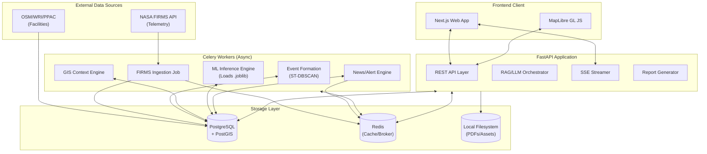
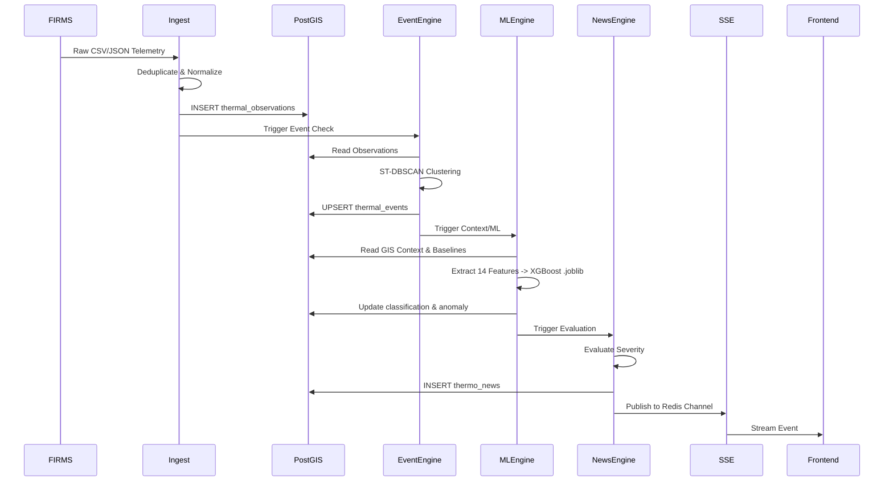
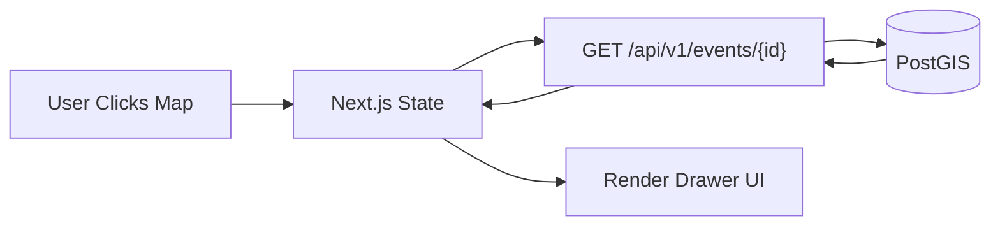
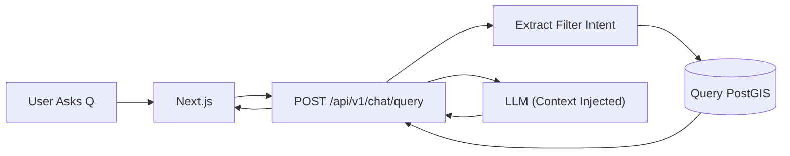

# OVERALL SYSTEM ARCHITECTURE DOCUMENT
## Thermo Intelligence — Industrial Fire & Persistent Thermal Source Detection

---

## 1. Architecture Purpose
This document defines the structural architecture of the Thermo Intelligence platform. It outlines exactly what components exist, their responsibilities, how they communicate, where the boundaries lie, and the flow of data through the system. This is the authoritative system-level reference for developers and agents building the SIH 2026 prototype.

## 2. Source Documents
This architecture is constrained and guided by the following locked project contracts:
1. `Thermo_Intelligence_PRD.md` (Product Requirements)
2. `Thermo_Intelligence_TRD.md` (Technical Requirements)
3. `Thermo_Intelligence_Workflow.md` (Operational Workflows)
4. `Thermo_Intelligence_Database_Storage.md` (Storage & Retention)
5. `Thermo_Intelligence_UIUX.md` (Design System)
6. `Thermo_Intelligence_DB_API_Contract.md` (Schema & REST API)
7. `openapi.yaml` (Machine-readable API Specification)

## 3. Architecture Principles
1. **Modular Monolith for MVP**: Avoid microservice explosion. Run the core system as a unified FastAPI application and a unified Celery background worker, backed by PostgreSQL and Redis.
2. **PostgreSQL/PostGIS is the System of Record**: No other component (not Redis, not the LLM, not the frontend) holds authoritative relational or spatial state.
3. **One Way Data Flow**: Raw Data → Validation → DB → Event Engine → Context/ML → DB → Frontend. 
4. **LLM as Synthesizer, Not Database**: The LLM cannot query the database arbitrarily. The backend fetches verified PostGIS records and injects them into the LLM prompt.
5. **No Direct DB Access from Frontend/ML**: The REST API is the only gateway. ML models run as local libraries (`.joblib`) invoked by the backend or workers, not as separate APIs (yet).

## 4. System Context
Thermo Intelligence ingests thermal telemetry primarily from NASA FIRMS, contextualizes it against industrial facility bounds, classifies it using Machine Learning, evaluates its anomaly level against historical baselines, and delivers actionable geospatial intelligence to a web-based command center.

## 5. Architecture Overview


## 6. Component Architecture & 7. Component Responsibilities
The system is divided into logical components mapped to runtime boundaries.

### Frontend Components (Next.js App)
* **Web Client**: Handles UI state, routing, and user interactions. Owns display logic. Reads from API.
* **GIS Rendering Layer**: MapLibre canvas. Owns vector-tile/GeoJSON rendering, viewport state.
* **Drawer Manager**: Contextual side-panel state for events/facilities.

### Backend Components (FastAPI Application)
* **REST API**: HTTP controllers, request validation (Pydantic), auth checks. Owns the API contract.
* **Grounded LLM/RAG Layer**: Extracts query intent, fetches PostGIS records, prompts LLM, formats response.
* **Report Generation Engine**: Fetches event data, merges into Jinja2 templates, renders PDFs.

### Worker Components (Celery Application)
* **FIRMS Ingestion Worker**: Fetches NASA APIs, normalizes, deduplicates, and inserts `thermal_observations`.
* **Event Formation Engine**: Runs ST-DBSCAN over unassigned observations to form/update `thermal_events`.
* **Geographic Context Engine**: Does spatial joins between `thermal_events` and `industrial_facilities`.
* **ML Inference Engine**: Loads `thermo_xgb_v1.joblib`, calculates 14-dim features, predicts classification.
* **Persistence/Baseline Engine**: Updates facility historical baselines based on new event closes.
* **Anomaly Engine**: Calculates Z-scores comparing current FRP to baselines.
* **News & Notification Dispatchers**: Triggers Thermo News and creates Alert records based on critical state changes.

## 8. System Boundaries
* **Frontend**: Strictly presentation. No business logic. Cannot touch DB directly.
* **Backend**: Strict stateless request/response lifecycle. Orchestrates reads/writes.
* **Workers**: Heavy compute (clustering, ML inference, PDF generation). Communicates state changes via Redis/DB.
* **Database**: Holds the single source of truth. Validates constraints.

## 9. Data-Flow Architecture


## 10. Request-Flow Architecture

### Event Investigation Flow


### RAG Chat Flow


## 11. FIRMS Ingestion Architecture
* **Trigger**: Scheduled Celery beat (e.g., every 30 mins) or manual API trigger.
* **Validation**: Drops rows missing coordinates or FRP.
* **Idempotency**: `SHA256(round(lat, 4) || round(lon, 4) || acq_time || sensor)` ensures no duplicates on overlap.
* **Failure**: Retries with exponential backoff on HTTP 429/500 from NASA.

## 12. Industrial/GIS Data Architecture
* **Facilities (`industrial_facilities`)**: Seeded once via ETL scripts (WRI/GEM/OSM) into PostGIS. Rarely changes.
* **Contextualization**: When an event is formed, the `Geographic Context Engine` runs `ST_DWithin(event.centroid, facility.geom, 2000m)` to link events to facilities (`associated_facility_code`).
* **Independence**: Thermal observations *never* alter facility master data.

## 13. Event-Processing Architecture
* **Where it runs**: Celery worker.
* **Mechanism**: Scans `thermal_observations` where `event_id IS NULL`. Runs ST-DBSCAN (`eps_spatial=750m`, `eps_temporal=12h`).
* **Result**: Assigns `event_id` to observations. Updates the `thermal_events` row (recalculating `ST_ConvexHull` bounding area, max FRP, and duration).

## 14. ML Architecture
* **Artifact**: `thermo_xgb_v1.joblib` built offline via Scikit-Learn pipeline.
* **Storage**: Packaged directly within the FastAPI/Celery container (e.g., `app/ml/models/`).
* **Inference**: The `MLEngine` (in Celery) reads the model into memory on startup. Extracts the 14-dimension vector from DB data, runs `.predict()`, and writes the Classification to `event_classifications`.
* **No separate API**: For the MVP, making HTTP calls to an internal ML microservice is unnecessary overhead.

## 15. Baseline/Anomaly Architecture
* **Baseline Engine**: Periodically (e.g., weekly) calculates `mean_frp` and `std_frp` for all historical events associated with a facility and stores it in `facility_baselines`.
* **Anomaly Engine**: For active events, reads the facility baseline, calculates `Z = (FRP - μ) / σ`, maps to `NORMAL/ELEVATED/ABNORMAL/CRITICAL`, and writes to `event_anomalies`.

## 16. GIS Architecture
* **Client**: MapLibre GL JS maintains bounding box (`bbox`) and `zoom`.
* **Request**: On map move, frontend calls `GET /api/v1/gis/events?bbox=...`
* **Backend**: FastAPI translates `bbox` to an `ST_MakeEnvelope` polygon and queries PostGIS (`ST_Intersects`).
* **Response**: Returns standard GeoJSON `FeatureCollection`. MapLibre renders layers (heatmaps, markers, polygons) based on GeoJSON properties.

## 17. Real-Time Architecture & 18. Thermo News & 19. Notifications
* **Trigger**: A Celery worker updates an event to `CRITICAL` anomaly.
* **Generation**: Worker inserts a row into `thermo_news` and `notifications`.
* **Dispatch**: Worker publishes the JSON payload to Redis Pub/Sub (`channel:updates`).
* **Delivery**: A dedicated FastAPI endpoint (`/api/v1/stream`) holds long-lived Server-Sent Events (SSE) connections with the browser. It subscribes to Redis and pushes the event to the client instantly.

## 20. LLM/RAG Architecture
* **Strict Boundary**: LLM (OpenAI/Gemini/Claude) is an external API call from the FastAPI backend.
* **Trust**: The backend *never* gives the LLM direct SQL execution rights. The backend translates the user's intent into a safe SQLAlchemy query, fetches JSON records, and injects them as a text block (`<CONTEXT>`) into the LLM prompt. The LLM only formats the output.

## 21. Report Architecture
* **Trigger**: User requests PDF via API.
* **Generation**: Celery worker fetches event data, uses Jinja2 to render HTML, uses headless Chrome/WeasyPrint to render PDF.
* **Storage**: Saves PDF to local `/app/data/reports` (or MinIO).
* **Return**: Updates DB `reports` table with `status=COMPLETED` and a `download_url`.

## 22. Storage Architecture
* **PostgreSQL (System of Record)**: Everything relational and spatial.
* **Redis (Ephemeral)**: Celery task queues, Pub/Sub for SSE, rate limiting.
* **Local Volume**: ML `.joblib` files, generated PDF reports.

## 23. Security/Trust Boundaries
* **Client to API**: Public/JWT auth over HTTPS.
* **API to DB**: Internal network, connection pool, strict credentials.
* **API to LLM**: Server-side API key injection. Keys never touch the browser.
* **Worker to FIRMS**: Server-side MAP_KEY injection.

## 24. Resilience/Failure Architecture
| Component | Failure | Detection | Fallback | Recovery |
| :--- | :--- | :--- | :--- | :--- |
| FIRMS API | Rate Limit / Down | Worker HTTP 429/500 | Pause ingestion | Celery retries with exponential backoff |
| PostgreSQL | DB Down | API/Worker connection error | API returns 503 | Docker restart, alerts trigger |
| Redis | Cache down | Celery/SSE fails | Sync processing (degraded) | Auto-restart |
| ML Model | `.joblib` missing | App startup crash | Container fails to start | Fix deployment volume mounts |
| LLM API | Rate limit / Down | API timeout | RAG chat disabled | Graceful UI error message |

## 25. Observability Architecture
* **Logging**: Standard stdout/stderr captured by Docker JSON logger.
* **Metrics**: Prometheus middleware on FastAPI exposing `/metrics`.
* **Tracing**: Optional OpenTelemetry for tracking request durations.
* **Error Tracking**: Sentry SDK configured in Next.js and FastAPI.

## 26. Deployment Architecture (MVP)
A single Docker Compose configuration:
```yaml
services:
  frontend:    # Next.js 14
  api:         # FastAPI
  worker:      # Celery
  postgres:    # PostGIS 16
  redis:       # Redis 7
```

## 27. Development / Parallel Agent Architecture
* **Frontend Agents**: Can build UI components against the `openapi.yaml` contract using mock data.
* **Backend Agents**: Can build FastAPI routes and SQLAlchemy models independently.
* **Data Agents**: Can build the FIRMS ingestion and ML inference scripts.
* **Shared Contract**: `Thermo_Intelligence_DB_API_Contract.md` ensures they all integrate cleanly at the end.

## 28. Code Ownership Boundaries
* `/frontend`: Next.js, Tailwind, MapLibre, React State.
* `/backend/api`: HTTP routes, Pydantic schemas, Auth.
* `/backend/workers`: Celery tasks, Ingestion, Background loops.
* `/backend/core`: Shared SQLAlchemy models, DB connections, GIS utilities.
* `/backend/ml`: Feature extraction logic, model loaders.

## 29. Dependency Rules
* Frontend strictly calls the Backend API.
* Backend strictly uses the Data Access Layer (SQLAlchemy) to touch the DB.
* Workers use the same Data Access Layer as the Backend.
* ML Inference takes raw primitives (dict/arrays) and returns primitives, isolated from HTTP/DB logic.

## 30. MVP Architecture vs 31. Future Architecture
* **MVP**: Modular monolith, local file storage, `.joblib` in backend, polling/SSE for real-time.
* **Future**: Separate ML Microservice (GPU-backed) for satellite image analysis, MinIO/S3 for distributed storage, Kafka for massive global ingestion streams. *These are NOT needed for the SIH prototype.*

## 32. Scalability Evolution
The current modular monolith scales gracefully.
1. Increase FastAPI replicas behind a Load Balancer.
2. Increase Celery worker replicas.
3. Scale up PostgreSQL CPU/RAM and add read replicas.
4. (Eventually) Extract workers into separate microservices if compute profiles diverge (e.g., heavy GPU ML vs light IO polling).

---

## 33. Architecture Decision Records (ADRs)

### ADR-01: Modular Monolith + Celery
* **Decision**: Build one FastAPI codebase containing API and Workers, rather than isolated microservices.
* **Reason**: Speeds up MVP development, shares SQLAlchemy models, prevents network latency issues.

### ADR-02: Direct `.joblib` ML Loading
* **Decision**: Backend/Workers load the XGBoost model directly into memory.
* **Reason**: Bypasses the need for a separate ML API, removing network hops and deployment complexity for tabular data inference.

### ADR-03: PostGIS as System of Record
* **Decision**: All spatial operations and relationships are handled by PostgreSQL.
* **Reason**: PostGIS is robust. Attempting to manage spatial relationships in application memory or Redis would be disastrous.

### ADR-04: Viewport/GeoJSON Delivery
* **Decision**: Frontend requests features based on bounding box, backend returns GeoJSON.
* **Reason**: Prevents transferring millions of points to the browser. Keeps client-side memory low.

### ADR-05: Non-Authoritative Redis
* **Decision**: Redis is used *only* for Celery queues and SSE Pub/Sub.
* **Reason**: If Redis is wiped, no historical or event data is lost.

### ADR-06: Pre-Filtered RAG
* **Decision**: The Backend queries PostGIS to get context *before* calling the LLM.
* **Reason**: Prevents hallucinations. Guarantees the LLM only speaks about verified database events.

### ADR-07: Local Object Storage for MVP
* **Decision**: PDF reports are saved to a local Docker volume.
* **Reason**: Avoids AWS S3 setup for the prototype while keeping the API interface identical to S3.

### ADR-08: No Dedicated ML API
* **Decision**: No `Flask/FastAPI` service dedicated solely to `model.predict()`.
* **Reason**: Unnecessary for a 14-feature XGBoost model which evaluates in microseconds.

---

## 34. Component Matrix
| Component | Responsibility | Owns | Reads | Writes | Depends On |
| :--- | :--- | :--- | :--- | :--- | :--- |
| **API** | HTTP interface | API layer | PostGIS, Redis | PostGIS | DB, Redis |
| **Worker** | Async Jobs | Background Tasks | FIRMS, PostGIS | PostGIS, Redis | DB, NASA APIs |
| **Frontend** | UI & GIS | Browser DOM | API | None | API |
| **PostGIS** | Persistence | All Data | N/A | N/A | Disk |

## 35. Interface Matrix
| Source | Destination | Protocol | Contract | Purpose |
| :--- | :--- | :--- | :--- | :--- |
| Frontend | API | HTTP/REST | openapi.yaml | Data retrieval |
| Frontend | API (SSE) | HTTP/SSE | Text Stream | Real-time alerts |
| Worker | PostGIS | TCP (5432) | SQLAlchemy | Data persistence |
| Worker | Redis | TCP (6379) | Celery | Queue/PubSub |

## 36. Runtime-Service Matrix
| Service | Runtime | Required MVP? | Dependencies |
| :--- | :--- | :--- | :--- |
| `frontend` | Node.js (Next) | Yes | `api` |
| `api` | Python (FastAPI) | Yes | `postgres`, `redis` |
| `worker` | Python (Celery) | Yes | `postgres`, `redis` |
| `postgres` | PostgreSQL/PostGIS | Yes | None |
| `redis` | Redis | Yes | None |

## 37. Data-Ownership Matrix
| Data | System of Record | Producer | Consumers |
| :--- | :--- | :--- | :--- |
| **Raw Telemetry** | PostGIS | Ingestion Worker | Event Engine |
| **Thermal Events** | PostGIS | Event Engine | ML, API, Workers |
| **ML Models** | File System | Data Scientists | Celery Workers |
| **User/Auth** | PostGIS | API | API |

## 38. Agent/Workstream Matrix
| Workstream | Main Code Area | Depends On | Can Work Independently? |
| :--- | :--- | :--- | :--- |
| UI/UX | `/frontend` | API Contract | Yes (with mocks) |
| Core API | `/backend/api` | DB Schema | Yes |
| ML Pipelines | `/ml` & Notebooks| DB Schema | Yes |
| Data Eng | `/backend/workers` | DB Schema | Yes |

---

## 39. Architecture Validation
* **PRD Checked**: Yes, supports the dual-axis model, tactical reports, RAG, and Thermo News.
* **TRD Checked**: Yes, strictly adheres to the Next.js/FastAPI/PostGIS 10/10 stack.
* **Workflow Checked**: Yes, background workers handle the ST-DBSCAN decoupled from the API.
* **Database Checked**: Yes, respects PostGIS as the single source of truth.

## 40. Final Architectural Principles
> **Every part of the application has one clear responsibility, one clear owner, one clear interface, and one clear source of truth. The system relies on a modular monolith backend, utilizing Celery for asynchronous heavy lifting, PostGIS for robust spatial persistence, and Next.js for a high-performance presentation layer.**
