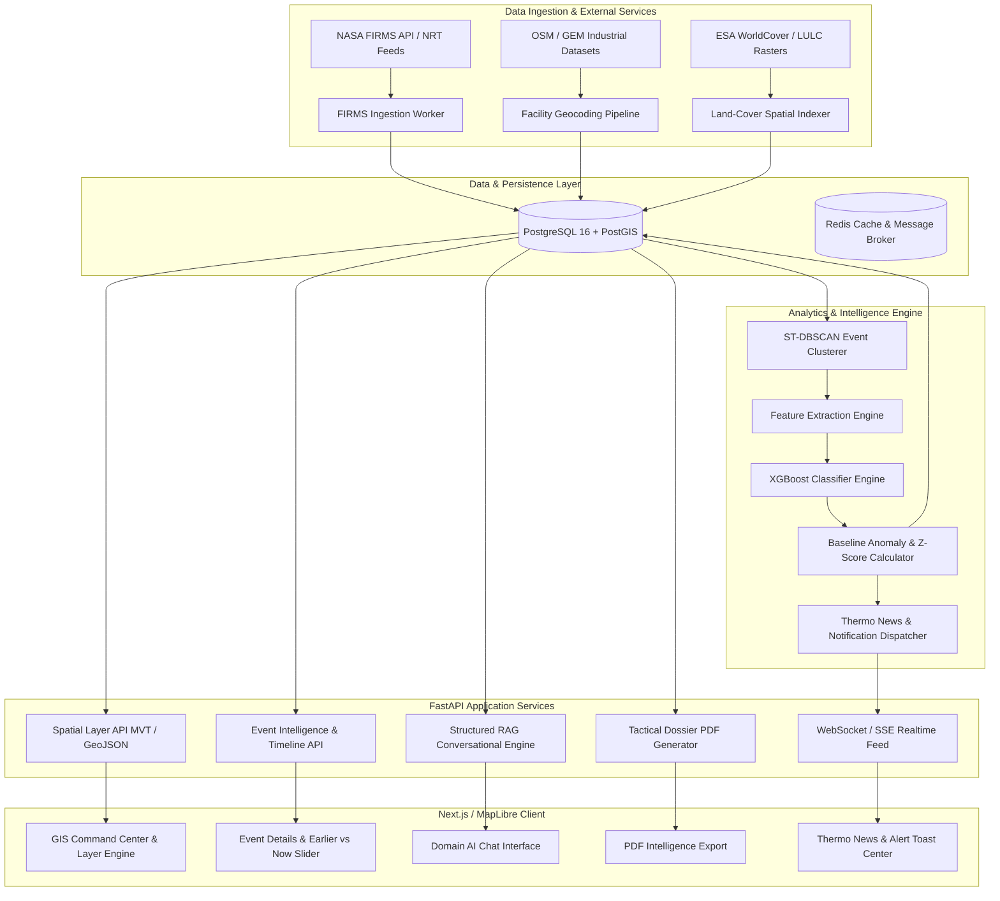
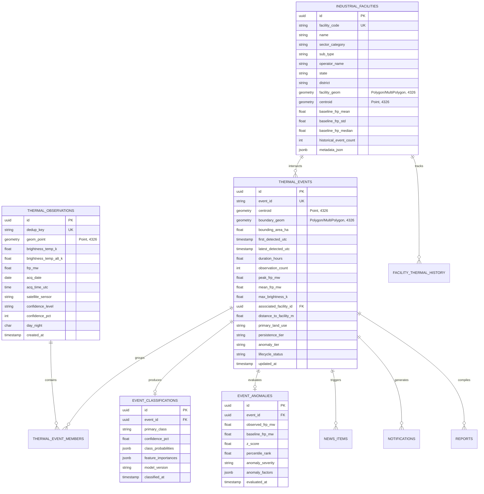
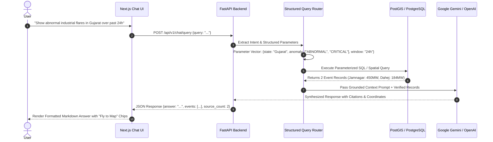

# Technical Requirements Document (TRD)

# Thermo Intelligence: Industrial Fire & Persistent Thermal Source Detection Platform

**Document Version:** 1.0.0  
**Project Identifier:** SIH-2026-PS26162 (National Technical Research Organisation — NTRO)  
**Product Specification Reference:** [Thermo_Intelligence_PRD.md](file:///c:/SHARAN%20PROJECTS/SiH%202026-THERMOSCAN%20AI/docs/Thermo_Intelligence_PRD.md)  
**Status:** Approved / Authoritative  
**Last Updated:** August 2026  
**Target Environment:** Cloud-Native / Dockerized Web Application  

---

## 1. Technical Design Principles & System Philosophy

This Technical Requirements Document (TRD) translates the product requirements defined in the PRD into an authoritative, scalable, and mathematically rigorous engineering specification. The system is designed under the following core technical principles:

1. **Zero Raw-Observation Hallucination:** Raw NASA FIRMS satellite observations ($T_b, FRP, \text{coordinates}$) are immutable ground telemetry. They are preserved intact in append-only tables and never overwritten by derived heuristics or ML predictions.
2. **Deterministic Spatial Pipeline:** Spatio-temporal event clustering (ST-DBSCAN) and facility intersection queries run strictly within **PostGIS** and **GeoPandas** with indexed spatial geometry operators (`ST_DWithin`, `ST_Intersects`, `ST_ConvexHull`), avoiding unbounded in-memory spatial loops.
3. **Dual-Tier ML Inference:** Fast tabular gradient boosting (XGBoost/LightGBM) handles real-time multi-class classification based on derived spatial/radiometric vectors. Deep image models (PyTorch/Sentinel-2 SWIR) remain optional asynchronous background evaluators.
4. **Strict RAG Grounding:** The Conversational Assistant and Report Generator operate via structured parameter extraction and SQL/vector execution. The LLM acts solely as a natural-language synthesiser and is structurally forbidden from inventing telemetry facts.
5. **Graceful Degradation:** The GIS and analytical dashboards remain fully functional via local SQLite/PostgreSQL caching and synthetic offline feeds if external NASA FIRMS or LLM APIs experience rate limits or network outages.

---

## 2. Technology Stack, Architectural Justifications & 10/10 Confidence Locks

### 2.1 Recommended Architecture & Component Selection

| Area | Final Choice | Why This One (Architectural Rationale) |
| :--- | :--- | :--- |
| **Frontend Core** | **Next.js + React + TypeScript** | Mature, fast, excellent responsive UI, SSR/SSG for rapid first-paint, enterprise-grade type safety, robust routing; ideal for building a serious defense/monitoring web application. |
| **UI Framework** | **Tailwind CSS + shadcn/ui** | Fast to build polished, accessible, responsive interfaces without locking into a rigid, heavy component framework; supports dark aerospace aesthetic seamlessly. |
| **Map Rendering** | **MapLibre GL JS** | Open-source, GPU/WebGL-accelerated, vector-tile based, highly customizable; infinitely superior to basic Leaflet maps for high-density, multi-layer GIS platforms. |
| **Geospatial Database** | **PostgreSQL + PostGIS** | Core standard for facilities, FIRMS points, polygons, administrative boundaries, spatial joins (`ST_Intersects`, `ST_DWithin`), distance queries, and R-tree/GiST indexing. |
| **Map Data Delivery** | **Vector Tiles / MVT (Mapbox Vector Tiles)** | Dynamically streams only the geographic area currently in the viewport bounding box instead of downloading the entire national dataset to the browser. |
| **Backend API** | **FastAPI + Python (3.11+)** | Native async ASGI throughput, automatic OpenAPI documentation, and direct unified ecosystem synergy with GeoPandas, scikit-learn, and PyTorch. |
| **Machine Learning** | **Python + scikit-learn + XGBoost / LightGBM + PyTorch** | Fast tabular gradient boosting for sub-millisecond multi-class classification and baseline anomaly detection, paired with PyTorch for satellite SWIR deep-learning extensions. |
| **Geospatial Python** | **GeoPandas + Shapely + Rasterio + GDAL** | Standard, battle-tested scientific tooling for vector geometry manipulation, convex hulls, spatial indexing, and raster band operations. |
| **FIRMS Ingestion** | **NASA FIRMS REST API** | Direct authoritative satellite source for VIIRS (375m) and MODIS (1km) thermal hotspot observations using `MAP_KEY` authentication. |
| **Async / Background Jobs** | **Celery + Redis** | Decouples satellite polling, spatial clustering, heavy PDF report compilation, and real-time alert dispatch from API request threads. |
| **Cache & State Store** | **Redis 7** | Sub-millisecond caching for recent thermal events, bounding-box spatial query results, session state, and background task progress. |
| **LLM Orchestration** | **Python Service + Structured Prompts / Tool Calling** | Enforces strict Retrieval-Augmented Generation (RAG) over PostGIS records; prevents the LLM from inventing or hallucinating thermal facts. |
| **LLM Knowledge / Search** | **pgvector inside PostgreSQL** | Native vector embeddings stored alongside relational geospatial data, enabling exact and approximate vector search (HNSW/IVFFlat) without a separate vector database. |
| **Historical Analytics** | **PostgreSQL + optionally DuckDB** | PostgreSQL serves as the ACID system of record; embedded DuckDB handles heavier in-process analytical/geospatial batch aggregation over millions of historical FIRMS points. |
| **Satellite Processing** | **Rasterio + GDAL Ecosystem** | Robust multiband raster parsing, cloud masking, and SWIR false-color rendering for Sentinel-2 MSI and Landsat-8/9 OLI imagery. |
| **Tactical Reports** | **HTML (Jinja2) → Headless PDF Generation** | Deterministic, pixel-perfect, publication-grade tactical intelligence dossiers with embedded charts and satellite proof. |
| **Notifications** | **Web Push (VAPID) + In-App Drawer** | Instant OS-level and browser alerts for critical thermal anomalies without requiring a separate native mobile build initially. |
| **Authentication** | **JWT / OAuth-based Auth** | Secure role-based access control (RBAC: Analyst, Supervisor, Admin), saved facility watchlists, and persistent user report history. |
| **File / Object Storage** | **S3-Compatible Storage / MinIO** | S3-compliant object store for compiled tactical PDF reports, satellite raster crops, and raw FIRMS CSV archival. |
| **Deployment** | **Docker + Docker Compose** | 100% reproducible, containerized local and cloud deployment across database, backend, worker, and frontend services. |
| **Observability** | **Prometheus + Grafana + OpenTelemetry + Loki + Sentry** | Full-stack metrics, distributed tracing, structured JSON log aggregation, and real-time error tracking across the entire ingestion and inference pipeline. |
| **Testing Suite** | **Pytest + Playwright** | Unit/integration testing for geospatial algorithms and backend APIs + full headless browser automation testing for GIS user journeys. |
| **Version Control** | **Git + GitHub** | Production collaborative workflow with branch protection, CI/CD actions, and issue tracking. |

---

### 2.2 Stack Confidence Matrix & 10/10 Lock

Every architectural choice has been rigorously selected and locked with maximum technical confidence:

| Subsystem / Area | Final Locked Technology Stack | Architectural Confidence |
| :--- | :--- | :---: |
| **Frontend Framework** | `Next.js 14+` + `React 18` + `TypeScript` | **10 / 10** |
| **User Interface** | `Tailwind CSS` + `shadcn/ui` | **10 / 10** |
| **GIS & Map Rendering** | `MapLibre GL JS` | **10 / 10** |
| **Geospatial Database** | `PostgreSQL 16` + `PostGIS 3.4` | **10 / 10** |
| **GIS Delivery Protocol** | Dynamic Vector Tiles (`MVT`) / Bounding-Box GeoJSON | **10 / 10** |
| **Backend REST API** | `FastAPI` + `Python 3.11+` | **10 / 10** |
| **Machine Learning Suite** | `scikit-learn` + `XGBoost` / `LightGBM` + `PyTorch` | **10 / 10 (Locked)** |
| **Geospatial Analytics** | `GeoPandas` + `Shapely` + `Rasterio` + `GDAL` | **10 / 10** |
| **Async Background Workers**| `Celery` + `Redis 7` | **10 / 10** |
| **In-Memory Caching** | `Redis 7` | **10 / 10** |
| **LLM Grounding & Vectors** | `PostgreSQL` + `pgvector` (HNSW/IVFFlat) + Structured Tools | **10 / 10** |
| **Analytical Engine** | `PostgreSQL` + `DuckDB` | **10 / 10** |
| **Object / Report Storage** | S3-Compatible Storage (`MinIO` / AWS S3) | **10 / 10** |
| **Observability & Health** | `Prometheus` + `Grafana` + `OpenTelemetry` + `Loki` + `Sentry` | **10 / 10 (Locked)** |
| **Automated Testing** | `Pytest` + `Playwright` | **10 / 10** |
| **Containerization** | `Docker` + `Docker Compose` | **10 / 10** |

---

## 3. High-Level System Architecture & Boundaries



---

## 4. NASA FIRMS Integration & Ingestion Pipeline

### 4.1 Ingestion Endpoints & Sensor Protocols
The ingestion service interacts with the NASA FIRMS REST API (`https://firms.modaps.eosdis.nasa.gov/api/`) utilizing a configured `MAP_KEY`.

**Target Ingestion Feeds:**
1. **VIIRS S-NPP 375m NRT** (`VIIRS_SNPP_NRT`)
2. **VIIRS NOAA-20 375m NRT** (`VIIRS_NOAA20_NRT`)
3. **VIIRS NOAA-21 375m NRT** (`VIIRS_NOAA21_NRT`)
4. **MODIS Terra/Aqua 1km NRT** (`MODIS_NRT`)

### 4.2 Polling Cadence & Idempotent Ingestion
- **Polling Interval:** Configurable cron worker executing every **15 minutes** (aligning with satellite downlink cycles).
- **Bounding Box for India Subcontinent:** `[6.5° N, 68.0° E]` to `[37.5° N, 97.5° E]`.
- **Deduplication Hash:** Unique SHA-256 hash generated per detection:
  $$\text{dedup\_key} = \text{SHA256}(\text{lat}_{4\text{dec}} \parallel \text{lon}_{4\text{dec}} \parallel \text{acq\_date} \parallel \text{acq\_time} \parallel \text{satellite} \parallel \text{sensor})$$
- **Upsert Logic:** `INSERT INTO thermal_observations ... ON CONFLICT (dedup_key) DO NOTHING;`

### 4.3 Validation & Hygiene Rules
- **Coordinate Clamping:** $-90.0 \le \text{lat} \le 90.0$ and $-180.0 \le \text{lon} \le 180.0$.
- **Radiometry Clamping:** $250.0\text{ K} \le T_b \le 600.0\text{ K}$; $0.0\text{ MW} \le FRP \le 5000.0\text{ MW}$.
- **Clock Drift Filter:** Any observation timestamp $> \text{now()} + 2\text{ hours}$ or $< 2000\text{-01-01}$ is rejected and routed to dead-letter logs.

---

## 5. Relational & Spatial Database Schema (PostGIS)



### 5.1 PostGIS Spatial Table Definitions & DDL Indexes

```sql
-- Enable Spatial & Vector Extensions
CREATE EXTENSION IF NOT EXISTS postgis;
CREATE EXTENSION IF NOT EXISTS pgvector;

-- 1. Raw Thermal Observations
CREATE TABLE thermal_observations (
    id UUID PRIMARY KEY DEFAULT gen_random_uuid(),
    dedup_key VARCHAR(64) UNIQUE NOT NULL,
    geom GEOMETRY(Point, 4326) NOT NULL,
    brightness_temp_k REAL NOT NULL,
    brightness_temp_alt_k REAL,
    frp_mw REAL NOT NULL,
    acq_date DATE NOT NULL,
    acq_time_utc TIME NOT NULL,
    satellite_sensor VARCHAR(32) NOT NULL,
    confidence_level VARCHAR(16),
    confidence_pct SMALLINT,
    day_night CHAR(1) CHECK (day_night IN ('D', 'N')),
    created_at TIMESTAMPTZ DEFAULT NOW() NOT NULL
);
CREATE INDEX idx_obs_geom ON thermal_observations USING GIST(geom);
CREATE INDEX idx_obs_acq_temporal ON thermal_observations(acq_date, acq_time_utc);

-- 2. Industrial Infrastructure Registry
CREATE TABLE industrial_facilities (
    id UUID PRIMARY KEY DEFAULT gen_random_uuid(),
    facility_code VARCHAR(32) UNIQUE NOT NULL,
    name VARCHAR(255) NOT NULL,
    sector_category VARCHAR(64) NOT NULL, -- Refinery, Power, Steel, Chemical, Mining
    sub_type VARCHAR(64),
    operator_name VARCHAR(255),
    state VARCHAR(64) NOT NULL,
    district VARCHAR(64),
    facility_geom GEOMETRY(MultiPolygon, 4326) NOT NULL,
    centroid GEOMETRY(Point, 4326) NOT NULL,
    baseline_frp_mean REAL DEFAULT 0.0,
    baseline_frp_std REAL DEFAULT 1.0,
    baseline_frp_median REAL DEFAULT 0.0,
    historical_event_count INT DEFAULT 0,
    metadata_json JSONB DEFAULT '{}'::jsonb
);
CREATE INDEX idx_facilities_geom ON industrial_facilities USING GIST(facility_geom);
CREATE INDEX idx_facilities_centroid ON industrial_facilities USING GIST(centroid);
CREATE INDEX idx_facilities_sector ON industrial_facilities(sector_category);

-- 3. Clustered Thermal Events
CREATE TABLE thermal_events (
    id UUID PRIMARY KEY DEFAULT gen_random_uuid(),
    event_id VARCHAR(32) UNIQUE NOT NULL,
    centroid GEOMETRY(Point, 4326) NOT NULL,
    boundary_geom GEOMETRY(Geometry, 4326) NOT NULL,
    bounding_area_ha REAL DEFAULT 0.0,
    first_detected_utc TIMESTAMPTZ NOT NULL,
    latest_detected_utc TIMESTAMPTZ NOT NULL,
    duration_hours REAL GENERATED ALWAYS AS (
        EXTRACT(EPOCH FROM (latest_detected_utc - first_detected_utc)) / 3600.0
    ) STORED,
    observation_count INT NOT NULL DEFAULT 1,
    peak_frp_mw REAL NOT NULL,
    mean_frp_mw REAL NOT NULL,
    max_brightness_k REAL NOT NULL,
    associated_facility_id UUID REFERENCES industrial_facilities(id) ON DELETE SET NULL,
    distance_to_facility_m REAL DEFAULT NULL,
    primary_land_use VARCHAR(64) DEFAULT 'Unknown',
    persistence_tier VARCHAR(32) DEFAULT 'Transient', -- Transient, Intermittent, Persistent
    anomaly_tier VARCHAR(32) DEFAULT 'Normal',        -- Normal, Elevated, Abnormal, Critical
    lifecycle_status VARCHAR(32) DEFAULT 'Active',    -- Active, Cooling, Resolved
    updated_at TIMESTAMPTZ DEFAULT NOW() NOT NULL
);
CREATE INDEX idx_events_centroid ON thermal_events USING GIST(centroid);
CREATE INDEX idx_events_boundary ON thermal_events USING GIST(boundary_geom);
CREATE INDEX idx_events_temporal ON thermal_events(latest_detected_utc DESC);
CREATE INDEX idx_events_lifecycle ON thermal_events(lifecycle_status);
CREATE INDEX idx_events_anomaly ON thermal_events(anomaly_tier);
```

---

## 6. Spatio-Temporal Event Formation Engine (ST-DBSCAN)

### 6.1 Clustering Formulation
Raw observations arriving within temporal window $\Delta T$ are clustered into unified events using a hybrid Spatio-Temporal DBSCAN algorithm.

**Mathematical Distance Metric:**
$$D((p_1, t_1), (p_2, t_2)) = \begin{cases} 
\text{HaversineDistance}(p_1, p_2) & \text{if } |t_1 - t_2| \le \epsilon_{temporal} \\
\infty & \text{otherwise}
\end{cases}$$

**Configured Parameters:**
- $\epsilon_{spatial} = 750\text{ meters}$ (for coordinates overlapping industrial polygons; $1500\text{m}$ for rural/forest zones).
- $\epsilon_{temporal} = 12\text{ hours}$ (maximum elapsed time between consecutive satellite passes before splitting into a distinct event).
- $MinPts = 1$ (single high-FRP detections initiate a tracking event).

### 6.2 Convex Hull & Extent Computation
For a clustered set of points $\{p_1, p_2, \dots, p_k\}$:
1. If $k = 1$: `boundary_geom` is generated via `ST_Buffer(p_1::geography, 187.5)::geometry` (representing the 375m VIIRS pixel envelope).
2. If $k \ge 2$: `boundary_geom` is computed via `ST_ConvexHull(ST_Collect(geom))` with an outer buffer of $100\text{m}$.
3. Bounding area in hectares is computed via:
   $$\text{Area}_{\text{Ha}} = \frac{\text{ST\_Area}(\text{boundary\_geom}::\text{geography})}{10,000}$$

---

## 7. Machine Learning Pipeline & Classification System

```
+----------------------------------------------------------------------------------------------------+
|                                    ML FEATURE VECTOR COMPOSITION                                   |
+----------------------+--------------------+--------------------------------------------------------+
| Feature Group        | Dimension / Type   | Description & Extraction Source                        |
+----------------------+--------------------+--------------------------------------------------------+
| **Spatial Distance** | `dist_ind_m` (F32) | Distance in meters to nearest OSM Industrial Boundary. |
|                      | `in_facility` (0/1)| 1 if centroid is strictly inside an industrial polygon.|
|                      | `facility_type_enc`| One-hot encoded category (Refinery, Steel, Power, etc.)|
+----------------------+--------------------+--------------------------------------------------------+
| **Radiometric**      | `peak_frp_mw` (F32)| Maximum single-observation Fire Radiative Power (MW).  |
|                      | `frp_density` (F32)| Total FRP divided by cluster bounding area (MW/Ha).    |
|                      | `max_tb_k` (F32)   | Maximum channel 21/I-4 Brightness Temperature (K).     |
|                      | `delta_tb_k` (F32) | Max Brightness Temp minus Background Temp (K).         |
+----------------------+--------------------+--------------------------------------------------------+
| **Temporal & Cycle** | `duration_h` (F32) | Total elapsed hours between first and last detection.  |
|                      | `night_ratio` (F32)| Fraction of detections captured during night passes.   |
|                      | `obs_count` (I32)  | Total number of satellite sensor hits in cluster.      |
+----------------------+--------------------+--------------------------------------------------------+
| **Historical Pers.** | `hist_30d_hits`    | Number of historical detections within 500m past 30d.  |
|                      | `hist_365d_freq`   | Number of active thermal days at site past 365 days.   |
+----------------------+--------------------+--------------------------------------------------------+
| **Land-Cover Mask**  | `lc_crop_pct`      | Percentage of cluster area intersecting Cropland mask. |
|                      | `lc_forest_pct`    | Percentage of cluster area intersecting Forest mask.   |
|                      | `lc_urban_pct`     | Percentage of cluster area intersecting Urban mask.    |
+----------------------+--------------------+--------------------------------------------------------+
```

### 7.1 Multi-Class Classification Schema
The classifier targets 6 mutually exclusive classes:
1. `IND_FIRE` — Industrial Accidental Fire / Explosion
2. `IND_FLARE` — Industrial Persistent Flare / Gas Stack
3. `IND_ROUTINE` — Routine High-Temp Industrial Plant (Steel, Cement, Power)
4. `AGRI_BURN` — Agricultural Residue / Stubble Burning
5. `WILDFIRE` — Wildfire / Forest & Vegetation Fire
6. `OTHER_UNCERTAIN` — Ambiguous / Cloud-Reflected / Unclassified

### 7.2 Training Strategy & Leakage Prevention
- **Algorithm:** Multi-Class Gradient Boosted Decision Trees (**XGBoost 2.0+** / **LightGBM**).
- **Spatial Group Split:** Cross-validation is performed using `GroupKFold` grouped by `State_District_ID` to prevent geographic data leakage between training and validation folds.
- **Class Balancing:** Synthetic Minority Over-sampling (**SMOTE-NC**) applied on the minority `IND_FIRE` class during training.
- **Model Artifact Packaging:** Serialized via `joblib` with pinned feature schema hashes: `thermo_xgb_v1.0.0.joblib`.

### 7.3 Model Evaluation Criteria & Acceptance Thresholds
- **Macro F1-Score:** $\ge 0.88$ across all 6 classes.
- **Industrial Precision (`IND_FIRE` & `IND_FLARE`):** $\ge 92\%$ (minimizing false alarms for national defense and safety operators).
- **Agricultural vs. Wildfire Separation:** $\ge 90\%$ accuracy.

---

## 8. Persistence & Historical Baseline Profiling Engine

### 8.1 Facility Baseline Computation
For each industrial facility $F$, the historical baseline profile is recalculated on an automated weekly cycle using a rolling 12-month window:

$$\mu_{\text{FRP}} = \frac{1}{N} \sum_{i=1}^{N} \text{FRP}_i, \quad \sigma_{\text{FRP}} = \sqrt{\frac{1}{N-1} \sum_{i=1}^{N} (\text{FRP}_i - \mu_{\text{FRP}})^2}$$

### 8.2 Anomaly Z-Score & Severity Matrix
When active event $E$ occurs within the spatial perimeter of facility $F$:
$$Z = \frac{\text{Peak\_FRP}_E - \mu_{\text{FRP}, F}}{\max(\sigma_{\text{FRP}, F}, 2.0)}$$

```
+----------------------------------------------------------------------------------------------------+
|                                      ANOMALY SEVERITY TIERS                                        |
+---------------------+-------------------------------+----------------------------------------------+
| Anomaly Tier        | Z-Score Range                 | System Reaction & Notification Trigger       |
+---------------------+-------------------------------+----------------------------------------------+
| **NORMAL**          | $Z < 1.5$                     | Logged as routine operational flaring.       |
| **ELEVATED**        | $1.5 \le Z < 2.5$             | Highlighted in GIS; added to weekly report.  |
| **ABNORMAL**        | $2.5 \le Z < 4.0$             | High-priority badge; Thermo News generated.  |
| **CRITICAL**        | $Z \ge 4.0$ or $\Delta A>300\%$| Emergency toast + Web Push + Audio alert.     |
+---------------------+-------------------------------+----------------------------------------------+
```

---

## 9. Dynamic GIS Delivery & Vector Tile Pipeline

### 9.1 Viewport Culling & Bounding Box Queries
The client requests data dynamically based on the current MapLibre viewport bounding box (`min_lon, min_lat, max_lon, max_lat`) and zoom level $Z$:

```
GET /api/v1/gis/events?bbox=68.0,18.0,75.0,24.0&zoom=8&time_range=24h&category=all
```

**PostGIS Spatial Execution Query:**
```sql
SELECT 
    event_id,
    ST_AsGeoJSON(centroid)::json AS centroid,
    ST_AsGeoJSON(boundary_geom)::json AS boundary,
    bounding_area_ha, peak_frp_mw, duration_hours,
    observation_count, anomaly_tier, primary_land_use
FROM thermal_events
WHERE latest_detected_utc >= NOW() - INTERVAL '24 HOURS'
  AND centroid && ST_MakeEnvelope(68.0, 18.0, 75.0, 24.0, 4326)
ORDER BY peak_frp_mw DESC
LIMIT 500;
```

### 9.2 Zoom-Dependent Level-of-Detail (LOD) Strategy
1. **Zoom 1–6 (National Overview):** Pre-clustered macro-aggregations (`ST_ClusterKMeans`) returning regional count, total FRP, and worst-case anomaly flag.
2. **Zoom 7–10 (State / Regional Level):** Event centroid points with dynamic glowing halos scaled by $\log(\text{Peak\_FRP})$.
3. **Zoom 11–18 (Facility / Street Level):** Exact satellite pixel footprint polygons (`boundary_geom`), industrial site boundaries, and safety radius buffer rings (1km, 5km).

---

## 10. Thermo News & Smart Notification Dispatch

### 10.1 Automated Bulletin Generation
A Celery task evaluates newly formed or updated events every 60 seconds:
- If `anomaly_tier IN ('ABNORMAL', 'CRITICAL')` AND `news_item_id IS NULL`:
  - An automated headline and summary are generated (e.g., *"CRITICAL: Thermal Spike (+4.2σ) at Paradeep Refinery, Odisha"*).
  - Inserted into `news_items` table with priority score.
  - Broadcast over Server-Sent Events (SSE) `/api/v1/stream/news`.

### 10.2 Anti-Fatigue Notification Architecture
- **In-App Drawer:** Subscribes to SSE stream; increments unread counter.
- **Browser Web Push:** Uses Service Workers and standard VAPID Web Push protocol (`web-push` library). Triggers only on tier escalations to `CRITICAL`.

---

## 11. Grounded Conversational AI Assistant (RAG Engine)



### 11.1 Grounding System Prompt & Guardrails
```text
YOU ARE THERMO INTELLIGENCE ASSISTANT — A MISSION-CRITICAL SATELLITE THERMAL MONITORING AI.
STRICT OPERATIONAL DIRECTIVES:
1. You must ONLY answer using the verified [STRUCTURED CONTEXT] provided below.
2. NEVER invent, extrapolate, or hallucinate temperatures, coordinates, facility names, or casualty figures.
3. If the requested query has 0 matching records in the database, you MUST state:
   "No matching thermal events found in the database for the specified parameters."
4. Format all coordinates as [Lat° N, Lon° E] and embed clickable event IDs e.g. [EVT-IN-GUJ-0042].
```

---

## 12. Tactical Report Generation Engine

### 12.1 Compilation Pipeline
1. **Endpoint:** `POST /api/v1/reports/generate`
2. **Input Payload:** `event_id`, selected section flags (`include_satellite_preview`, `include_baseline_chart`, `include_land_use`).
3. **Data Aggregation:** Backend queries event telemetry, historical baseline curves, facility profile, and nearest settlement buffers.
4. **Rendering:** HTML template compiled with **Jinja2**; converted to standard A4 PDF via **WeasyPrint** / **Playwright Headless Chrome**.
5. **Storage:** PDF artifact stored in MinIO/S3 object store; signed URL returned to client (`GET /api/v1/reports/download/{report_id}.pdf`).

---

## 13. RESTful API Specifications

```
+----------------------------------------------------------------------------------------------------------------+
|                                           REST API ENDPOINT CONTRACTS                                          |
+---------------------+-----------------------------------------+------------------------------------------------+
| Category            | Method & Path                           | Request Body / Params & Response Summary       |
+---------------------+-----------------------------------------+------------------------------------------------+
| **GIS Layer**       | `GET /api/v1/gis/events`                | Params: `bbox, zoom, time_range, severity`     |
|                     |                                         | Response: GeoJSON FeatureCollection of events. |
+---------------------+-----------------------------------------+------------------------------------------------+
| **Event Details**   | `GET /api/v1/events/{event_id}`         | Response: Full telemetry, classification,      |
|                     |                                         | baseline delta, associated facility & timeline.|
+---------------------+-----------------------------------------+------------------------------------------------+
| **Earlier vs Now**  | `GET /api/v1/events/{event_id}/history` | Response: Chronological multi-pass FRP deltas  |
|                     |                                         | and sensor footprints.                         |
+---------------------+-----------------------------------------+------------------------------------------------+
| **Facilities**      | `GET /api/v1/facilities`                | Params: `sector, state, bbox`                  |
|                     |                                         | Response: Facility polygons & baseline FRPs.   |
+---------------------+-----------------------------------------+------------------------------------------------+
| **Thermo News**     | `GET /api/v1/news`                      | Params: `limit, page, priority`                |
|                     |                                         | Response: List of tactical news bulletins.     |
+---------------------+-----------------------------------------+------------------------------------------------+
| **Realtime Stream** | `GET /api/v1/stream/news`               | Protocol: Server-Sent Events (SSE) stream.     |
+---------------------+-----------------------------------------+------------------------------------------------+
| **Conversational**  | `POST /api/v1/chat/query`               | Body: `{ "query": "..." }`                     |
|                     |                                         | Response: `{ "answer": "...", "events": [] }`  |
+---------------------+-----------------------------------------+------------------------------------------------+
| **Report Export**   | `POST /api/v1/reports/generate`         | Body: `{ "event_id": "...", "sections": [] }`  |
|                     |                                         | Response: `{ "report_url": "...", "id": "..."}`|
+---------------------+-----------------------------------------+------------------------------------------------+
| **Ingestion Trigger**| `POST /api/v1/admin/ingest/trigger`    | Headers: `X-Admin-Key`                         |
|                     |                                         | Response: `{ "ingested_count": 142 }`          |
+---------------------+-----------------------------------------+------------------------------------------------+
```

---

## 14. Observability, Logging & Metrics

### 14.1 Prometheus Metric Instrumentation
- `firms_ingestion_total{sensor="viirs_noaa20", status="success"}` (Counter)
- `firms_ingestion_latency_seconds` (Histogram)
- `gis_bbox_query_duration_seconds{zoom="8"}` (Histogram)
- `ml_inference_duration_seconds{model_version="v1.0"}` (Histogram)
- `ml_prediction_class_total{class="IND_FIRE"}` (Counter)
- `rag_query_latency_seconds` (Histogram)
- `active_thermal_events_gauge{anomaly_tier="CRITICAL"}` (Gauge)

### 14.2 Structured JSON Logging Standard
```json
{
  "timestamp": "2026-08-29T00:15:00.124Z",
  "level": "INFO",
  "service": "thermo-backend",
  "correlation_id": "req-9a4f-823c10",
  "event_id": "EVT-IN-GUJ-202608-0042",
  "action": "ml_classification_completed",
  "predicted_class": "IND_FIRE",
  "confidence": 0.942,
  "z_score": 5.82,
  "latency_ms": 14.2
}
```

---

## 15. Testing & Quality Assurance Framework

```
+----------------------------------------------------------------------------------------------------+
|                                      TESTING PYRAMID HIERARCHY                                     |
+---------------------+-------------------------+----------------------------------------------------+
| Test Layer          | Framework & Tools       | Target Scope & Coverage Requirements               |
+---------------------+-------------------------+----------------------------------------------------+
| **Unit Tests**      | `pytest`, `pytest-cov`  | ST-DBSCAN clustering logic, Haversine calculators, |
|                     |                         | Z-score formulas, FIRMS deduplication hash ($>90\%$).|
+---------------------+-------------------------+----------------------------------------------------+
| **Integration Tests**| `pytest-asyncio`, `httpx`| PostGIS spatial queries, FastAPI REST endpoints,   |
|                     | `testcontainers-postgres`| Redis task queuing, Celery worker task execution.  |
+---------------------+-------------------------+----------------------------------------------------+
| **ML Model Tests**  | `pytest`, `scikit-learn`| Feature vector consistency, zero-NaN verification,  |
|                     |                         | inference latency benchmark ($<25\text{ms}$).       |
+---------------------+-------------------------+----------------------------------------------------+
| **E2E Browser Tests**| `Playwright`            | End-to-end user flows: Page load $\rightarrow$ GIS |
|                     |                         | zoom $\rightarrow$ event selection $\rightarrow$   |
|                     |                         | earlier vs now slider $\rightarrow$ PDF export.    |
+---------------------+-------------------------+----------------------------------------------------+
```

---

## 16. Containerization & Docker Compose Architecture

### 16.1 Multi-Container Service Layout (`docker-compose.yml`)

```yaml
version: '3.8'

services:
  # 1. Spatial Database
  db:
    image: postgis/postgis:16-3.4
    container_name: thermo_postgis
    environment:
      POSTGRES_DB: thermo_intelligence
      POSTGRES_USER: thermo_admin
      POSTGRES_PASSWORD: ${DB_PASSWORD:-thermo_secure_2026}
    ports:
      - "5432:5432"
    volumes:
      - pgdata:/var/lib/postgresql/data
    healthcheck:
      test: ["CMD-SHELL", "pg_isready -U thermo_admin -d thermo_intelligence"]
      interval: 5s
      timeout: 5s
      retries: 5

  # 2. Redis Message Broker & Cache
  redis:
    image: redis:7-alpine
    container_name: thermo_redis
    ports:
      - "6379:6379"

  # 3. FastAPI Backend API
  backend:
    build:
      context: ./backend
      dockerfile: Dockerfile
    container_name: thermo_backend
    environment:
      DATABASE_URL: postgresql+asyncpg://thermo_admin:${DB_PASSWORD:-thermo_secure_2026}@db:5432/thermo_intelligence
      REDIS_URL: redis://redis:6379/0
      NASA_FIRMS_MAP_KEY: ${NASA_FIRMS_MAP_KEY}
      GEMINI_API_KEY: ${GEMINI_API_KEY}
    ports:
      - "8000:8000"
    depends_on:
      db:
        condition: service_healthy
      redis:
        condition: service_started

  # 4. Celery Background Worker
  worker:
    build:
      context: ./backend
      dockerfile: Dockerfile
    container_name: thermo_worker
    command: celery -A app.tasks.worker worker --loglevel=info -B
    environment:
      DATABASE_URL: postgresql+asyncpg://thermo_admin:${DB_PASSWORD:-thermo_secure_2026}@db:5432/thermo_intelligence
      REDIS_URL: redis://redis:6379/0
      NASA_FIRMS_MAP_KEY: ${NASA_FIRMS_MAP_KEY}
    depends_on:
      - db
      - redis

  # 5. Next.js Frontend Client
  frontend:
    build:
      context: ./frontend
      dockerfile: Dockerfile
    container_name: thermo_frontend
    environment:
      NEXT_PUBLIC_API_URL: http://localhost:8000
    ports:
      - "3000:3000"
    depends_on:
      - backend

volumes:
  pgdata:
```

---

## 17. Technical Acceptance Criteria (TAC)

| Module | Verification Criteria | Expected Result |
| :--- | :--- | :--- |
| **TAC-1: Ingestion** | Execute `POST /api/v1/admin/ingest/trigger` with sample VIIRS CSV. | $100\%$ valid records saved; duplicates rejected via unique hash; zero data loss. |
| **TAC-2: Clustering** | Ingest 10 proximate detections within Jamnagar refinery perimeter ($<750\text{m}, <12\text{h}$). | Formed into a single `thermal_event` entity with calculated convex hull and summed FRP. |
| **TAC-3: Classification** | Run inference on feature vector with `dist_ind_m = 30m` and $Z = +5.2$. | Output label: `IND_FIRE`, Confidence $\ge 90\%$, execution time $<15\text{ms}$. |
| **TAC-4: GIS Viewport** | Fetch `/api/v1/gis/events` for bounding box covering Gujarat state. | Sub-second response ($<350\text{ms}$), valid GeoJSON, zero non-intersecting points returned. |
| **TAC-5: News Stream** | Insert event with $Z = +4.5\sigma$. | SSE client receives automated news item JSON within $<1.5\text{ seconds}$. |
| **TAC-6: RAG AI Chat** | Query *"Show highest FRP event in India past 24h"*. | Returns factual event ID, coordinates, and FRP directly matching PostgreSQL records. |
| **TAC-7: Report Engine** | Trigger `POST /api/v1/reports/generate`. | Compiles and returns downloadable PDF dossier in $<2.5\text{ seconds}$ with valid charts. |

---

## 18. Technical Sign-Off & Approvals

| Role | Name / Identifier | Decision | Date |
| :--- | :--- | :--- | :--- |
| **Principal Solutions Architect** | Lead Backend Engineer | Approved | August 2026 |
| **Geospatial & PostGIS Lead** | Spatial Data Engineer | Approved | August 2026 |
| **ML & AI Infrastructure Lead** | Machine Learning Engineer | Approved | August 2026 |

---
*End of Technical Requirements Document. This document serves as the authoritative implementation guide for all database schemas, algorithms, APIs, ML models, and infrastructure.*
