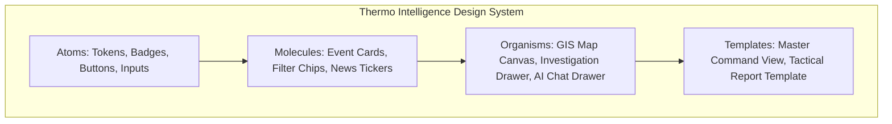

# UI/UX Design Requirements Document

# Thermo Intelligence: Industrial Fire & Persistent Thermal Source Detection Platform

**Document Version:** 1.0.0  
**Project Identifier:** SIH-2026-PS26162 (National Technical Research Organisation — NTRO)  
**Product Reference:** [Thermo_Intelligence_PRD.md](file:///c:/SHARAN%20PROJECTS/SiH%202026-THERMOSCAN%20AI/docs/Thermo_Intelligence_PRD.md)  
**Technical Reference:** [Thermo_Intelligence_TRD.md](file:///c:/SHARAN%20PROJECTS/SiH%202026-THERMOSCAN%20AI/docs/Thermo_Intelligence_TRD.md)  
**Workflow Reference:** [Thermo_Intelligence_Workflow.md](file:///c:/SHARAN%20PROJECTS/SiH%202026-THERMOSCAN%20AI/docs/Thermo_Intelligence_Workflow.md)  
**Database Reference:** [Thermo_Intelligence_Database_Storage.md](file:///c:/SHARAN%20PROJECTS/SiH%202026-THERMOSCAN%20AI/docs/Thermo_Intelligence_Database_Storage.md)  
**Status:** Approved / Authoritative  
**Last Updated:** August 2026  

---

## 1. Design Vision & Philosophy

**Thermo Intelligence** is an enterprise-grade geospatial monitoring and situational awareness platform built for defense, environmental safety boards, and national emergency monitoring organizations.

The design philosophy follows six non-negotiable operational principles:
1. **Clarity Over Decoration:** Every pixel, border, and badge must serve an analytical purpose. Zero decorative clutter.
2. **Data & Cartography First:** The MapLibre GIS canvas is the primary command workspace; supporting panels frame and elevate map data rather than competing with it.
3. **Restrained, High-Contrast Palette:** Strict avoidance of neon, glowing borders, gamer aesthetics, or rainbow hues. Colors are used strictly for semantic severity and operational state.
4. **Zero AI Novelty Tropes:** Complete absence of generic robot icons, sparkle emojis, magic-wand graphics, or futuristic animated blobs. The conversational assistant is presented as an authoritative, structured intelligence query tool.
5. **Calm, High-Density Information Hierarchy:** High data density achieved through clean typography, structured tables, and progressive disclosure—never by cramming illegible text into tiny cards.
6. **Native Mobile Ergonomics:** Mobile is not a shrunken desktop iframe; it reorganizes into one-handed bottom sheets, touch-optimized map controls, and fluid bottom navigation while preserving full analytical capabilities.

---

## 2. Absolute Visual Restrictions (Anti-Patterns Prohibited)

### PROHIBITED DESIGN PATTERNS

| Prohibited Pattern                 | Design Rationale & Required Alternative                       |
|:---|:---|
| **Neon / Hyper-Glow Colors**       | Causes visual fatigue and looks like gaming software.         |
| (e.g., `#00FFCC`, `#FF00FF`)       | Use calibrated, matte semantic tones (e.g., Crimson `#DC2626`).|
| **Generic AI & Sparkle Tropes**    | Erodes user trust and credibility with defense evaluators.   |
| (Robots, wands, brain SVGs)        | Use minimal, technical Lucide iconography (Terminal, Search). |
| **Excessive Glassmorphism**        | Blurs text contrast over satellite imagery.                  |
| (High blur, frosted cards)         | Use solid, high-contrast surfaces (`#111827`, `#1F2937`).    |
| **Hyper-Rounded Cards (>16px)**    | Consumes valuable screen space on GIS viewports.             |
|                                    | Enforce subtle, crisp radii (4px – 8px max).                  |
| **Constant Floating Animations**   | Distracts analysts from identifying real-world thermal spikes.|
| (Pulsing blobs, particle meshes)   | Restrain animation to subtle micro-state transitions (<150ms).|

---

## 3. Design System Tokens & Foundations

### 3.1 Color System (Dual Theme: Dark Aerospace & Clean Light)

### DESIGN COLOR TOKEN MATRIX

| Token Name           | Dark Mode (Default)      | Light Mode (Operations)   | Semantic Role / Usage            |
|:---|:---|:---|:---|
| `bg-app`             | `#0B0F17` (Deep Obsidian)| `#F8FAFC` (Slate Cool)    | Root application background      |
| `bg-surface`         | `#111827` (Carbon Gray)  | `#FFFFFF` (Pure White)    | Navigation sidebar, card panels  |
| `bg-surface-elevated`| `#1F2937` (Graphite)     | `#F1F5F9` (Subtle Gray)   | Dropdowns, modals, hover states  |
| `border-subtle`      | `#1E293B` (Slate Muted)  | `#E2E8F0` (Border Gray)   | Card dividers, panel boundaries  |
| `border-strong`      | `#334155` (Slate Active) | `#CBD5E1` (Border Focus)  | Active inputs, selected states   |
| `text-primary`       | `#F8FAFC` (Crisp Slate)  | `#0F172A` (Ink Dark)      | Headings, primary metrics        |
| `text-secondary`     | `#94A3B8` (Medium Slate) | `#475569` (Charcoal)      | Labels, subheadings, metadata    |
| `text-muted`         | `#64748B` (Muted Slate)  | `#94A3B8` (Cool Muted)    | Timestamps, disabled captions    |
| `status-critical`    | `#DC2626` (Matte Crimson)| `#B91C1C` (Deep Crimson)  | Accidental Industrial Fire, Z>4σ |
| `status-warning`     | `#D97706` (Amber Orange) | `#B45309` (Deep Amber)    | Elevated Anomaly, Unclassified   |
| `status-persistent`  | `#0284C7` (Sky Steel)    | `#0369A1` (Ocean Steel)   | Routine Industrial Flare / Kiln  |
| `status-vegetation`  | `#16A34A` (Forest Green) | `#15803D` (Deep Green)    | Wildfire / Forest Fire           |
| `status-agri`        | `#CA8A04` (Harvest Gold) | `#A16207` (Ochre Gold)    | Agricultural Stubble Burning     |
| `status-normal`      | `#059669` (Emerald)      | `#047857` (Deep Emerald)  | Compliant Baseline, Resolved     |

### 3.2 Typography Hierarchy
- **Font Families:**
  - **Primary UI & Headings:** `Inter`, `-apple-system`, `BlinkMacSystemFont`, `sans-serif` (Optimal readability at small sizes).
  - **Telemetry & Numerics:** `JetBrains Mono`, `ui-monospace`, `monospace` (Tabular numbers for coordinates, timestamps, and FRP).

### TYPOGRAPHIC SPECIFICATIONS

| Style Level          | Font Size / Line  | Weight        | Tracking      | Typical Application                 |
|:---|:---|:---|:---|:---|
| **Display Title**    | `24px` / `32px`   | Bold (700)    | `-0.02em`     | Landing Title, PDF Header           |
| **Page Heading**     | `18px` / `24px`   | SemiBold (600)| `-0.01em`     | Top Bar Title, Section Names        |
| **Section Heading**  | `14px` / `20px`   | SemiBold (600)| `0.0em`       | Drawer Tabs, Card Headers           |
| **Body Primary**     | `13px` / `18px`   | Regular (400) | `0.0em`       | Incident summaries, explanations    |
| **Body Metadata**    | `12px` / `16px`   | Regular (400) | `0.0em`       | Secondary details, table rows       |
| **Badge / Caption**  | `11px` / `14px`   | Medium (500)  | `+0.02em`     | Status badges, coordinate tags      |
| **Data Metric Large**| `20px` / `26px`   | Bold (700)    | Monospace     | Peak FRP (`450 MW`), Max Temp (`482K`)|
| **Data Metric Small**| `12px` / `16px`   | Medium (500)  | Monospace     | Lat/Lon (`22.4712°N, 70.0631°E`)    |

### 3.3 Spacing, Radii, Borders & Shadows
- **Base Grid:** Strict 4px modular grid (`4px`, `8px`, `12px`, `16px`, `20px`, `24px`, `32px`).
- **Corner Radii:**
  - `radius-sm`: `4px` (Badges, tooltips, inline chips).
  - `radius-md`: `6px` (Buttons, input fields, table rows).
  - `radius-lg`: `8px` (Cards, panels, modal dialogs, investigation drawer).
- **Borders:** Crisp `1px solid` utilizing `border-subtle` (`#1E293B` dark / `#E2E8F0` light).
- **Shadows:** Flat, low-diffusion shadows for subtle layer separation:
  - `shadow-panel`: `0 4px 12px rgba(0, 0, 0, 0.25)` (Dark mode) / `0 2px 8px rgba(0, 0, 0, 0.08)` (Light mode).

---

## 4. Master Layout Architecture

### 4.1 Desktop Viewport Layout (`>= 1200px`)

```
+------------------------------------------------------------------------------------------------------------------+
| TOP BAR: Brand Logo | Live Telemetry Counter | Global Search Omnibox | Filter Chips | Freshness Ping | Profile   |
+-----------+-------------------------------------------------------------------------+----------------------------+
| LEFT NAV  | CENTRAL GIS COMMAND WORKSPACE (MapLibre GL JS)                          | RIGHT INVESTIGATION DRAWER |
| (64px /   |                                                                         | (380px – Collapsible)      |
| 200px)    | [ Floating Map Controls: Zoom, Pitch, Reset, Layer Toggle, Basemap ]    |                            |
|           |                                                                         | [ Event ID: EVT-IN-GUJ-42 ]|
| • Monitor |                                                                         | • Tab 1: Current State     |
| • News    |                                                                         | • Tab 2: Historical Base   |
| • Alerts  |                                                                         | • Tab 3: Geo Context       |
| • Plant DB|                                                                         | • Tab 4: Earlier vs. Now   |
| • History |                                                                         |                            |
| • Reports | [ Bottom Floating Timeline Scrubber: 6h | 24h | 7d | 30d | Playback ]   | [ Action: Generate Dossier]|
| • Chat    |                                                                         | [ Action: Focus / Share ]  |
+-----------+-------------------------------------------------------------------------+----------------------------+
| FOOTER STATUS BAR: PostGIS Active | Satellite Pass: VIIRS NOAA-20 (14m ago) | Mode: Operational | Z-Score Engine: OK|
+------------------------------------------------------------------------------------------------------------------+
```

### 4.2 Mobile Viewport Layout (`< 768px`)

```
+----------------------------------------------------------------------------------+
| TOP MOBILE BAR: Brand Title | Global Search Toggle | Filter Sheet Button | Alerts|
+----------------------------------------------------------------------------------+
|                                                                                  |
|                      FULLSCREEN GIS VIEWPORT (Touch Optimized)                   |
|                                                                                  |
|   [ Floating Compact Controls: Layer Toggle (Top Right) | Location Reset ]       |
|                                                                                  |
|   [ Floating Mini Event Card: Tap marker to preview summary ]                    |
|                                                                                  |
+----------------------------------------------------------------------------------+
| SWIPEABLE BOTTOM DRAWER (Peek: 140px, Half: 50vh, Full: 92vh)                   |
| Pull Up: Event Telemetry, Historical Curve, earlier/now slider & report export   |
+----------------------------------------------------------------------------------+
| BOTTOM NAVIGATION BAR (Fixed 60px):                                              |
| [ Map (Active) ]     [ Thermo News ]     [ Alerts (3) ]     [ AI Chat ]          |
+----------------------------------------------------------------------------------+
```

---

## 5. Component System & Visual Design Specifications



### 5.1 Map Event Visualization Language
Markers avoid generic circular pins. They use a precise geometric symbology:

### EVENT CARTOGRAPHY SYMBOLOGY

| Classification      | Geometric Marker  | Fill Color      | Border / Stroke                        |
|:---|:---|:---|:---|
| **Industrial Fire** | Hexagon with core | `#DC2626` (Red) | 2px solid `#FFFFFF`, subtle ping ring  |
| **Industrial Flare**| Solid Circle (8px)| `#0284C7` (Sky) | 1.5px solid `#0B0F17`                  |
| **Routine High-Temp**| Diamond (10px)   | `#475569` (Dark)| 1.5px solid `#94A3B8`                  |
| **Wildfire**        | Triangle (9px)    | `#16A34A` (Grn) | 1.5px solid `#0B0F17`                  |
| **Agricultural**    | Square (7px)      | `#CA8A04` (Gold)| 1px solid `#0B0F17`                    |
| **Uncertain**       | Circle (Dotted)   | `#D97706` (Amb) | 1.5px dashed `#F8FAFC`                 |

### 5.2 Dynamic Clustering Display
- **Zoom 1–6 (Macro National Clusters):** Solid circular badge with dark background, crisp border, and white tabular count: `14 (2 Critical)`.
- **Zoom 7–10 (Regional Groups):** Individual geometric markers scaled proportionally to `\log_10(Peak_FRP)`.
- **Zoom 11–18 (Deep Inspection):** Exact satellite pixel footprint polygon (`boundary_geom`) rendered with 20% opacity fill and 1.5px high-contrast stroke + 1km/5km safety buffer rings.

---

## 6. Page-by-Page UX Specifications

### 6.1 Screen 1: Introduction & First-Open Experience
- **User Goal:** Understand the mission value of Thermo Intelligence in `<15 seconds` and immediately access the live GIS.
- **Layout:** High-contrast modal overlay over the dimmed live GIS map.
- **Visual Content:**
  - Header: *"Thermo Intelligence: Industrial Thermal Monitoring Platform (NTRO PS 26162)"*.
  - 3 Compact Feature Cards:
    1. *Contextual Spatial AI:* Distinguish industrial gas flares from accidental fires and farm stubble.
    2. *Historical Baseline Engine:* Automated `Z`-Score anomaly detection comparing current FRP against 12-month facility history.
    3. *Tactical Reporting & Grounded Chat:* Instant multi-section PDF dossiers and strict zero-hallucination RAG assistant.
  - Action Button: `Launch Command Center →` (Dismisses modal, sets `localStorage`, reveals full GIS).

---

### 6.2 Screen 2: Main GIS Command Center (Default Monitor)
- **User Goal:** Real-time spatial situational awareness over the Indian Subcontinent.
- **Components:**
  - **Global Header:** System Status (`ONLINE`), Satellite Feed Status (`VIIRS NOAA-20 — 18m ago`), Active Alert Counter.
  - **Layer Controller (Top Left Floating):** Expandable popover with toggle switches for:
    - `[x] Thermal Events (Clustered)`
    - `[x] Industrial Facilities (OSM Registry)`
    - `[ ] Raw Sensor Pixels (VIIRS 375m)`
    - `[ ] Land-Cover (LULC Context)`
    - `[x] Anomaly Buffer Rings (1km / 5km)`
  - **Quick Filter Bar (Top Center Floating):**
    - Time Filter: `[Last 6h] [Last 24h] [Last 7d] [Custom]`
    - Severity Filter: `[All] [Critical (4)] [Abnormal (12)] [Routine]`
    - Sector Filter: `[All Sectors] [Refinery] [Power] [Steel] [Mining]`
  - **Temporal History Scrubber (Bottom Center Floating):**
    - Interactive time slider with scrubber knob allowing users to step backward through consecutive satellite passes.

---

### 6.3 Screen 3: Event Investigation Drawer (Slide-Out)
- **User Goal:** Deep-dive forensic analysis of a selected thermal incident.
- **Layout:** Persistent 380px right-side panel (Desktop) or Swipeable Bottom Sheet (Mobile).
- **Structure (4 Tabs):**
  1. **Tab 1: Current Telemetry:**
     - Primary Classification Banner: `Industrial Accidental Fire (94.2% Confidence)`.
     - 4-Card Telemetry Grid: Peak FRP (`450 MW`), Max Temp (`482 K`), Sensor Hits (`8 Hits`), Area (`14.2 Ha`).
     - AI Attribution List: `1. Distance to Refinery: 45m`, `2. FRP Anomaly: +5.8σ`, `3. Night Persistence`.
  2. **Tab 2: Historical Baseline:**
     - Chart: Observed FRP Curve vs. Facility Normal Envelope (`μ \pm 1σ, 2σ`).
     - Recurrence Breakdown: `28 Active Days past 30 Days` (Persistent Source).
  3. **Tab 3: Geographic Context:**
     - Associated Facility Card: *Reliance Jamnagar Refinery Complex (Petrochemical)*.
     - Buffer Proximity: Nearest Settlement (`1.8 km`), Fuel Storage Tanks (`320 m`).
  4. **Tab 4: "Earlier vs. Now" Timeline:**
     - Multi-pass visual comparator slider (T-18h vs. T-12h vs. T-6h vs. Current Pass).
     - Satellite evidence tile (Optical RGB vs. SWIR False-Color).
  - **Drawer Footer Actions:**
    - `[ Generate Tactical Report (PDF) ]` (Primary Action Button).
    - `[ Ask Assistant about this Event ]` (Secondary Action Button).

---

### 6.4 Screen 4: Thermo News Feed
- **User Goal:** Rapid chronological scanning of newly detected anomalies across India.
- **Layout:** Clean 2-column list of event cards sorted by publication timestamp.
- **Card Structure:**
  - Severity Chip: `CRITICAL` (Crimson) or `ALERT` (Amber).
  - Timestamp & Sensor: `14m ago — VIIRS NOAA-20`.
  - Headline: `Thermal Surge (+5.2σ) at Paradeep Refinery, Odisha`.
  - Summary: `Abrupt 380 MW heat spike detected within crude distillation zone; footprint expanded by 220% in 4h.`
  - Action Button: `[ View on Map → ]` (Flies GIS camera to coordinates, opens drawer).

---

### 6.5 Screen 5: Smart Notification Drawer
- **User Goal:** Review urgent alerts requiring operational intervention.
- **Components:**
  - Badge Header: `Active Notifications (3 Unread)`.
  - Filter Tabs: `[All] [Critical Only] [System Ingestion]`.
  - Notification Item: Icon, Title, Location, Metrics, `Mark as Read`, `Investigate`.

---

### 6.6 Screen 6: Grounded Conversational AI Assistant (RAG Chat)
- **User Goal:** Natural language data extraction over live database records.
- **Visual Treatment:** Clean, technical terminal drawer (No floating robot graphics or gradient bubbles).
- **Components:**
  - Header: `Thermal Intelligence Query Assistant (PostGIS Grounded)`.
  - Suggested Query Chips:
    - `"Show abnormal flares in Gujarat past 24h"`
    - `"List top 5 highest FRP events in India"`
    - `"Which steel plants are currently active in Odisha?"`
  - Message Bubbles:
    - User Message: Dark slate card on right.
    - Assistant Message: Solid carbon surface on left with structured markdown table, metric callouts, and clickable `[EVT-IN-GUJ-0042]` map links.
    - Data Provenance Footer: `Data retrieved from PostGIS thermal_events (3 records matched).`

---

### 6.7 Screen 7: Tactical Intelligence Report Generator & Preview
- **User Goal:** Compile, customize, and export publication-grade PDF incident dossiers.
- **Layout:** Multi-step modal with real-time A4 print preview.
- **Section Selection Checklist:**
  - `[x] 1. Executive Incident Brief & Location Stamp`
  - `[x] 2. Radiometric Telemetry & Sensor Provenance`
  - `[x] 3. Facility Historical Baseline Comparison Graph`
  - `[x] 4. Surrounding Land-Cover & Settlement Buffer Analysis`
  - `[x] 5. Multi-Pass "Earlier vs. Now" Timeline Delta`
  - `[x] 6. Optical / SWIR Satellite Visual Evidence Tile`
- **Actions:** `[ Download Official PDF ]`, `[ Print Preview ]`, `[ Copy JSON Payload ]`.

---

## 7. Responsive Design & Touch Ergonomics

### RESPONSIVE ADAPTATION MATRIX

| Screen Breakpoint   | Viewport Width    | Navigation Layout   | Map & Panel Behavior                           |
|:---|:---|:---|:---|
| **Desktop Wide**    | `>= 1440px`| Persistent Sidebar  | Map takes 70% width; Investigation drawer      |
|                     |                   | (200px Expanded)    | open persistently on right (380px).            |
| **Standard Laptop** | `1024px - 1439px`| Icon Sidebar  | Map takes full width; Investigation drawer     |
|                     |                   | (64px Collapsed)    | slides over map with backdrop dimming.         |
| **Tablet**          | `768px - 1023px` | Icon Sidebar  | Map takes full width; Investigation drawer     |
|                     |                   | (64px)              | opens as 450px side sheet from right.          |
| **Mobile**          | `< 768px`  | Bottom Navigation   | Map takes 100% viewport; Investigation drawer  |
|                     |                   | Bar (60px Fixed)    | operates as a swipeable bottom sheet drawer.   |

### 7.1 Mobile Touch Targets & Usability Constraints
- **Minimum Touch Target:** `44px × 44px` for all clickable buttons, map controls, and filter chips.
- **One-Hand Reachability:** Map layer toggles and search controls placed in the lower-right and bottom sheet zones.
- **Zero Horizontal Overflow:** All tables, telemetry cards, and charts wrap fluidly with zero horizontal page scrolling.

---

## 8. Accessibility & Ergonomic Standards (WCAG 2.1 AA)

1. **Color Contrast:** All body text (`#F8FAFC` on `#111827`) exceeds a minimum contrast ratio of **7.5:1** (far exceeding the 4.5:1 WCAG AA threshold).
2. **Non-Color-Only Indicators:** Every severity level uses both a distinct **Icon Shape** (Hexagon, Triangle, Circle) and an **Explicit Text Label** (`CRITICAL`, `ELEVATED`, `NORMAL`), ensuring accessibility for color-blind analysts.
3. **Keyboard Navigation:** Full focus trap support (`Tab`, `Shift+Tab`, `Escape`) across all modals, dropdowns, and drawers with a high-contrast focus ring (`2px solid #0284C7`).
4. **ARIA Roles:** Explicit ARIA landmark roles on map canvas (`role="region" aria-label="Interactive Thermal Map"`), live news feed (`aria-live="polite"`), and alert toasts (`role="alert"`).

---

## 9. Loading, Empty & Error UI States

### STATE TREATMENT STANDARDS

| State Type           | Visual Specification & User Feedback                                        |
|:---|:---|
| **Map Loading**      | Subtle skeleton shimmer on sidebar; minimal top-line progress bar on map.  |
|                      | No blocking full-screen spinners.                                           |
| **Empty Search**     | Clean slate panel: "No thermal events match the selected filters."          |
|                      | Action: `[ Reset Filters ]` button with suggested broader search chips.     |
| **Satellite Cloud**  | Explicit amber badge: "Optical pass cloud-obscured; thermal radiometry active"|
| **Obscuration**      | Vector bounding polygon renders cleanly over high-contrast dark basemap.   |
| **FIRMS Ingestion**  | Amber banner in top bar: "Operating on cached satellite telemetry (2h ago)"|
| **Delayed**          | Background polling continues automatically without disrupting the session.  |

---

## 10. UI/UX Acceptance Criteria (UI-AC)

| Acceptance Code | Verification Criteria | Expected Result |
| :--- | :--- | :--- |
| **UI-AC-1: Aesthetics** | Visual audit of full application. | Zero neon/gamer glow; zero robot/sparkle AI graphics; consistent matte palette. |
| **UI-AC-2: Map Dominance**| Open application on 1920×1080 display. | Map canvas occupies `>= 70\%` of screen real estate with clear visual hierarchy. |
| **UI-AC-3: Event Drawer** | Click any event marker on GIS. | Investigation drawer opens in `<150ms` displaying 4 tabs and telemetry grid. |
| **UI-AC-4: Mobile Sheet** | Open app on iPhone / Android (375px). | Bottom navigation renders; bottom sheet swipes smoothly between peek, half, and full. |
| **UI-AC-5: Contrast** | Run automated axe-core / Lighthouse audit. | 100% WCAG 2.1 AA compliance score with `>7.0:1` text contrast. |
| **UI-AC-6: News Fly-to** | Click `"View on Map"` on Thermo News card. | GIS camera smoothly pans/zooms to coordinates and highlights bounding envelope. |
| **UI-AC-7: Report Print** | Click `"Download PDF"` in Report Generator. | Compiles clean A4 formatted dossier with vector charts and zero layout clipping. |

---

## 11. Design Sign-Off & Approvals

| Role | Name / Identifier | Decision | Date |
| :--- | :--- | :--- | :--- |
| **Lead Product Designer (UI/UX)** | Lead Design Architect | Approved | August 2026 |
| **Frontend Engineering Lead** | Principal Web Engineer | Approved | August 2026 |
| **SIH Project Lead** | Thermo Intelligence Team | Approved | August 2026 |

---
*End of UI/UX Design Requirements Document. This document serves as the authoritative visual and interaction specification for all frontend components, design tokens, responsive layouts, and cartographic styles.*
