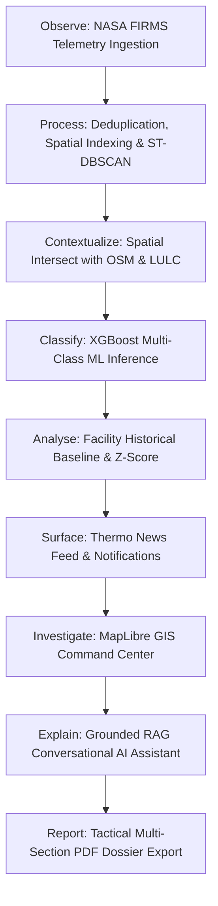
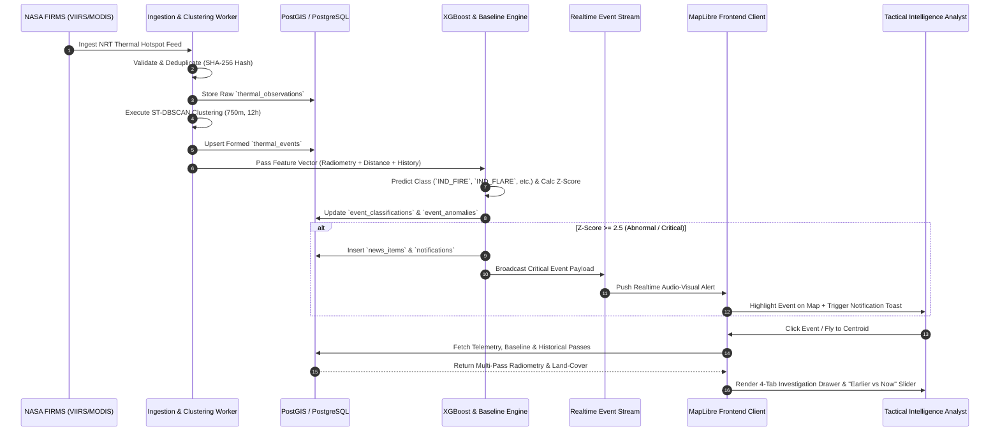
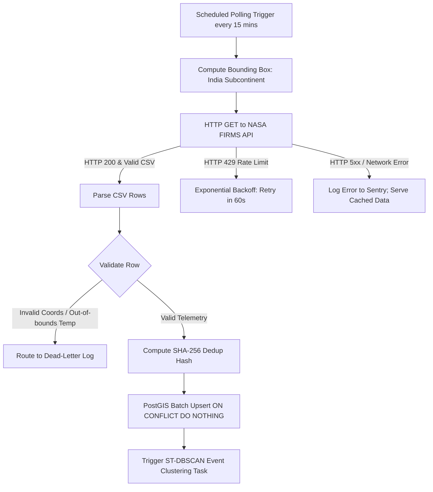
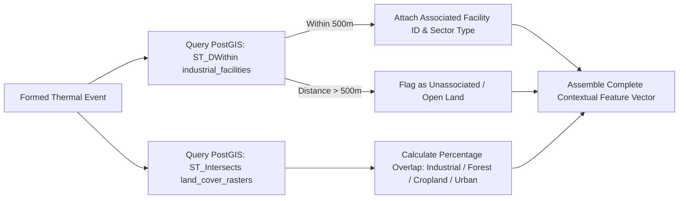
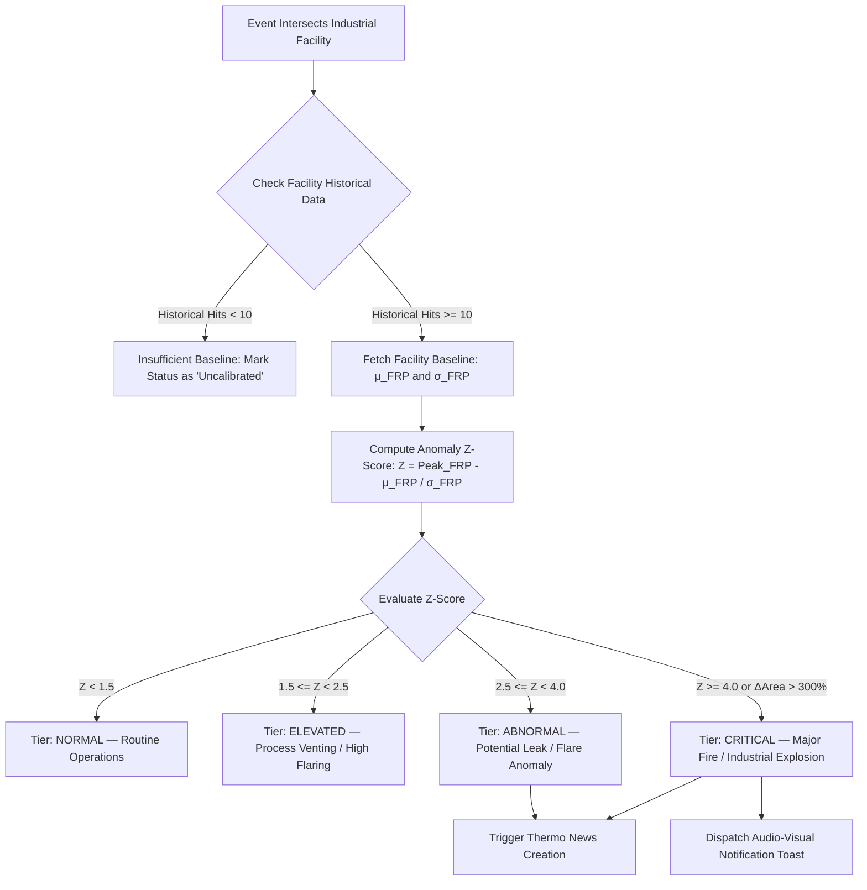
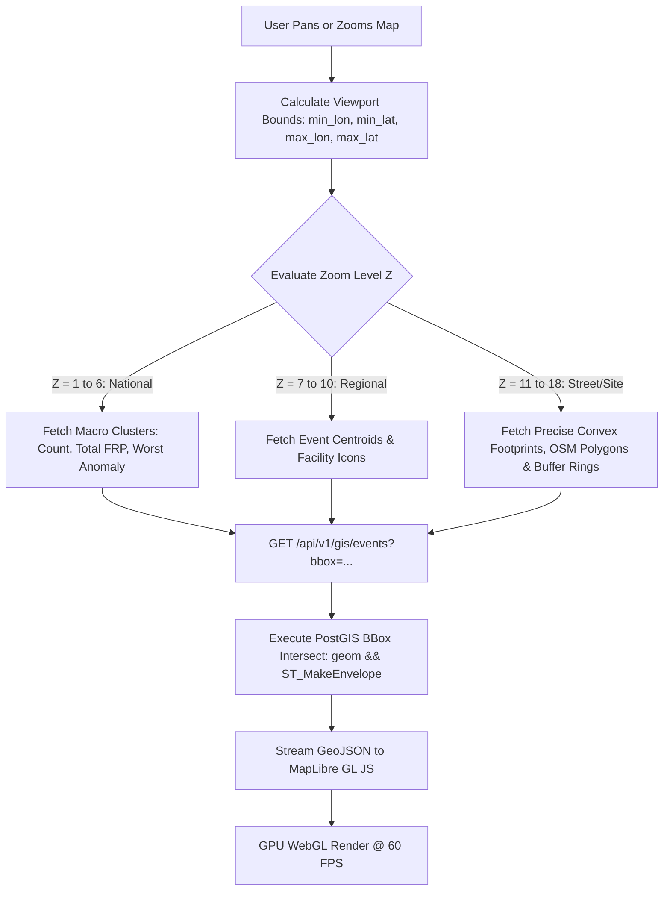
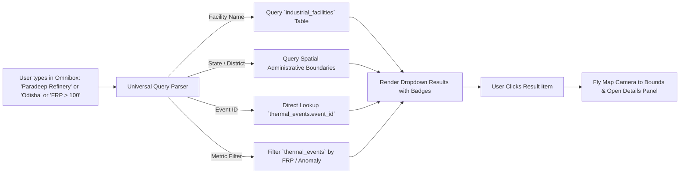
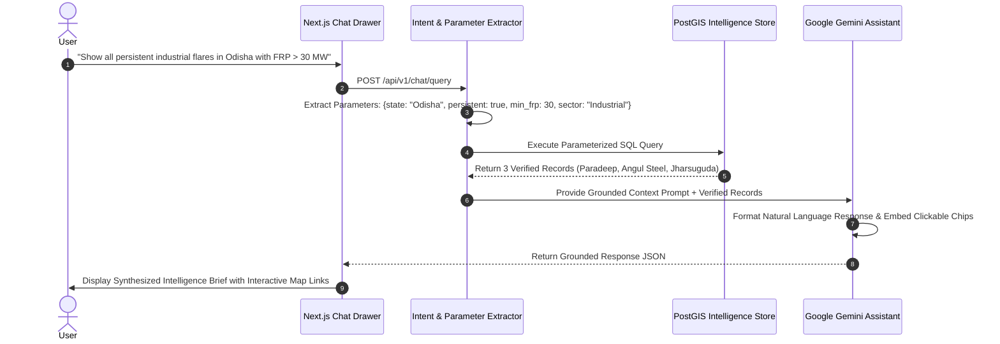
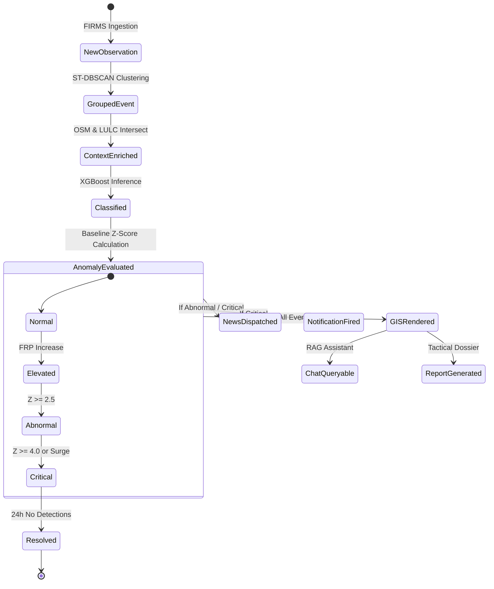

# Workflow Specification Document

# Thermo Intelligence: Industrial Fire & Persistent Thermal Source Detection Platform

**Document Version:** 1.0.0  
**Project Identifier:** SIH-2026-PS26162 (National Technical Research Organisation — NTRO)  
**Product Specification Reference:** [Thermo_Intelligence_PRD.md](file:///c:/SHARAN%20PROJECTS/SiH%202026-THERMOSCAN%20AI/docs/Thermo_Intelligence_PRD.md)  
**Technical Specification Reference:** [Thermo_Intelligence_TRD.md](file:///c:/SHARAN%20PROJECTS/SiH%202026-THERMOSCAN%20AI/docs/Thermo_Intelligence_TRD.md)  
**Status:** Approved / Authoritative  
**Last Updated:** August 2026  

---

## 1. Purpose & Workflow Philosophy

This Workflow Document defines **how information and users move through the Thermo Intelligence platform from beginning to end**. It bridges the product requirements (PRD) and technical specifications (TRD) into deterministic operational sequences, covering:

- Automated data ingestion, clustering, ML inference, and anomaly escalation pipelines.
- User-driven exploration, visual investigation, natural language querying, and tactical reporting.
- Edge cases, concurrent updates, and graceful degradation workflows under failure conditions.



---

## 2. System-Wide End-to-End Workflow



---

## 3. First-Time User Onboarding Workflow

```
[ New User Visits App ] 
         ↓
[ Check localStorage('thermo_onboarded') ]
         ↓
  ├── If FALSE → Display Interactive 4-Slide Introduction Modal
  │                Slide 1: Platform Purpose & NTRO Mission
  │                Slide 2: Dual-Axis Model (Classification vs. Anomaly)
  │                Slide 3: GIS Layer Controls & Thermo News
  │                Slide 4: Grounded AI Assistant & Tactical Reports
  │                [ Click "Launch Command Center" ] → Set localStorage = true
  │
  └── If TRUE → Skip Intro directly to Main GIS
         ↓
[ Render India Default Overview (Center: 20.59°N, 78.96°E, Zoom: 5) ]
[ Stream Initial GeoJSON Event Clusters (Past 24 Hours) ]
```

---

## 4. Returning User Workflow

1. **State Restoration:** Client reads cached filter preferences from `localStorage` (e.g., active layers, severity filters, preferred basemap).
2. **Viewport Initialization:** Center map on user's last viewed bounding box or default to national overview.
3. **Delta Sync:** Fetch newly ingested events since last session timestamp (`GET /api/v1/gis/events?since={last_timestamp}`).
4. **Badge Synchronization:** Update unread counts on the **Thermo News** ticker and **Notification Drawer**.

---

## 5. NASA FIRMS Ingestion Workflow



---

## 6. Observation -> Event Formation Workflow (ST-DBSCAN)

```
[ New Normalized Observations Ingested ]
                   ↓
[ Query Existing Active Events within Spatial Radius (750m) & Time Window (12h) ]
                   ↓
     ├── Match Found (Distance <= 750m & dt <= 12h)
     │         ↓
     │   [ Attach Observation to Existing Event Entity ]
     │   [ Recalculate Event Centroid (FRP-Weighted Average) ]
     │   [ Compute Updated Convex Hull: ST_ConvexHull(ST_Collect(geoms)) ]
     │   [ Update Peak FRP, Aggregate FRP, and Duration ]
     │
     └── No Match Found
               ↓
         [ Instantiate New Thermal Event Entity: `EVT-IN-{STATE}-{YYYYMM}-{SEQ}` ]
         [ Generate Initial Bounding Box: ST_Buffer(geom, 187.5m) ]
         [ Set first_detected_utc = observation_time ]
                   ↓
[ Trigger Downstream Geographic Context & ML Classification Pipeline ]
```

---

## 7. Geographic & Industrial Context Extraction Workflow



> [!IMPORTANT]
> **Spatial Proximity Principle:** Proximity to an industrial facility does **NOT** automatically classify an event as an industrial fire. Proximity is merely one input feature among radiometry, persistence, and land-use passed to the ML classifier.

---

## 8. Machine Learning Classification Workflow

```
[ Assemble Event Feature Vector (14 Dimensions) ]
                   ↓
  • Distance to Industrial Boundary (m)
  • Peak FRP (MW) & FRP Spatial Density (MW/Ha)
  • Max Brightness Temp (K) & Background Delta (K)
  • Elapsed Duration (Hours) & Diurnal Night Ratio
  • Historical 30-Day & 365-Day Recurrence Count
  • Land-Cover Overlap Percentages (Crop, Forest, Urban)
                   ↓
[ Execute XGBoost Classifier: `thermo_xgb_v1.0.0.joblib` ]
                   ↓
[ Output Probability Distribution across 6 Classes ]
                   ↓
     ├── Highest Probability >= 0.60
     │         ↓
     │   [ Assign Class: `IND_FIRE` | `IND_FLARE` | `IND_ROUTINE` | `AGRI_BURN` | `WILDFIRE` ]
     │   [ Compute SHAP Feature Importance Attribution ]
     │
     └── Highest Probability < 0.60
               ↓
         [ Assign Class: `OTHER_UNCERTAIN` / Under Analysis ]
         [ Flag for Manual Review ]
                   ↓
[ Write Output to `event_classifications` Table ]
```

---

## 9. Persistence Analysis Workflow

1. **Spatial Buffer Query:** System queries `thermal_observations` within a 500m radius of the event centroid across the trailing 12 months.
2. **Metrics Computation:**
   - Total Historical Detections (`N_hits`).
   - Unique Active Days (`D_active`).
   - Recurrence Frequency (`F_rec = D_active / 365`).
3. **Persistence State Classification:**
   - **Transient:** `D_active <= 2` days and duration `< 24 hours` (e.g., farm fires).
   - **Intermittent:** `3 <= D_active <= 14` days per year (e.g., seasonal brick kilns, periodic maintenance flaring).
   - **Persistent:** `D_active > 15` days per month over `>6 months` (e.g., continuous refinery flaring stacks).

---

## 10. Facility Baseline & Abnormality Workflow



---

## 11. Thermo News Feed Workflow

1. **Qualification Gate:** An event qualifies for a news bulletin if:
   - It is newly classified as `IND_FIRE` or `WILDFIRE`.
   - Its anomaly tier reaches `ABNORMAL` or `CRITICAL`.
   - Its persistence status is officially confirmed (`>30 days`).
2. **Deduplication Check:** Check if a news item already exists for `event_id`. If exists -> Update headline/metrics rather than creating duplicate entries.
3. **Headline & Summary Generation:**
   - Template: `"{SEVERITY}: {EVENT_TYPE} Detected at {FACILITY_NAME / LOCATION}, {STATE}"`
   - Example: *"CRITICAL: Major Thermal Surge (+5.2σ) Detected at Jamnagar Petrochemical Complex, Gujarat"*.
4. **Broadcast & UI Ingestion:** Insert into `news_items` table -> Publish payload via Server-Sent Events (SSE) -> Animate new card at top of frontend news stream.

---

## 12. Smart Notification Workflow

```
[ Critical / Abnormal Event Triggered ]
                   ↓
[ Anti-Fatigue Suppression Check ]
  • Has notification fired for this event in last 60 mins?
  • Does event meet user's minimum severity threshold?
                   ↓
     ├── If Suppressed → Log silently; update badge counter only.
     │
     └── If Approved →
               ↓
         [ 1. Dispatch In-App Glowing Toast Banner with Audio Ping ]
         [ 2. Increment Unread Notification Counter ]
         [ 3. Trigger Browser Web Push (if permission granted) ]
                   ↓
[ User Clicks Notification ]
         ↓
[ 1. Map Camera flies smoothly to Event Centroid ]
[ 2. Thermal Footprint Polygon highlights with pulsating neon ring ]
[ 3. Open Event Investigation Drawer directly ]
```

---

## 13. GIS Exploration & Dynamic Loading Workflow



---

## 14. Event Investigation Drawer Workflow

When a user selects an event marker or news card:

```
[ User Selects Event `EVT-IN-GUJ-0042` ]
                   ↓
[ Open Right-Side Investigation Drawer & Lock GIS Focus ]
                   ↓
+----------------------------------------------------------------------------------------------------+
|  TAB 1: CURRENT STATE                                                                              |
|  • Classification: Industrial Accidental Fire (94.2% Confidence)                                   |
|  • Peak FRP: 450 MW | Max Temp: 482 K | Active Hits: 8 | Area: 14.2 Ha                             |
|  • Top AI Feature Drivers: 1. In-Facility (100%), 2. FRP Surge (+5.8σ), 3. Night Persistence       |
+----------------------------------------------------------------------------------------------------+
|  TAB 2: HISTORICAL BASELINE                                                                        |
|  • Facility: Reliance Jamnagar Refinery Complex                                                    |
|  • Baseline Curve: Observed (450 MW) vs Historical Mean (42 MW ± 12 MW)                            |
|  • 30-Day Activity Calendar: Continuous Flaring (28/30 Days)                                       |
+----------------------------------------------------------------------------------------------------+
|  TAB 3: GEOGRAPHIC CONTEXT                                                                         |
|  • Surrounding LULC: 84% Industrial, 12% Urban, 4% Barren                                          |
|  • Proximity Buffers: Nearest Residential: 1.8 km | Critical Fuel Tanks: 320 m                     |
+----------------------------------------------------------------------------------------------------+
|  TAB 4: "EARLIER VS. NOW" TIMELINE                                                                 |
|  • Temporal Scrubber: Pass 1 (T-18h) → Pass 2 (T-12h) → Pass 3 (T-6h) → Pass 4 (Current)           |
|  • Multi-Pass Delta: Area expanded from 1.2 Ha to 14.2 Ha (+1080%)                                 |
|  • Satellite Evidence: True-Color RGB vs SWIR False-Color comparison tile                         |
+----------------------------------------------------------------------------------------------------+
```

---

## 15. Supporting Satellite Imagery Workflow

1. **Target Coordinate Resolution:** Extract bounding box from `thermal_events.boundary_geom`.
2. **Catalog Query:** Query Copernicus / Sentinel-2 Open Access Hub for latest cloud-free optical/SWIR passes over the target envelope.
3. **Rendering Modes:**
   - **Optical RGB (B4-B3-B2):** Structural verification and smoke plume inspection.
   - **SWIR False-Color (B12-B8A-B4):** Active combustion visualization through smoke.
4. **Graceful Fallback:** If optical imagery is unavailable or obscured by monsoon clouds, the UI displays the timestamped synthetic vector polygon over the high-contrast dark map with an explicit badge: *"Optical pass obscured by clouds; thermal radiometry active"*.

---

## 16. Search & Exploration Workflow



---

## 17. Grounded Conversational AI Workflow (RAG Chat)



---

## 18. Tactical Report Generation Workflow

```
[ User Clicks "Generate Intelligence Dossier" on Event EVT-IN-GUJ-0042 ]
                                   ↓
[ Modal Opens: Select Dossier Sections ]
  [x] Executive Incident Summary
  [x] Radiometric & Telemetry Breakdown
  [x] Historical Baseline & Anomaly Delta Charts
  [x] Surrounding Land-Use & Vulnerability Buffers
  [x] Multi-Pass "Earlier vs. Now" Timeline
  [x] Satellite Visual Evidence (SWIR Tile)
                                   ↓
[ Click "Compile Official Report (PDF)" ]
                                   ↓
[ Backend Aggregates Structured Telemetry & Renders Jinja2 HTML Template ]
                                   ↓
[ Headless Chromium / WeasyPrint Compiles Pixel-Perfect A4 PDF ]
                                   ↓
[ PDF Artifact Stored in MinIO/S3 → Signed Download URL Returned ]
                                   ↓
[ Browser Triggers Instant PDF Download & Displays Print Preview ]
```

---

## 19. Failure & Graceful Degradation Workflows

### DEGRADED MODE BEHAVIOR MATRIX

| Subsystem Failure | Fallback Behavior | User-Facing UI Status Indicator |
|:---|:---|:---|
| **NASA FIRMS Offline** | Serve cached NRT & historical database records seamlessly. | Amber Top Banner: "Operating on Cached Satellite Feed (Updated 2h ago)"|
| **ML Inference Service** | Fall back to heuristic rule engine based on OSM proximity. | Badge: "Heuristic Classification — Model Re-evaluating" |
| **LLM Provider API Down**| Fall back to template-based SQL data summaries for chat/reports. | Structured tabular responses served with no disruption to core data. |
| **Satellite Imagery Cloud Obscuration**| Render synthetic thermal vector footprint over dark basemap. | "Optical imagery cloud-obscured; thermal radiometry fully active" |
| **Network Loss (Client)**| MapLibre serves cached vector tiles via Service Worker cache. | Offline banner; auto-reconnects when connectivity is restored. |

---

## 20. End-to-End Concrete Operational Scenarios

### Scenario 1: Accidental Refinery Fire Escalation
- **T+00m:** VIIRS NOAA-20 night pass detects a 420 MW thermal hotspot at Jamnagar Refinery.
- **T+02m:** Ingestion worker deduplicates and clusters 6 points into `EVT-IN-GUJ-202608-0042`.
- **T+03m:** ML Classifier computes `Z = +5.8σ` and assigns `IND_FIRE` (94% confidence).
- **T+04m:** Thermo News generates bulletin; in-app audio-visual toast triggers on analyst screen.
- **T+05m:** Analyst clicks notification -> Map flies to Jamnagar -> Timeline shows 700% area surge -> Analyst exports Tactical PDF report for emergency dispatch.

### Scenario 2: Agricultural Stubble Fire near Captive Power Plant
- **T+00m:** Afternoon MODIS pass detects dense thermal points in Sangrur, Punjab, 400m from a thermal plant.
- **T+02m:** Classifier evaluates features: high cropland overlap (92%), transient duration (3h), low FRP (14 MW).
- **T+03m:** System classifies cluster as `AGRI_BURN` (91% confidence) and labels the captive plant as `IND_ROUTINE`.
- **T+04m:** Analyst toggles `Industrial Only` filter -> Agricultural points fade out, preventing false alarms.

---

## 21. Cross-Feature Data Flow & State Lifecycle



---

## 22. Time & Data Freshness Taxonomy

To eliminate temporal confusion, the system strictly separates and exposes 5 distinct timestamps:
1. **Observation Time (`T_obs`):** Exact UTC instant the satellite sensor scanned the ground pixel.
2. **Ingestion Time (`T_ingest`):** Time the FIRMS CSV was downloaded and parsed into PostGIS.
3. **Processing Time (`T_process`):** Time ML classification and anomaly scoring completed.
4. **Publication Time (`T_pub`):** Time the event was broadcasted to Thermo News and GIS layers.
5. **Viewing Time (`T_view`):** Current local time of the user's browser session.

---

## 23. Workflow Acceptance Criteria (WAC)

| Workflow Module | Verification Criteria | Expected Result |
| :--- | :--- | :--- |
| **WAC-1: First-Time User** | Open app with cleared browser cache. | Onboarding modal appears; dismissing it opens the India GIS overview cleanly. |
| **WAC-2: Ingestion & Cluster** | Push 10 raw FIRMS points within 500m. | Exactly 1 cohesive `thermal_event` entity created with calculated convex hull geometry. |
| **WAC-3: Baseline Escalation** | Ingest event with FRP `= 5.0x` facility mean. | System transitions status to `CRITICAL`, creates news bulletin, and fires alert toast. |
| **WAC-4: GIS Viewport Zoom** | Zoom from Level 4 to Level 12 over Gujarat. | Dynamically transitions from macro count badges to precise satellite footprint polygons. |
| **WAC-5: RAG Chat Assistant** | Ask: *"Show active industrial flares in Gujarat"*. | Returns factual, database-grounded response with clickable event map chips in `<1.5s`. |
| **WAC-6: Report Compilation** | Click *"Generate Report"* on active event. | Compiles and downloads publication-grade PDF dossier with valid charts in `<2.5s`. |

---

## 24. Document Sign-Off & Approvals

| Role | Organization | Status | Date |
| :--- | :--- | :--- | :--- |
| **Lead Systems Architect** | Thermo Intelligence Team | Approved | August 2026 |
| **Operational Workflow Specialist** | Thermo Intelligence Team | Approved | August 2026 |
| **SIH Technical Lead** | Thermo Intelligence Team | Approved | August 2026 |

---
*End of Workflow Specification Document. This document serves as the authoritative operational guide for all system transitions, UI behaviors, background pipelines, and user journeys.*
