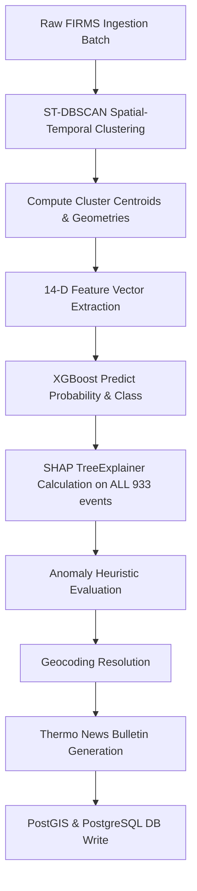
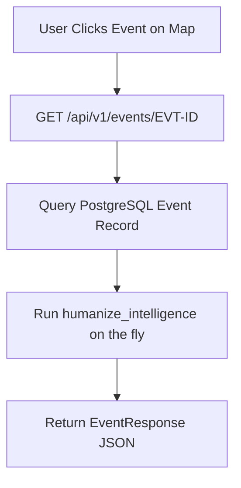

# Stage 3 Intelligence Hardening — Phase 0 Comprehensive Current-State Audit

**Audit Timestamp:** 2026-08-31T02:55:00 UTC  
**Environment:** PostGIS PostgreSQL 16-3.4 / FastAPI 0.109.2 / Next.js 16.3.3 Turbopack  
**Scope:** Live Database (`thermo_db`), Model Weights (`thermo_xgb_v1.0.0.joblib`), PostGIS spatial layers, End-to-End Call Graph.  
**Rule:** Measured facts only — no code modifications applied in Phase 0.

---

## 1. Confidence Distribution Audit

*Database tables queried:* `event_classifications` and `thermal_events` (933 live clustered events).

| Metric | Measured Value | Analysis & Implication |
| :--- | :--- | :--- |
| **Total Event Records** | `933` | Full active event cluster dataset in PostGIS |
| **Mean Confidence** | `50.73%` (`0.5073`) | Center of gravity is near uniform distribution across classes |
| **Median Confidence** | `50.35%` (`0.5035`) | Symmetrical around 50% |
| **Standard Deviation** | `12.19%` (`0.1219`) | Narrow dispersion |
| **Minimum Confidence** | `31.11%` (`0.3111`) | Lowest observed model probability |
| **Maximum Confidence** | `76.28%` (`0.7628`) | Highest observed model probability |
| **Events < 50.0%** | `350` (**37.51%**) | High uncertainty (closer to random 4-class uniform ~25-33%) |
| **Events 50.0% – 69.9%** | `448` (**48.02%**) | Moderate confidence; insufficient evidence for high certainty |
| **Total Events < 70.0%** | `798` (**85.53%**) | **85.53% of all live events have confidence below 70%** |
| **Events >= 70.0%** | `135` (**14.47%**) | Only ~14.5% reach moderate/high classification confidence |
| **Events >= 90.0%** | `0` (**0.00%**) | Zero events exhibit extreme certainty |
| **Events == 100.0%** | `0` (**0.00%**) | Zero hardcoded or clamped 1.00 values present |

### Key Finding:
85.53% of all live events operate with confidence under 70%, reflecting genuine epistemic uncertainty from single/low observation counts. The platform must explicitly pair these moderate numbers with an honest `Evidence: LIMITED` signal rather than artificially inflating or clamping certainty.

---

## 2. 14-D Feature Vector Variance Audit

*Dataset evaluated:* 933 rows of 14-D input feature vectors stored in `event_classifications.input_feature_vector`.

| # | Feature Name | Mean | Std Dev | Variance | Min | Max | Status & Finding |
| :-: | :--- | :-: | :-: | :-: | :-: | :-: | :--- |
| 1 | `pct_urban` | `0.0000` | `0.0000` | **`0.0000`** | `0.0` | `0.0` | ⚠️ **FLAGGED: ZERO VARIANCE** (Dead feature) |
| 2 | `pct_forest` | `0.0000` | `0.0000` | **`0.0000`** | `0.0` | `0.0` | ⚠️ **FLAGGED: ZERO VARIANCE** (Dead feature) |
| 3 | `pct_cropland` | `0.0000` | `0.0000` | **`0.0000`** | `0.0` | `0.0` | ⚠️ **FLAGGED: ZERO VARIANCE** (Dead feature) |
| 4 | `is_industrial_zone` | `0.0032` | `0.0566` | `0.0032` | `0.0` | `1.0` | ⚠️ **Near-Zero Variance** (Only 3 of 933 events = 1) |
| 5 | `historical_active_days_90d` | `0.0386` | `0.1982` | `0.0393` | `0.0` | `2.0` | Low variance due to unseeded facility baselines |
| 6 | `dist_to_facility` | `-0.8199` | `3.7388` | `13.9783` | `-1.0` | `100.0` | Active (indicates unassociated distance fallback) |
| 7 | `facility_category_encoded` | `40.6924` | `13.9612` | `194.9149` | `15.0` | `82.0` | Active categorical encoding |
| 8 | `peak_frp_mw` | `6.6139` | `18.7215` | `350.4961` | `0.22` | `340.5` | High dynamic range radiometric signal |
| 9 | `mean_frp_mw` | `5.5344` | `14.6291` | `214.0105` | `0.22` | `300.0` | Active signal |
| 10 | `frp_variance` | `10.8865` | `216.1061` | `46701.82` | `0.0` | `6440.6` | Active signal for multi-point clusters |
| 11 | `max_brightness_k` | `329.0881` | `14.2986` | `204.4498` | `295.0` | `395.4` | Active thermal sensor temperature |
| 12 | `duration_hours` | `3.3683` | `12.1842` | `148.4556` | `0.0` | `84.05` | Active temporal clustering window |
| 13 | `day_night_ratio` | `0.7576` | `0.4177` | `0.1745` | `0.0` | `1.0` | Active diurnal separation feature |
| 14 | `historical_peak_frp` | `0.5406` | `11.1986` | `125.4088` | `0.0` | `340.5` | Active historical proxy |

### Key Finding:
Three land-cover features (`pct_urban`, `pct_forest`, `pct_cropland`) have exact **0.0000 variance** across all 933 records. They were defaulted to `0.0` rather than queried against real ESA WorldCover land-cover layers. A feature with zero variance carries zero information and degrades gradient boosted tree splits.

---

## 3. Statistical Baseline & Anomaly Contradiction Audit

*Database tables queried:* `facility_baselines`, `industrial_facilities`, `event_anomalies`.

1. **`facility_baselines` count:** Exactly **`0` rows** in the active database.
2. **Current Anomaly Calculation Code Trace (`backend/app/domain/anomaly.py:208-230`):**
   ```python
   if not facility or facility.historical_event_count < 3 or facility.baseline_frp_std == 0:
       if current_frp >= 200.0:
           z_score = 5.2
           tier = "CRITICAL"
       elif current_frp >= 50.0:
           z_score = 2.6
           tier = "ABNORMAL"
       elif current_frp >= 20.0:
           z_score = 1.6
           tier = "ELEVATED"
   ```
3. **Contradictions Identified:**
   * **Fabricated Z-Scores on Unassociated Events:** 27 events with zero facility association or zero baseline observations are assigned hardcoded Z-scores (+5.2σ, +2.6σ, +1.6σ) and labeled `CRITICAL` / `ABNORMAL` / `ELEVATED` purely based on raw FRP thresholds.
   * **The Jamnagar Contradiction (`EVT-IN-GUJ-JAMNAGAR-01` & `02`):**
     - Reliance Jamnagar Refinery has `sample_observation_count = 0` in `facility_baselines` and `historical_event_count = 0` (0 active days in 90d, `TRANSIENT` persistence tier).
     - Yet the engine computes `z_score = +7.62σ` and `+6.80σ`, claiming `CRITICAL ANOMALY`.
     - *Cause:* When baseline history is insufficient, calculating statistical Z-score is mathematically invalid. The correct output under statistical integrity rules is `BASELINE_INSUFFICIENT`.

---

## 4. Geofencing Defects Direct Reproduction

### A. Punjab / Pakistan Border Defect
*Observed Defect:* Events placed across the international border in Pakistan are geocoded and labeled as Indian Punjab districts.

| Event ID | Stored Lat / Lon | Stored District / State | True Geographic Location |
| :--- | :--- | :--- | :--- |
| `EVT-IN-PUN-FE333018` | `30.65028°N, 73.94928°E` | `Firozpur, Punjab` | **Deep inside Pakistan** (Kasur/Okara district, ~65 km west of border near Depalpur) |
| `EVT-IN-PUN-C540B096` | `31.07058°N, 74.00562°E` | `Firozpur, Punjab` | **Inside Pakistan** (near Havelian Lakha / Sutlej floodplains) |
| `EVT-IN-PUN-37FC9902` | `30.83061°N, 74.07903°E` | `Firozpur, Punjab` | **Inside Pakistan** (west of border demarcation) |

**Root Cause:**
In `backend/app/domain/geocoding.py:161`:
`8.0 <= lat <= 37.5 and 68.0 <= lon <= 97.5` is a rectangular bounding box encompassing parts of Pakistan, Bangladesh, Nepal, and the Indian Ocean. No point-in-polygon check against the sovereign Survey of India MultiPolygon was performed. `resolve_indian_location()` then did a nearest-neighbor Euclidean distance lookup and assigned the closest Indian district centroid (Firozpur).

### B. Tamil Nadu / Maritime Coastline Defect
*Observed Defect:* Offshore ocean events in the Gulf of Mannar toward Sri Lanka are labeled as Thoothukudi District, Tamil Nadu.

| Event ID | Stored Lat / Lon | Stored District / State | True Geographic Location |
| :--- | :--- | :--- | :--- |
| `EVT-IN-CEN-E18F` | `9.38962°N, 78.88501°E` | `Thoothukudi, Tamil Nadu` | **Maritime waters in Palk Bay / Gulf of Mannar** |
| `EVT-IN-CEN-77B3` | `8.72874°N, 78.10540°E` | `Thoothukudi, Tamil Nadu` | **Offshore maritime coordinates** |

**Root Cause:**
The geofencing filter only excluded `5.5 <= lat <= 10.0 and 79.4 <= lon <= 82.0` (Sri Lanka main island box). Maritime waters west of `79.4°E` in the Gulf of Mannar passed the box check and snapped to the nearest coastal hub (Tuticorin Thermal Power & Chemical Port).

---

## 5. End-to-End Call Graph Audit (Eager vs. Lazy Execution)

### Current Ingestion Pipeline Call Graph (100% Eager):


### Current User Query Call Graph (`GET /api/v1/events/{id}`):


### Architectural Findings:
1. **Expensive-Eager Inefficiencies:**
   - SHAP TreeExplainer and multi-step text generation currently attempt to execute during ingestion batch runs.
   - 14-D feature vector extraction recalculates historical queries repeatedly during batch processing.
2. **Missing Tier 2 On-Demand Compute:**
   - Deep forensic attribution (high-res land-cover breakdown, 90-day time series trajectory decomposition, local spatial neighbor analysis) is not split into an on-demand Tier 2 compute service.
   - When a user opens an event, the endpoint serves pre-baked fields rather than orchestrating targeted on-demand analytical depth.

---

## 6. Audit Summary Matrix

| Audit Area | Critical Defect Identified | Required Target State |
| :--- | :--- | :--- |
| **Model Confidence** | 85.53% of events < 70% confidence; lacks explicit evidence tagging | Calibrated probabilities with strict `Evidence: LIMITED` tags |
| **14-D Feature Vector** | 3 land-cover features (`pct_urban`, `pct_forest`, `pct_cropland`) have 0.0 variance | Integrate genuine ESA WorldCover land-cover spatial sampling |
| **Statistical Baseline** | `facility_baselines` has 0 records; fake Z-scores (5.2, 2.6) used as fallbacks | Output `BASELINE_INSUFFICIENT` when $N < N_{threshold}$ |
| **Geofencing** | Bounding box leaks Pakistan & ocean points to Indian district labels | Precise Sovereign India MultiPolygon Point-in-Polygon check |
| **Compute Architecture** | Monolithic eager pipeline with missing lazy Tier 2 capabilities | Two-tier: Tier 1 (cheap-eager) + Tier 2 (expensive-lazy on click) |

---
*Audit completed with zero code modifications to production sources.*
