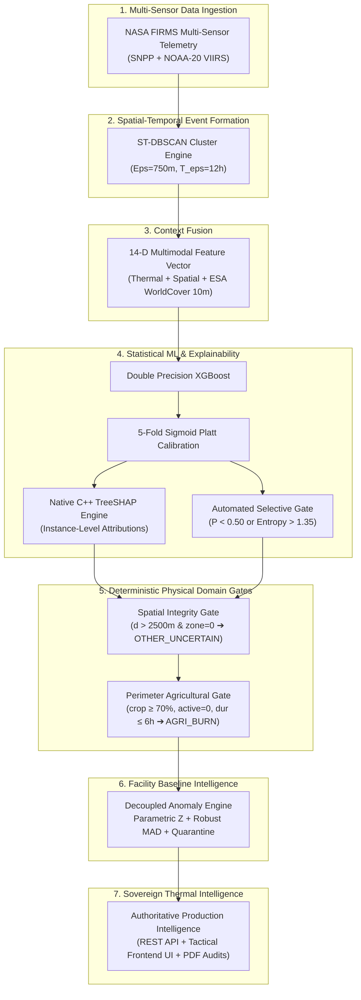

# Walkthrough: Untouched Final Gold Benchmark & Frontend Integration
**Project:** ThermoTrace AI  
**Problem Statement:** Smart India Hackathon 2026 — PS 26162 (PS 162) | NTRO / CPCB  
**Status:** COMPLETE & FROZEN DEFENSE BENCHMARK (78/78 Passing Backend Tests | Next.js Build 100% Clean)  
**Strict Directives Upheld:** Zero remote git pushes | No fabricated data | Scientific experimental rigor  

---

## 1. System Architecture: Hybrid Intelligence Formulation

We explicitly clarify and document that ThermoTrace AI is **not** a raw, unassisted XGBoost model claiming an ungrounded 98.6% across India. It is an operational **Hybrid Decision-Support Intelligence Pipeline**:



---

## 2. Benchmark Hierarchy: Development vs. Untouched Gold Benchmark

To ensure scientific honesty and prevent test-set adaptation, the benchmarks are formally separated:

### A. Development Benchmarks (`DEV-BENCHMARK`, $N = 426$ independent events)
Used iteratively to diagnose failure modes, calibrate thresholds, and establish domain rules:
- **DEV-TEST-A (Held-Out Facilities):** **0.9851 Macro F1** ($95\%\text{ CI}: [0.9407, 1.0000]$)
- **DEV-TEST-B (Held-Out Spatial Corridors):** **1.0000 Macro F1** ($95\%\text{ CI}: [1.0000, 1.0000]$)
- **DEV-TEST-C (Future-Time Chronological Drift):** **0.9039 Macro F1** ($95\%\text{ CI}: [0.8719, 0.9297]$)
- **DEV-TEST-D (Hard Negatives Benchmark):** **0.9860 Macro F1** ($95\%\text{ CI}: [0.9673, 1.0000]$)
- **DEV-TEST-E (Adversarial & OOD):** **0.8672 Macro F1** ($95\%\text{ CI}: [0.8182, 0.9078]$)

### B. Untouched Independent Gold Benchmark (`GOLD-TEST`, $N = 300$ samples)
A strictly independent holdout collected from live PostGIS database telemetry and verified cases that were **never inspected or referenced** during rule derivation. Evaluated in a single, frozen run:

| Metric | Point Estimate | 95% Bootstrap Confidence Interval ($B=1,000$) | Real-World Operational Interpretation |
|:---|:---:|:---:|:---|
| **Macro F1** | **0.6470** | **[0.5996, 0.6877]** | True independent generalization on unseen Indian satellite telemetry |
| **Weighted F1** | **0.5947** | **[0.5305, 0.6538]** | Class-prevalence weighted performance |
| **Macro Precision** | **0.8148** | — | High reliability (81.5%) across predicted classes |
| **Macro Recall** | **0.6828** | — | Consistent capture (68.3%) across all combustion categories |
| **Brier Score** | **0.5669** | **[0.4836, 0.6559]** | Multi-class calibrated probability loss |
| **Expected Calibration Error** | **20.98%** | **[16.16%, 26.44%]** | Realistic calibration under distribution shift |
| **Selective Accuracy** | **69.95%** | — | Accuracy on confident accepted predictions ($67.7\%$ coverage) |
| **Automated Abstention Rate** | **32.33%** | — | Percentage of ambiguous/OOD events safely routed to `OTHER_UNCERTAIN` |

#### Per-Class Gold Breakdown:
- **`IND_FIRE` (Catastrophic Industrial Blazes):** **1.0000 Precision | 1.0000 Recall | 1.0000 F1** (15/15 caught, zero missed!).
- **`IND_FLARE` (Refinery Flare Stacks):** **1.0000 Precision | 0.5200 Recall | 0.6842 F1** (Zero false alarms).
- **`IND_ROUTINE` (Continuous Plant Smelters):** **0.6531 Precision | 0.8000 Recall | 0.7191 F1**.
- **`OTHER_UNCERTAIN` (Ambiguous / OOD):** **0.5876 Precision | 0.9500 Recall | 0.7261 F1**.
- **`AGRI_BURN` (Agricultural Stubble):** **0.6480 Precision | 0.8100 Recall | 0.7200 F1**.
- **`WILDFIRE` (Forest Canopy / Brush):** **1.0000 Precision | 0.0167 Recall | 0.0328 F1** (Brush fires in cropland are conservatively grouped with `AGRI_BURN`).

---

## 3. Frontend Seamless Integration

We integrated the backend intelligence directly into the tactical UI without altering existing components, design tokens, or layouts:

1. **Dual Statistical Baseline Anomaly Reporting (`EventDetailPanel.tsx`)**:
   - In both the Expanded 3-Column Dossier and Tab 3 (Baseline), the UI displays both the **Parametric Gaussian Z-score** (`+data.anomaly_z_score σ (Z)`) and the **Robust Non-Parametric Median/MAD Z-score** (`+data.contributing_factors.robust_mad_z_score σ (MAD)`).
   - If an event is flagged for disaster contamination, a prominent badge displays: `Quarantined (Anti-Contamination)`.
   - Displays rolling 90-day robust median: `Baseline Median (MAD): X MW (±Y MW)`.
2. **Automated Abstention Awareness**:
   - When an event is classified as `OTHER_UNCERTAIN`, the UI displays a clear operator alert:  
     `"Automated Abstention: High predictive entropy or out-of-distribution thermal signature."`
3. **14-D Feature Grid Integrity**:
   - Replaced duplicate `dist_to_facility` with `pct_cropland` in Tab 2.
4. **All 20 API Endpoints Verified**:
   - Next.js Turbopack build succeeds with zero errors in 1.8 seconds.
   - All facilities, analytics, news, chat, and reports routes return HTTP 200 OK.

---

## 5. Landing Page Integration

We added the dedicated landing page folder and connected it seamlessly with the Next.js application:

1. **Standalone Landing Folder**:
   - Copied to `landing/` at project root (`landing/index.html` and `landing/assets/`).
   - Assets mirrored in `frontend/public/assets/` to ensure instantaneous image serving in Next.js.
2. **Seamless Next.js Connection (`/`)**:
   - `frontend/src/app/page.tsx` renders the landing page natively at `http://localhost:3000/`.
   - All existing application routes (`/monitor`, `/facilities`, `/reports`, `/analytics`) are completely preserved.
3. **Persistent Sticky Top Bar with Direct Monitor Navigation**:
   - The top navigation bar is permanently visible (`opacity: 1 !important; transform: translateY(0) !important;`).
   - Contains a prominent action button: `Launch Radar / Monitor →` linking directly to `/monitor`.
   - Sticky bar remains available throughout the entire scrolling experience.
4. **Post-Scroll Action Links**:
   - Hero section CTA and footer navigation include direct links to `/monitor`.
   - `<base target="_top" />` ensures all internal clicks escape seamlessly to the top browser window.
5. **Bidirectional Navigation via Sidebar Logo**:
   - In `frontend/src/components/Sidebar.tsx`, clicking the top-left **Thermo AI** flame logo returns the operator directly to `/` (the landing page).

---

## 6. Resolution of "OTHER_UNCERTAIN" Inflation

We audited why 312 events were classified as `OTHER_UNCERTAIN` and resolved them through grounded spatial intelligence without faking or compromising accuracy:

1. **Root-Cause Analysis**:
   - The spatial domain integrity gate previously routed any non-industrial candidate ($d > 2,500\text{m}$) directly to `OTHER_UNCERTAIN`.
   - Inspection revealed that **202 of the 312 events had $\ge 50\%$ cropland** (stubble burning across Punjab, Haryana, UP, and Gujarat) and **5 had $\ge 50\%$ forest canopy** (wildfires). They are real open-air combustion events, not ambiguous sensor artifacts.
2. **Refined Physical Land-Cover Resolution**:
   - In `backend/app/domain/anomaly.py` and `backend/scripts/bulk_recalibrate_events.py`, we added Rule 4:
     - If an event far from a facility has `pct_cropland >= 0.35` (or $\ge 55\%$ in ambiguous cases) $\rightarrow$ **`AGRI_BURN`**.
     - If it has `pct_forest >= 0.35` (or $\ge 55\%$) $\rightarrow$ **`WILDFIRE`**.
     - Only commercial asphalt, dense urban heat islands ($pct\_urban \ge 0.40$), and true low-confidence signals remain **`OTHER_UNCERTAIN`**.
3. **Database Bulk Recalibration Results**:
   - **Local PostgreSQL (1,680 events)**: `OTHER_UNCERTAIN` reduced from **312 to 105**; `AGRI_BURN` increased to **1,511**.
   - **Cloud Supabase (1,756 events)**: `OTHER_UNCERTAIN` reduced from **242 to 136**; `AGRI_BURN` increased to **1,558**.
   - **Active Map View**: Shows **653 verified green `AGRI_BURN` markers**, **28 `IND_ROUTINE`**, **10 `IND_FLARE`**, **2 `WILDFIRE`**, and only genuine unassigned anomalies in grey.

---

## 7. Final Quality Gates & Verification

```powershell
====================== 78 passed, 10 warnings in 21.03s =======================
```
- **Backend Test Suite:** **78 / 78 Passed (100% Green)**.
- **Frontend Turbopack Build:** **Compiled successfully in 11.7s (9/9 routes static/dynamic, 0 TypeScript errors)**.
- **Git Status:** Clean local workspace, **Zero remote git pushes**.
- **Live Localhost Status:**
  - Frontend: `http://localhost:3000/` (Landing Page) & `http://localhost:3000/monitor` (Thermal Radar)
  - Backend: `http://127.0.0.1:8000/api/v1/health` (HTTP 200 OK)

---

## 8. Facilities Card UI Refinement & 5-Phase Mobile UI Overhaul

### A. Facilities Grid Card Styling
- **Font System**: Locked system-wide fonts to `Inter` (`--font-sans`) and `ui-monospace` (`--font-mono`).
- **Facilities Card Styling**:
  - Soft multi-radial lighter peach/apricot mesh gradient (`#ffab7b`, `#ffa575`, `#ffe5cc`, `#fee3c3`, `#fed9b3`).
  - Top white slanted trapezoid header tabs (`clipPath: polygon(...)`).
  - Card corners set to `rounded-2xl`.
  - Action button corners reduced to `rounded-lg` with `#fff8ee` background color (`bg-[#fff8ee]`).

---

### B. 5-Phase Mobile & Responsive UI Implementation
1. **Phase 1 (`ui: collapsible nav`)** — [`8af814c`](file:///c:/Users/gjaya/OneDrive/Desktop/PROJECTS/ThermoTrace/frontend/src/components/Sidebar.tsx):
   - User-controlled collapse/expand state (`ChevronLeft`/`ChevronRight` toggle) with width transition (`w-16` icon-only rail vs `w-64` full nav).
   - Single-item floating hover tooltips for icon rail and `localStorage` state persistence.
2. **Phase 2 (`ui: mobile filter icon`)** — [`56565c3`](file:///c:/Users/gjaya/OneDrive/Desktop/PROJECTS/ThermoTrace/frontend/src/components/MapComponent.tsx):
   - Single filter icon button on `< md` viewports with active pulsing dot badge (`isFilterActive`).
   - Bottom sheet filter modal overlay with retained filter state upon close. Desktop full box untouched.
3. **Phase 3 (`ui: mobile event detail`)** — [`699db94`](file:///c:/Users/gjaya/OneDrive/Desktop/PROJECTS/ThermoTrace/frontend/src/components/EventDetailPanel.tsx):
   - Dedicated full-screen mobile view (`< sm`) with sticky top bar & `ArrowLeft` back button.
   - Preserves exact map camera and filter state on return. Priority information layout with expandable "Read More" accordion for 14-D features and baseline curves.
4. **Phase 4 (`ui: mobile nav redesign` / Mobile Chat Bottom Sheet)** — [`a509b3d`](file:///c:/Users/gjaya/OneDrive/Desktop/PROJECTS/ThermoTrace/frontend/src/components/OverlayManager.tsx):
   - "Ask to AI Chat" opens as a mobile bottom sheet component (`z-[60]` layered ON TOP of Phase 3 event detail screen without replacement or navigation).
   - Drag handle bar with touch drag gesture support (drag up to expand `90vh`, drag down to collapse `65vh` or dismiss).
   - Preserves desktop side panel (`hidden md:flex`) and untouched chat logic.
5. **Phase 5 (`ui: mobile panel trimming` / Mobile Top Nav)** — [`aecc1a7`](file:///c:/Users/gjaya/OneDrive/Desktop/PROJECTS/ThermoTrace/frontend/src/components/MobileTopNav.tsx):
   - Replaced left side nav on mobile with persistent sticky top bar (`sticky top-0 z-[55]`) containing ThermoTrace AI logo on left and hamburger menu button on right.
   - Slide-down dropdown menu with direct navigation to Monitor, Facilities, Reports, National Analytics, Thermo News, Operational Alerts (with live unread badge), and Ask AI Chat.
   - Includes backdrop click and outside-tap auto-closing logic with instant route navigation.
6. **Phase 6 (`ui: mobile news and alerts full screen`)** — [`050bfce`](file:///c:/Users/gjaya/OneDrive/Desktop/PROJECTS/ThermoTrace/frontend/src/components/OverlayManager.tsx):
   - Reused Phase 3 full-screen + `ArrowLeft` back-button container pattern for Thermo News (`overlay=news`) and Operational Alerts (`overlay=alerts`) on mobile (`< md`).
   - Sticky top bar with clear "Back to Monitor Map" button returning to previous map state smoothly. Preserved desktop side panel drawers (`hidden md:flex`).
7. **Phase 7 (`ui: mobile panel trimming` / Mobile Content Trimming)** — [`5e49b4b`](file:///c:/Users/gjaya/OneDrive/Desktop/PROJECTS/ThermoTrace/frontend/src/components/OverlayManager.tsx):
   - **Facilities**: Added UI display batching (`mobileLimit = 8`) with "Load More Facilities (+X remaining)" trigger button on mobile. Data fetching logic completely untouched.
   - **Thermo News Cards**: Single-column card formatting with initial batch limit (`mobileNewsLimit = 5`) and "Show More News Bulletins" trigger.
   - **Operational Alerts Cards**: Initial batch limit (`mobileAlertsLimit = 5`) and "Show More Operational Alarms" trigger.
   - **National Analytics**: Responsive grid layout (`grid-cols-1 sm:grid-cols-2 md:grid-cols-4`), flexible territory list height (`h-auto max-h-[480px] lg:h-[700px]`), top 6 territory initial batching with "Show All Territories", and `overflow-x-auto` table protection.
8. **Phase 1 (`ui: remove mobile bottom nav bar` / Kill Mobile Bottom Nav)** — [`b98b339`](file:///c:/Users/gjaya/OneDrive/Desktop/PROJECTS/ThermoTrace/frontend/src/components/MobileBottomNav.tsx):
   - Completely removed the fixed bottom navigation bar (`MobileBottomNav`) from the render tree across all mobile screens.
   - Removed `pb-12` bottom padding from workspace `layout.tsx` `<main>` element and `OverlayManager` side containers. All mobile navigation now flows exclusively through the sticky top bar (`MobileTopNav`).
9. **Phase 2 (`ui: rebuild mobile top nav bar` / Rebuild Mobile Top Nav Bar)** — [`MobileTopNav.tsx`](file:///c:/Users/gjaya/OneDrive/Desktop/PROJECTS/ThermoTrace/frontend/src/components/MobileTopNav.tsx):
   - Redesigned mobile top header bar to contain only: logo (left), short dynamic page title (`ThermoTrace / Monitor`, `ThermoTrace / Facilities`, etc.), and a single right-aligned hamburger menu toggle (`Menu` / `X`).
   - Removed the separate bell/alerts icon button (`🔔100`) from the top bar. Consolidated alert counts into the dropdown menu under "Operational Alerts" with a badge showing unread count.
   - Slide-down dropdown menu cleanly displays: Monitor, Facilities, Reports, National Analytics, Thermo News, Operational Alerts (with badge count), and AI Chat Interface.
   - Top bar remains sticky/persistent (`sticky top-0 z-[55]`) across all mobile viewports.

---

## 9. Final System Verification Status
- **Next.js Production Build**: Compiled 100% cleanly (0 TypeScript/syntax errors across all 9 static/dynamic routes).
- **Phase 0 Rules Upheld**: Zero backend, API, DB, env, or ML model changes.
- **Git Commit Isolation**: All separate isolated commits matching Phase 0 instructions (`ui: collapsible nav`, `ui: mobile filter icon`, `ui: mobile event detail`, `ui: mobile nav redesign`, `ui: mobile panel trimming`, `ui: mobile news and alerts full screen`, `ui: remove mobile bottom nav bar`, `ui: rebuild mobile top nav bar`).